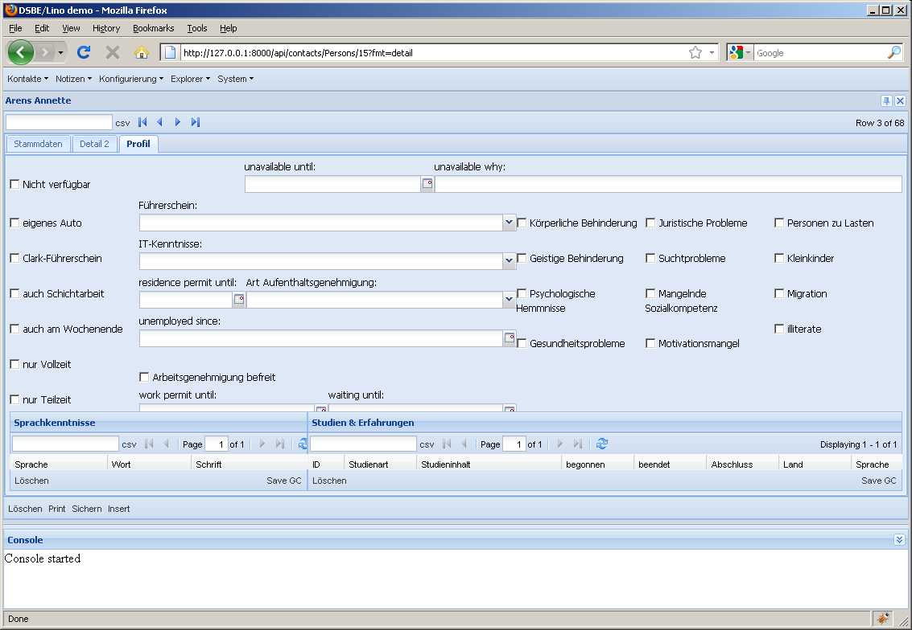
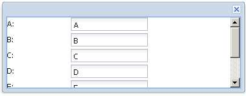

2010-09-09
==========

Diverse
-------

- Firefox 3.6.9 funktioniert wieder. Nachtrag in :doc:`0823`.

Ein neuer Django-Pitfall
------------------------

:xfile:`initdb.py` hatte ein Problem mit :func:`lino.modlib.system.models.get_site_config` bekommen.
Das lag daran, dass ich in :mod:`lino.modlib.countries.fixtures.initial_data` folgendes definiert hatte::

  def objects():
      return [] # just to avoid AttributeError: 'module' object has no attribute 'objects'

In dieser Fixture werden zur Zeit keine Objekte definiert. Ich wollte die Datei aber nicht löschen, weil vielleicht bald wieder welche da rein kommen. Django sagt dann zwar "No fixture data found for 'initial_data'. (File format may be invalid.)", aber das störte mich nicht weiter. 

Denn Django sagte sich "If the fixture we loaded contains 0 objects, assume that an error was encountered during fixture loading."
Aber dadurch werden *alle* Fixtures namens `initial_data` ignoriert.
Unlogischerweise jedoch macht das loaddata dann mit der nächsten Fixture (`demo`) weiter.

Also ein neues Beispiel für :doc:`/django/DjangoPitfalls`.
  
Layout-Probleme
---------------

Wenn ein PageLayout nicht in den Viewport passt, zeigt es keine Scrollbars an. 

Kann es sein, dass `autoScroll` nicht funktioniert, wenn es auf dem einzigen Item eines Containers mit ``layout='fit'`` sitzt? (Weil der Container die Größe seines Items forciert, ohne auf minHeight zu achten?). Versuch::

    var win = new Ext.Window({
      width: 400, height:150,
      layout:'fit',
      items: {
        autoScroll:true,
        layout: 'form',
        items: [
          {xtype: 'textfield', fieldLabel: 'A', value:'A'},
          {xtype: 'textfield', fieldLabel: 'B', value:'B'},
          {xtype: 'textfield', fieldLabel: 'C', value:'C'},
          {xtype: 'textfield', fieldLabel: 'D', value:'D'},
          {xtype: 'textfield', fieldLabel: 'E', value:'E'},
          {xtype: 'textfield', fieldLabel: 'F', value:'F'},
          {xtype: 'textfield', fieldLabel: 'G', value:'G'}
        ]
      }    
    });
    win.show();
    
Das funktioniert:

 
Als nächstes verdächtige ich die Grid-Elemente, dass die den Layoutmanager durcheinander bringen.
