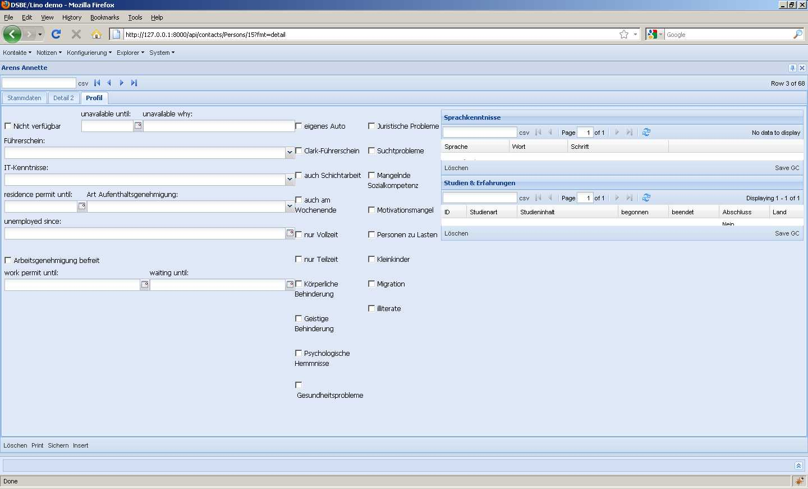

2010-09-11
==========

Cool: die Forum-Software von ExtJS hat mir geholfen, die Lösung für mein gestriges Problem 
(`Resizing viewport containing a constrained maximized window 
<http://www.sencha.com/forum/showthread.php?109509-Resizing-viewport-containing-a-constrained-maximized-window&p=512168#post512168>`__)
zu finden. Ein Laurent aus Paris hatte geantwortet. Sein Vorschlag war zwar nicht die Lösung, aber als ich ihm das gepostet hatte, sah ich die Liste von "Similar Threads", die man bei jedem Post automatisch generiert kriegt. Einer dieser Threads behandelte genau mein Problem!

Check-in. 

Kleines Detail zwischendurch: Wenn man ein "#" vor den Namen eines Feldes in einem :class:`lino.layouts.Layout` setzt, wird das Feld ignoriert (rauskommentiert). Aber bisher wurde die ganze Serie rauskommentiert, wenn man das erste Feld einer horizontalen Serie rauskommentierte. Jetzt kann man eine ganze Zeile nur noch rauskommentieren, indem man ein Leerzeichen hinter das "#" am Anfang der Zeile setzt.

Noch ein Layout-Problem behoben, das im Personen-Detail von DSBE auftrat:
Ich wollte sehen wie es aussieht, wenn ich die beiden Gridelemente "Sprachkenntnisse" und "Erfahrungen" 
senkrecht untereinander auf der rechten Bildschirmhälfte vom Profil. 
Aber zwei Grids untereinander ging nur, wenn es die einzige vbox der Seite war. 
Also das folgende ging nicht::
  
   box1 = """
   foo     
   bar  
   baz     
   """
   
   box2 = """
   grid1
   grid2
   """
   
   main = "box1 box2"
                 
Das ist jetzt behoben. Jetzt gibt es noch mindestens ein Problem:

Die beiden Grid-Elemente rechts ("Sprachkenntnisse" und "Studien & Erfahrungen") 
sollten sich die gesamte verfügbare Höhe teilen.
Wieso tun die das nicht? Das `align` von `main` (die ja ein :extjs:`Ext.layout.HBoxLayout` hat) 
jedenfalls ist auf `stretch` gesetzt.
Problem ist, dass Lino die beiden GridPanles (bzw. deren WrapperPanels) 
nochmals in ein panel mit layout='form' packt.

(Ich habe mit einer neuen Variable `has_fields` angefangen, aber das klappt noch nicht. Morgen weiter.)