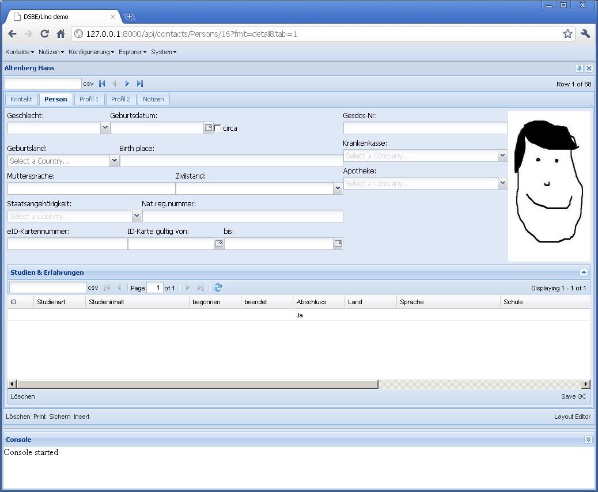

20101004
========

Also hier einige Layout-Bugs, die ich jetzt mal bearbeiten will, weil sie
momentan schön sichtbar sind im Detail von dsbe.Persons:

- "Studien & Erfahrungen" im Tab `Person <http://127.0.0.1:8000/api/contacts/Persons/16?fmt=detail&tab=1>`__ lässt sich 
  höhenverstellen, aber "AG-Sperren" in "Profil 1" nicht. Die hbox mit dem Bild hat anfangs immer die falsche Höhe.
- Im Tab `Kontakt <http://127.0.0.1:8000/api/contacts/Persons/16?fmt=detail&tab=0>`__ fehlen die flags, die ich noch zwischen remarks und coaching knallen will. Zumindest will ich mal sehen, wie sich das macht. Aber wenn ich das tue, ist die ganze untere hbox nicht mehr da.
- Im Tab `Kontakt <http://127.0.0.1:8000/api/contacts/Persons/16?fmt=detail&tab=0>`__ , box "coaching" nimmt die Grid zu viel Platz ein. Da hat Lino unnötigerweise einen VBorderPanel benutzt. Das ist nicht nötig, wenn nur ein Element vflex ist.
- Im Tab `Person <http://127.0.0.1:8000/api/contacts/Persons/16?fmt=detail&tab=1>`__ nimmt die Grid zu viel Höhe.
- Im Detail-Tab "Profil 1" nimmt das GridElement anfangs den ganzen Raum ein, die Felder im oberen Teil werden erst nach einem resize sichtbar.

Na schauen wir uns das Person-Tab mal genauer an. Hier die Layout-Beschreibung::

  
    main = 
      box1:40 box2:20  image:30
      dsbe.StudiesByPerson 
    box1 = 
      sex:8 birth_date birth_date_circa     
      birth_country birth_place  
      native_language civil_state 
      nationality national_id:15 
      card_number:10 card_valid_from card_valid_until:10
    box2 =
      gesdos_id
      health_insurance 
      pharmacy

So sieht es aus:
    

    

Problem ist, dass `box1` anfangs nicht sichtbar ist (Höhe 0 hat).

Jetzt schauen wir uns mal einige Auszüge aus dem generierten JS-Code an.
Also `box1` und `box2` sind zwei Container mit layout "form"::

    var box1_panel285 = new Ext.Container({
        flex: 57, layout: "form",
        items: [box1_1_panel262, box1_2_panel267, box1_3_panel272, box1_4_panel277, box1_5_panel284],
    });
    var box2_panel292 = new Ext.Container({
        flex: 28, layout: "form",
        items: [gesdos_id_ct_panel287, health_insurance_ct_panel289, pharmacy_ct_panel291],
    });
    
Dann das Bild::

    var image293 = new Ext.BoxComponent({
        flex: 14, 
        style: { cursor: "pointer", height: "100%" },
        autoEl: { tag: "img" },
        plugins: Lino.PictureBoxPlugin
    });
    
Diese drei kommen in eine hbox `main_1` (der Name bedeutet, 
dass es die erste Zeile im Element `main` ist)::

    var main_1_panel294 = new Ext.Container({
        layout: "hbox",
        split: true,
        items: [box1_panel285, box2_panel292, image293],
        region: "north",
        layoutConfig: { align: "stretch" },
    });
    
Dann die Grid::
    
    var dsbe_StudiesByPerson_grid307 = new Lino.GridPanel({
        flex: 66,
        title: "Studien & Erfahrungen",
        region: "center",
        split: true,
        ...
    });
    
    
Und diese beiden kommen in ein VBorderPanel::

    var main_panel308 = new Lino.VBorderPanel({
        title: "Person",
        autoScroll: true,
        items: [main_1_panel294, dsbe_StudiesByPerson_grid307],
        frame: true,
        border: false,
        bodyBorder: false,
        labelAlign: "top"
    });

Frage der Woche: wo ist der Fehler?

05.10. und 06.10. : Arbeiten an :srcref:`/extjs-showcases/20101005.html`.

06.10., 15 Uhr:  Tilt! 
Eine hbox, die ein vflex-Element enthält (also die `main_1` im Beispiel)
muss für `layoutConfig.align` nicht `stretch` sondern `stretchmax` haben.
Eigentlich müssen alle hboxen, deren autoHeight=true ist
und die eine form enthalten (für die das autoHeight ja gedacht ist), 
stretchmax statt stretch verwenden.

Das Passfoto habe ich nach Profil 1 versetzt, wo es m.E. am besten hinpasst.

Alle oben genannten Probleme sind jetzt gelöst. 
Ein Problem ist hinzugekommen oder offensichtlicher geworden: einige Details funktionieren nur, 
wenn sie über den Permalink aufgerufen werden. Also wenn man über den Button hinklickt, sind Fehler. 
Der Permalink-Button ist dafür kein zufriedenstellender Workaround, weil bei dessen 
Verwendung die Historie verloren geht. Habe schon einen neuen Tool-Button "refresh" hingeklebt, 
der momentan `main_item.doLayout()` macht. Aber das hat leider auch keinen Effekt.

Check-In 
`Lino <http://code.google.com/p/lino/source/detail?r=3203a1bb7c0be8c07aed3efe3b956ee6df15c70d>`__
und
`DSBE <http://code.google.com/p/lino-dsbe/source/detail?r=f73250498612e82f24e50582d557b486b806f5a8>`__.