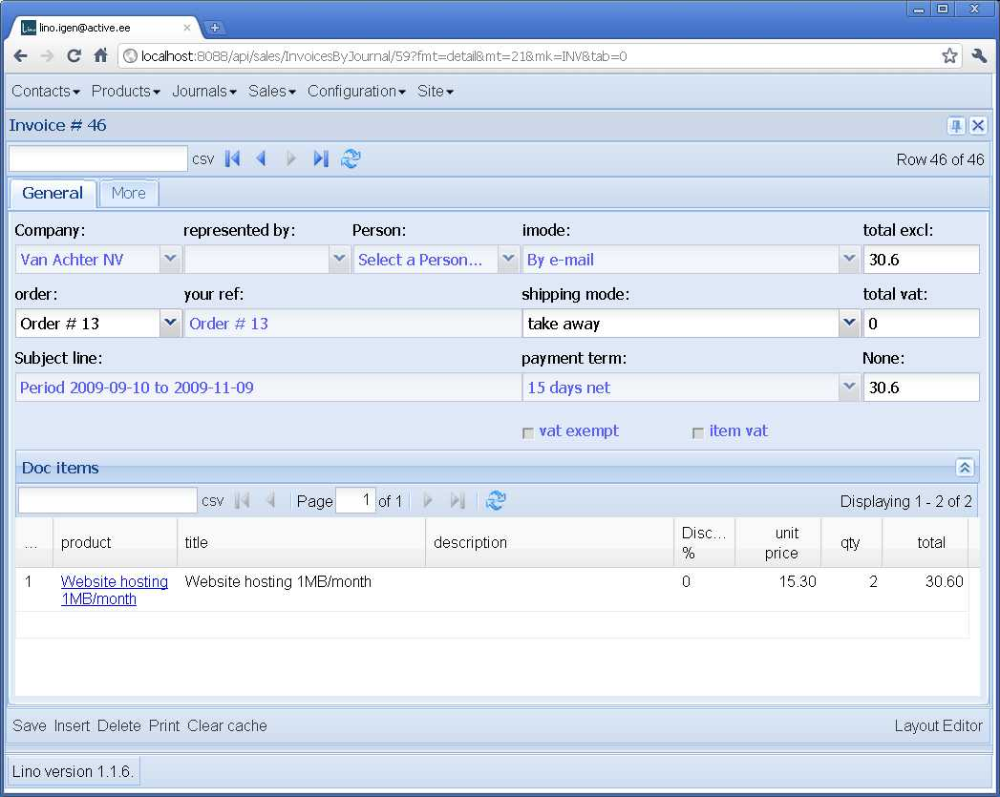
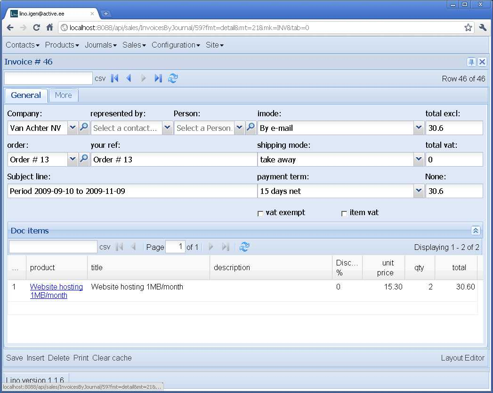

20110303
========

Vorbereitungen Demo in Pärnu
----------------------------

6.20 Uhr. Cool: Babel-Felder werden jetzt automatisch expandiert. 
Also (zumindest deswegen) sind keine lokalen .dtl-Dateien mehr nötig.

8 Uhr. Release :doc:`/releases/20110303` and Upgrade in Pärnu.

Upgrade nach 1.1.6 in Eupen
---------------------------

10 Uhr. Ich nutze den Altweiberdonnerstag aus, um auch in Eupen 
den Lino auf 1.1.6 zu heben. 

Abgesehen von den erwarteten 
Anpassungen im .dpy-Dump hatte ich 
auch folgende Überraschung::

  Problem installing fixture '/usr/local/django/dsbe_eupen/fixtures/d20110303u.dpy': Traceback (most recent call last):
    File "/var/snapshots/django/django/core/management/commands/loaddata.py", line 174, in handle
      obj.save(using=using)
    File "/var/snapshots/lino/lino/utils/dpy.py", line 246, in save
      if not self.try_save(obj,*args,**kw):
    File "/var/snapshots/lino/lino/utils/dpy.py", line 292, in try_save
      dblogger.debug("Deferred %s : %s",obj2str(obj),e)
    File "/var/snapshots/lino/lino/tools.py", line 95, in obj2str
      return u"%s #%s (%s)" % (i.__class__.__name__,i.pk,i)
    File "/var/snapshots/lino/lino/modlib/properties/models.py", line 246, in __unicode__
      self.group,self.property,
    File "/var/snapshots/django/django/db/models/fields/related.py", line 304, in __get__
      rel_obj = QuerySet(self.field.rel.to).using(db).get(**params)
    File "/var/snapshots/django/django/db/models/query.py", line 349, in get
      % self.model._meta.object_name)
  DoesNotExist: PropGroup matching query does not exist.
  
Also `lino.tools.obj2str` ist jetzt ein bisschen narrensicherer.

Und hier noch eine Überraschung. 
Wenn beim :term:`loaddata` irgendwas nicht klappt, dann macht
:term:`initdb` ja eine Warnung im Stil::

  WARNING Abandoning with 49 unsaved instances.
  Problem installing fixture '/usr/local/django/dsbe_eupen/fixtures/d20110303u.dpy': Traceback (most recent call last):
    File "/var/snapshots/django/django/core/management/commands/loaddata.py", line 174, in handle
      obj.save(using=using)
    File "/var/snapshots/lino/lino/utils/dpy.py", line 260, in save
      raise Exception("Abandoned with %d unsaved instances. See dblog for details." % len(save_later))
  Exception: Abandoned with 49 unsaved instances. See dblog for details.

Also man muss die :xfile:`system.log` konsultieren um zu sehen, 
welches denn diese 49 Records waren. 
Dumm ist dann nur, wenn in der lokalen :setting:`LOGGING` 
etwas anderes als ``level='DEBUG'`` stand. 
Dann sieht man nämlich die Debug-Meldungen nicht.

Zunächst habe ich daraufhin über eine halbe Stunde gewurstelt, 
damit :term:`initdb` folgenden Test macht, 
um mich vor meiner eigenen Dummheit zu schützen::

    if not dblogger.logger.isEnabledFor(logging.DEBUG):
        raise CommandError("System logger must be enabled for DEBUG")
        
Man kann dort nicht einfach nur auf `dblogger.logger.level` schauen, 
weil die praktisch immer 0 (``UNSET``) ist. Und es hat auch keinen Zweck, 
mit `dblogger.logger.setLevel` den level dort zu heben, weil ja schon 
der root logger die Meldungen rausfängt.

Danach fiel mir noch ein, dass es eigentlich logischer ist,
außerdem in :class:`lino.utils.dpy.FakeDeserializedObject` die 
"Deferred"-Meldungen mit `info` statt `debug` zu machen. 
Und den Test in :term:`initdb` entschärfe ich dann: er braucht 
nicht auf DEBUG zu stehen, wohl aber auf INFO.

Hier ist nun auch der Schuldige::

  201103-03 10:51:13 DEBUG dpy : Deferred PropType #1 (Bewertung) : 
  {'choicelist': [u"Value u'HowWellDoYouKnow' is not a valid choice."]}

Logisch, da waren also noch ein paar Details in der .dpy-Datei zu beachten::

  def create_properties_proptype(id,name,choicelist,limit_to_choices,multiple_choices,name_fr):
      if name_fr is None: name_fr = ''
      if choicelist == 'HowWellDoYouKnow':
          choicelist = 'HowWell'
      return PropType(id=id,name=name,choicelist=choicelist,limit_to_choices=limit_to_choices,multiple_choices=

(Wenn irgendwann mal mehr Linos in der Welt rumlaufen, muss ich solche 
Upgrades natürlich automatisiseren: :doc:`/tickets/28`.

Das Resultat ist jetzt richtig schön. Weil die Deferred-Meldungen 
nun INFO sind, werden sie live am Bildschirm angezeigt::

  INFO Deferred PersonProperty #1 (Fachkompetenzen.Führerschein=Klasse B) : {'person': [u'Model person with pk 200007 does not exist.']}
  INFO Deferred PersonProperty #2 (Hindernisse.Motivationsmangel=) : {'person': [u'Model person with pk 200007 does not exist.']}
  INFO Deferred PersonProperty #3 (Fachkompetenzen.Clark-Führerschein=) : {'person': [u'Model person with pk 22406 does not exist.']}
  INFO Deferred PersonProperty #4 (Fachkompetenzen.Führerschein=Klasse B) : {'person': [u'Model person with pk 22406 does not exist.']}
  INFO Deferred PersonProperty #5 (Hindernisse.Juristische Probleme=) : {'person': [u'Model person with pk 22406 does not exist.']}
  INFO Deferred PersonProperty #6 (Hindernisse.Gesundheitliche Einschränkung=) : {'person': [u'Model person with pk 22315 does not exist.']}
  INFO Deferred PersonProperty #8 (Sozialkompetenzen.Führungsfähigkeit=gut) : {'person': [u'Model person with pk 200007 does not exist.']}
  INFO Deferred PersonProperty #9 (Fachkompetenzen.Clark-Führerschein=) : {'person': [u'Model person with pk 200007 does not exist.']}
  INFO Deferred PersonProperty #10 (Fachkompetenzen.Verkäufer=) : {'person': [u'Model person with pk 200007 does not exist.']}
  INFO Deferred PersonProperty #11 (Hindernisse.Suchtprobleme=) : {'person': [u'Model person with pk 200007 does not exist.']}
  INFO Deferred PersonProperty #12 (Hindernisse.Geistige Einschränkung=) : {'person': [u'Model person with pk 200007 does not exist.']}
  INFO Deferred PersonProperty #13 (Fachkompetenzen.Führerschein=) : {'person': [u'Model person with pk 22315 does not exist.']}
  INFO Deferred Unprintable Contact(pk=1,error=Person matching query does not exist. : {'person': [u'Model person with pk 200001 does not exist.']}
  INFO Deferred Unprintable Contact(pk=3,error=Person matching query does not exist. : {'person': [u'Model person with pk 22314 does not exist.']}
  INFO Deferred Unprintable Contact(pk=4,error=Person matching query does not exist. : {'person': [u'Model person with pk 200005 does not exist.']}
  INFO Deferred Unprintable Contact(pk=5,error=Person matching query does not exist. : {'person': [u'Model person with pk 200006 does not exist.']}

Und *diese* Meldungen hier sind ja normal. Sie kommen daher, dass diese 
Records erst in der zweiten Runde gespeichert werden können.

Unsterblicher Dämon ?
---------------------

Noch eine Überraschung, nachdem die Daten zurückgeladen sind: 
:term:`watch_tim` lässt sich nicht stoppen.

:command:`ps aux | grep watch_tim` meldet::

  root      3042  0.0  2.4  87216 25200 ?        S    Feb18   0:27 python /usr/local/django/dsbe_eupen/manage.py watch_tim

Hatte ich etwa vergessen, ihn zu stoppen? Nochmal::

  lsaffre@lino:/usr/local/django/dsbe_eupen$ ./stop
  Stopped process in pidfile '/usr/local/django/dsbe_eupen/watch_tim/pid' (pid 3042).
  Done.
  Stopping web server: apache2.

Aber :command:`ps aux | grep watch_tim` meldet anschließend noch 
immer genau das Gleiche.

Auch :command:`/etc/init.d/apache2 stop` meldet keinen Fehler, 
wenn der Server gar nicht lief. Oder noch genauer: das Folgende 
kann ich so lange spielen wie ich will::

  $ sudo /etc/init.d/apache2 stop && echo $?
  Stopping web server: apache2.
  0
  $ sudo /etc/init.d/apache2 stop && echo $?
  Stopping web server: apache2.
  0
  $ sudo /etc/init.d/apache2 stop && echo $?
  Stopping web server: apache2.
  0

Das verstehe ich nicht...

Jetzt sehe ich wohl, dass :term:`watch_tim` 
noch nicht angepasst worden war an die Änderung vom :doc:`0214` 
(:mod:`lino.utils.dblogger` jetzt nur noch ein Wrapper 
zur :xfile:`system.log`).
Aber ich sehe auf Anhieb nicht, was das damit zu tun haben 
sollte.

Aha, hier ist was:
der Auslöser scheint mal wieder das Mount zum Novell-Dateiserver 
zu sein. Auch das Folgende funktioniert nicht::

  $ ls -l /mnt/oeshz_home_server
  ls: reading directory /mnt/oeshz_home_server: Input/output error
  total 0
  

Mit anderen Worten: :command:`reboot` und bis auf weiteres *ad acta* damit. 
Alaaf!

(Check-in-Serie "20110303c")

TwinTriggerField for ForeignKeys
--------------------------------

Cool: ForeignKeys, die auf ein Modell verweisen, das ein Detail hat, 
haben jetzt einen weiteren Trigger-Button: der erste ist der normale 
Button zum Öffnen der Auswahlliste, und daneben ist ein Button 
(der mit der Lupe), mit dem man direkt ins Detail des ausgewählten 
Records springen kann.

Vorher:

Nachher:

    
.. currentmodule:: lino.modlib.sales.models

Dank eines Tipps von Animal aus dem Jahre 2007 
`im ExtJS-Forum <http://www.sencha.com/forum/showthread.php?15842-2.0-SOLVED-Combobox-twintrigger-clear&p=76130&viewfull=1#post76130>`_
war der erste Schritt ein Kinderspiel.
Lino.TwinCombo ist eine Kombination von ComboBox und TwinTriggerField.
Anschließend kamen noch zwei Lino-spezifische Subtilitäten hinzu.
Zum Beispiel haben die Felder `imode`, `shipping_mode` und `payment_term`
im obigen Beispiel keinen solchen Zusatzknopf (obwohl das auch ForeignKeys 
sind), weil diese Modelle 
(:class:`ShippingMode`, :class:`InvoicingMode` und :class:`PayementTerm`)
kein Detail-Fenster definiert haben.

(Siehe Änderungen im Check-in 
`20110303d <http://code.google.com/p/lino/source/detail?r=fb8f47627b9c6907bd731fb6e635013745fceb93>`_,
Dateien
:srcref:`lino/ui/extjs/ext_elems.py`
und :srcref:`lino\ui\extjs\linolib.js`)
