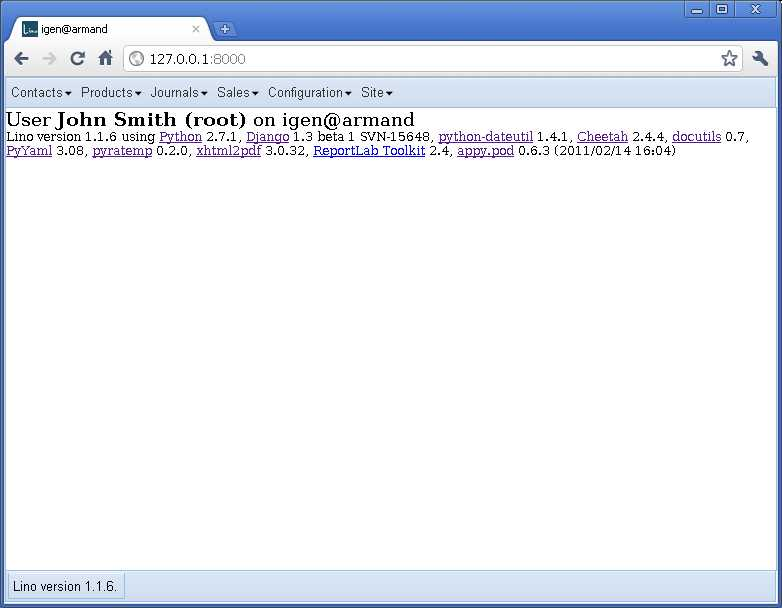

========
20110308
========

A Qooxdoo User Interface for Lino
=================================

The final goal is that you simply change 
the value of your local 
:setting:`ROOT_URLCONF` from 
``'lino.ui.extjs.urls'`` 
(currently the only allowed value)
to ``'lino.ui.qx.urls'``.
Lino would do the rest for you. 

But there is some work to do before we get there.

Step 1 : The Qooxdoo application "Lino"
---------------------------------------

I started to write a standalone 
Qooxdoo application called "Lino". 
The code is here:
:srcref:`/lino/lino/ui/qx/app`.

This application currently doesn't do very much:
it just issues an AJAX call to request the main menu, 
which it then uses to actually build and show the menu.
The menu items are correctly shown, 
but they currently don't do anything.

.. |qx| image:: 0308a.jpg
  :scale: 40

  
=======  ========
Qooxdoo  ExtJS
-------  -------- 
|qx|     |extjs|
=======  ========

And that's enough for the moment. 
Before going on, we must solve another problem:
how to get our Qooxdoo application 
integrated into the Django server?

Step 2 : Running a Qooxdoo application on a Django server
---------------------------------------------------------

Here is how I do it for the moment.
Unfortunately I need to do a :command:`generate.py build`
each time I want to test a code change.
See :doc:`/tickets/30`

   
#.  On the development server I have in my 
    :srcref:`urls.py </lino/lino/ui/qx/urls.py>`::

      if False and settings.DEBUG:
          # doesn't yet work.
          QXAPP_PATH = os.path.abspath(os.path.join(os.path.dirname(__file__),'app','source'))
      else:
          QXAPP_PATH = os.path.abspath(os.path.join(os.path.dirname(__file__),'app','build'))
      QX_PATH = "L:/snapshots/qooxdoo/qooxdoo",
          
      prefix = settings.MEDIA_URL[1:]
      assert prefix.endswith('/')
      
      urlpatterns += patterns('django.views.static',
      (r'^%sqxapp/(?P<path>.*)$' % prefix, 
          'serve', {
          'document_root': QXAPP_PATH,
          }))
          
      urlpatterns += patterns('django.views.static',
      (r'^%sqx/(?P<path>.*)$' % prefix, 
          'serve', {
          'document_root': QX_PATH,
          }))

    On a production server, I'll create symbolic links in the server's media directory::

      cd /usr/local/django/myproject/media
      ln -s /var/snapshots/lino/lino/ui/qx/app/build qxapp
      ln -s /var/snapshots/qooxdoo-1.3-sdk qx

#.  Here is my index view::

      def index_view(self, request,**kw):
          if False and settings.DEBUG:
              # doesn't yet work.
              QXAPP_ROOT = os.path.abspath(os.path.join(os.path.dirname(__file__),'app','source'))
          else:
              QXAPP_ROOT = os.path.abspath(os.path.join(os.path.dirname(__file__),'app','build'))
          fn = os.path.join(QXAPP_ROOT,"index.html")
          return HttpResponse(file(fn).read())

#.  In file :srcref:`/lino/lino/ui/qx/app/source/index.html`, 
    I manually replaced the line

    ::
      

    by

    ::
      

