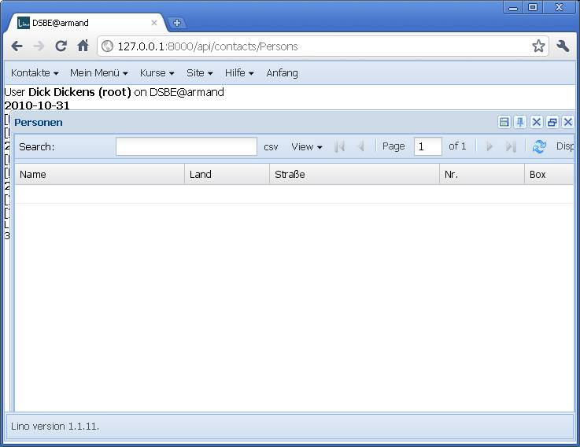
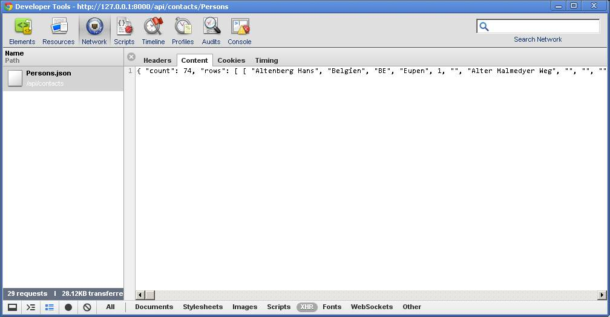

20110503
========

Umstieg ExtJS 3 nach 4
----------------------

Die Anpassungen zum neuen `Ext.data.Model` haben gestern einigermaßen geklappt.
Jedenfalls wird das GET jetzt korrekt rausgeschickt und auch beantwortet.
Ich mach mal ein 
`Check-in
<http://code.google.com/p/lino/source/detail?r=d055c0e969152c664009804bf0f1947c29a067bd>`_,
eher zwecks Archivierung. 

Die nächsten Probleme sind: 

- Die Daten der Grid werden trotzdem nicht angezeigt.   
  Da scheint beim Verarbeiten was nicht zu klappen.
- Das Fenster hat den Close-Button doppelt.
- Das Fenster und ist nicht korrekt positioniert.
- Die Tool-Buttons haben keinen qtip bzw. tooltip.

    
Ja, da steh ich dumm da. 
Keine Fehlermeldungen, aber auch kein korrektes Resultat.
Eine Stunde lang probiere ich es mit dem Compatibility pack, 
aber das kriege ich nicht ans Laufen.

Entsprechend dem Tipp von Brian Moeskau
in seinem `Screencast <http://vimeo.com/23046756>`_
beginne ich nun, meine Klassen auf das neue System (`Ext.define`) 
umzustellen.

:mod:`lino.ui.extjs3`
---------------------

Unterbrechung: ein kleines Release ist nötig in Eupen. 
Also zuerst mal testen, ob :mod:`lino.ui.extjs3` noch funktioniert 
Oho! Funktioniert überhaupt nicht.
Das war aber nur ein ``import``-Statement. 
In Einem hole ich auch hier die beiden kleinen Bugs raus.
Die Variable `USER_INTERFACES` in der :xfile:`settings.py` kann raus.
Und :setting:`USE_GRIDFILTERS` stelle ich wieder auf `True`.

Trotzdem habe ich jetzt noch 
"Uncaught TypeError: Object #<Object> has no method 'reg'".
Als wäre die Version 4 doch noch irgendwo aktiv.