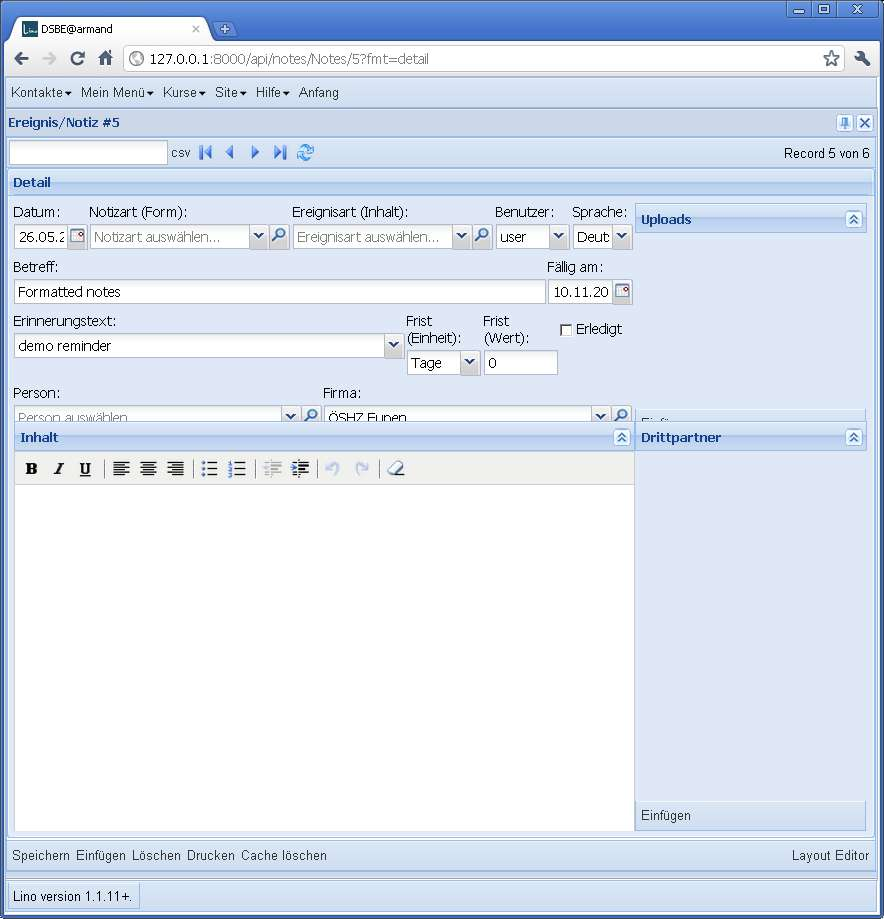
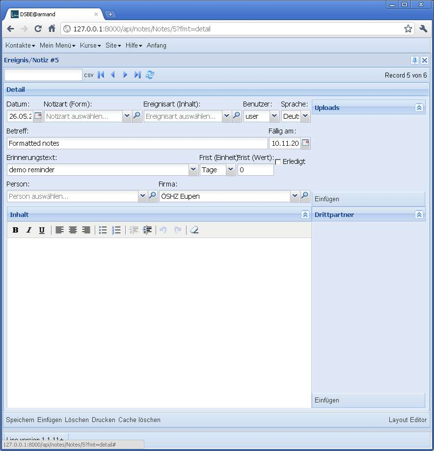
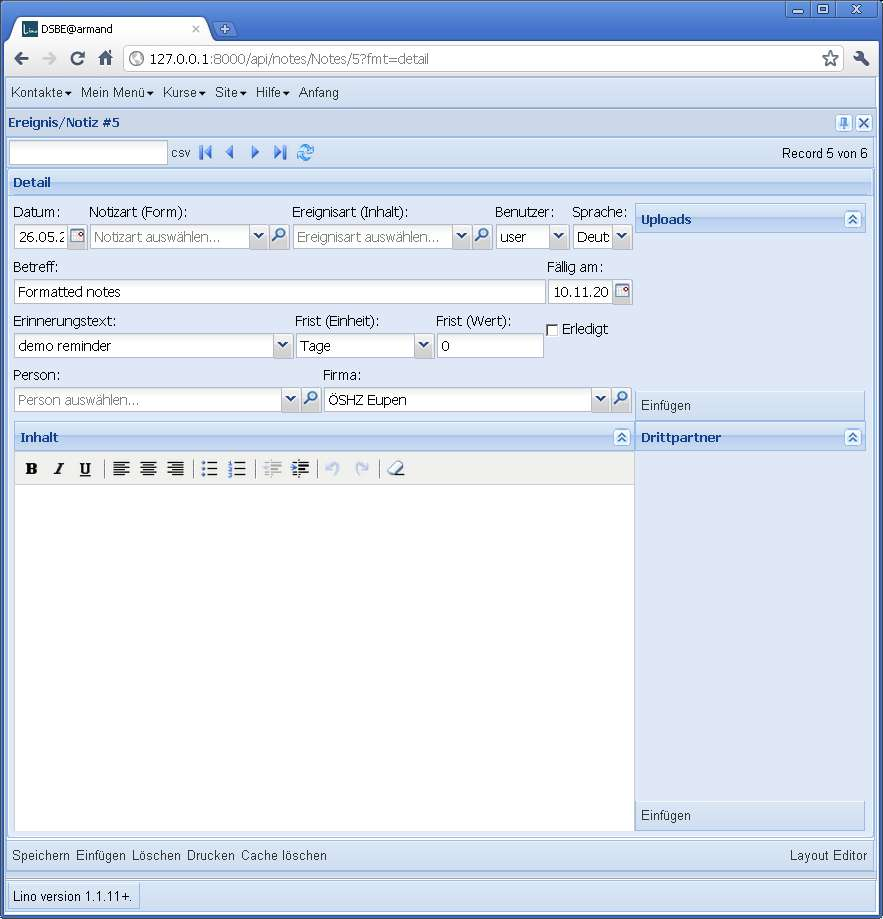
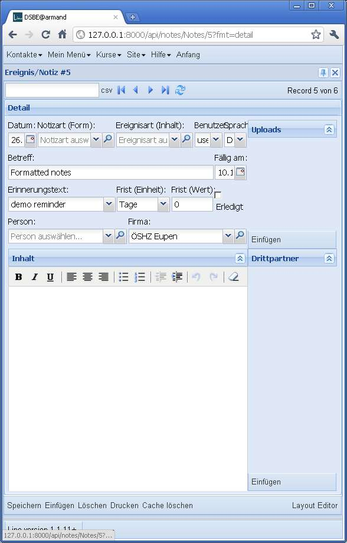

20110603
========

Und doch noch weiter am WYSIWYG-Editor
--------------------------------------

Mir ist über Nacht aufgefallen, was noch fehlt: 
die Benutzer, die bisher gewohnt sind, unformatierte 
Notizen zu erfassen, werden sich daran stören dass 
sie nun jedesmal einen Button mehr klicken müssen 
um den Text einzugeben.
Andererseits wollen wir ja eine Lösung für den Fall, 
dass eine Notiz mal länger wird und ausführlich formatiert 
werden soll.
Lösung ist, dass Lino *zwei* Editoren anbietet: 
einen TinyMCE mit nur einer Toolbar im Formular selber, 
und per Klick öffnet sich der Editor im eigenen Fenster.
Also statt eines `Lino.HtmlBoxPanel` mach ich eine neue 
Klasse `Lino.RichTextPanel`.

Ein Layout-Bug weniger
----------------------

Beim Arbeiten am TextFieldPanel fiel mir ein Bug auf: 
wenn das fieldLabel eines Feldes wegen mangelnder 
Breite des Fensters auf zwei Zeilen verteilt wird, 
dann kann das zu falscher Dimensionierung der 
davon abhängigen vflex-Elemente führen. 

    

Im Beispiel links passen die Texte 
"Frist (Einheit)" und "Frist (Wert)" nicht auf eine Zeile.
Rechts das Gleiche, nachdem ich in der :xfile:`lino.css` folgendes eingefügt habe::

  .x-form-item-label{
      white-space: nowrap; 
  }

Zusatzfrage: 
Warum macht Lino das Feld "Erinnerungstext" nicht einfach ein wenig 
breiter? 
Richtig, das wäre ja im obigen Fall eine evidente Umgehung des Problems.

Das kam daher, dass die relative Breite dieser Felder in der 
:srcref:`notes.Note.dtl </lino/apps/dsbe/config/notes.Note.dtl>` 
wie folgt deklariert war::

  left = 
      date:10 type:25 event_type:25 user:10 language:8
      subject:60 reminder_date:10 
      reminder_text:50 delay_type:10 delay_value:10 reminder_done:10
      person company
      
Das ändern wir nach::

      reminder_text:30 delay_type:15 delay_value:12 reminder_done:10
    
Resultat:

Trotzdem ist das `white-space: nowrap;` in der :xfile:`lino.css` 
eine gute Sache, denn auch bei optimaler Proportionierung kann es 
ja immer mal passieren, dass der Benutzer sein Browserfenster 
unerträglich eng macht:

In so einem Extremfall sind doch überlappende Feldbezeichner 
immer noch besser as komplett falsch positionierte Elemente, oder?

Endspurt vor Release 1.1.12
---------------------------

Ich habe mal den Dump eines Kunden runtergeladen und versuche den 
bei mir zu importieren. Dabei stelle ich fest, dass das Problem mit den Babelfeldern, 
das ich am :doc:`0527` gesehen habe (und das inzwischen behoben ist), 
auch im py-Serializer Folgen hatte: alle leeren Babelfleder haben 
dort `None` statt `u''` stehen.

Deshalb muss ich das Dump manuell korrigieren::

  def create_countries_language(id,name,iso2,name_fr,name_en):
      if name_fr is None: name_fr = ''
      if name_en is None: name_en = ''
      return Language(id=id,name=name,iso2=iso2,name_fr=name_fr,name_en=name_en)
      
(Das Gleiche für alle betroffenen Tabellen: 
Language, Country, ContractType, AidType, ExamPolicy...)

Diverse Optimierungen in :mod:`lino.utils.dpy`: 

- im obigen Fall musste ich immer bis ganz zum Schluss 
  warten bevor er eine Fehlermeldung auswarf.  Das war natürlich ärgerlich. 
  Deshalb schaut er jetzt in 
  :meth:`lino.utils.dpy.FakeDeserializedObject.try_save` etwas genauer hin, 
  bevor ein ein misslungenes `save()` wiederholt.
  
- Die Deklarationen `resolve_model` und `create_%s` im dpy-Dump ist jetzt 
  alphabetisch sortiert. Was nützlich ist, wenn man zwei Dumps miteinander 
  vergleichen will. Das war bisher (für Dumps von verschiedenen Versionen) 
  manchmal fast unmöglich, weil die Reihenfolge sich sehr ändern konnte.

- Wenn ich die importieren Daten wiederum exportiere, 
  generiert er jetzt im Dump auch ein Objekt `sites.Site`.
  Beim erneuten Einlesen kriege ich dann 
  "Exception: Failed to save independent Site #1 (example.com). Abandoned."
  Ich schätze mal, dass das daran liegt, dass :term:`initdb` 
  jetzt nicht mehr `reset` sondern `syncdb` und `flush` macht.
  Deshalb ist `django.contrib.sites` jetzt auch aus den :setting:`INSTALLED_APPS` raus.

Kleinkram:

- Die Felder `type` und `event_type` (in :class:`lino.apps.dsbe.models.Note` 
  sowie :class:`lino.modlib.notes.models.Note`) werden jetzt disabled_fields, 
  wenn das Dokument ausgedruckt ist.

- :class:`lino.apps.dsbe.models.Contracts` ist jetzt nach 
  Vertragsnummer sortiert (statt bisher zufällig).
  
- Erfreulich: 5 TinyMCE-Editoren in einer Seite gehen nicht 
  merklich auf die Performance. 
  Also die Memofelder in :class:`lino.apps.dsbe.models.Contract` 
  dürfen ``format='html'`` kriegen.
  
- Aufzählungen werden noch immer nicht gedruckt. Testfall Vertrag Nr 4.