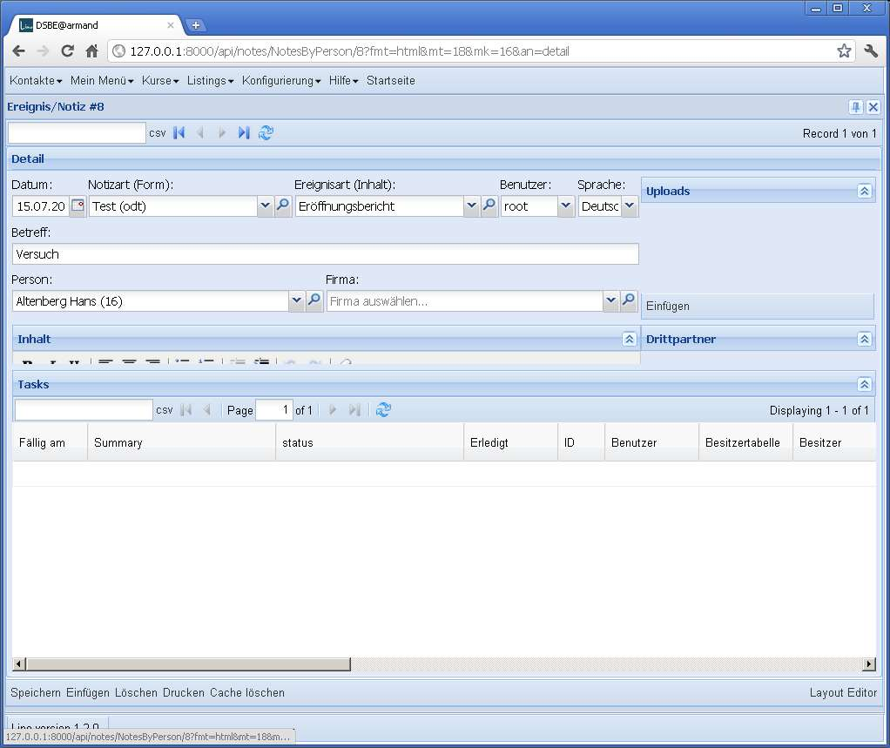
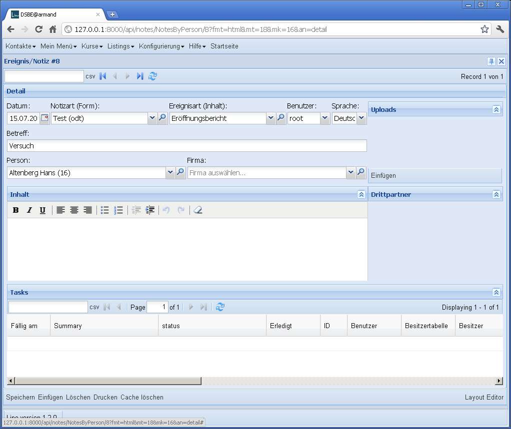

20110715
========

Drei kleine Bugs
----------------

Den ganzen Tag habe ich Jagd auf drei kleine Fehler gemacht.

Der permalink-Button funktionierte nicht. Behoben.

Zweitens. In `notes.Note.dtl` war ein Layout-Problem::

    left = 
        date:10 type:25 event_type:25 user:10 language:8
        subject:60 #reminder_date:10 
        person company
        
    main =
        left uploads.UploadsByOwner
        body:80 thirds.ThirdsByOwner:30
        cal.TasksByOwner

Also das main panel war ein VBorderLayout mit drei Elementen, 
von denen das erste feste Höhe hatte, das die anderen beiden vflex 
waren. Element 2 war ein TextEditor und ein HtmlBox nebeneinander 
(preferred width 5), und Element 3 war einfach ein GridPanel. 
Und die hatte `preferred_height` 30.
Das sah dann so aus:
  

    
Lösung: lino.ui.extjs2.ext_elems.GridElement 
machte ``self.preferred_height = rpt.page_length``, 
das habe ich rausgeholt. 
Grids, HtmlBoxen und TextElements haben also jetzt immer 
eine `preferred_height` von 5, und wenn man die Höhenproportion 
in einer vbox verändern will, muss man in der `.dtl` manuelle Höhen angeben.
  

  
Drittens : der RichTextEditor wurde nicht mehr gespeichert, weil der `name` 
der Feldes nicht gesetzt war. Behoben.
