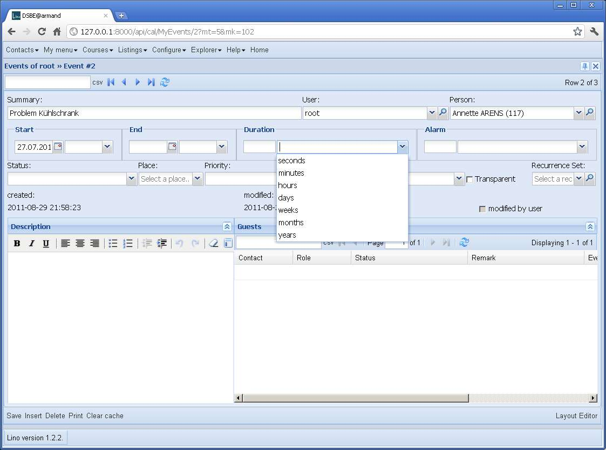
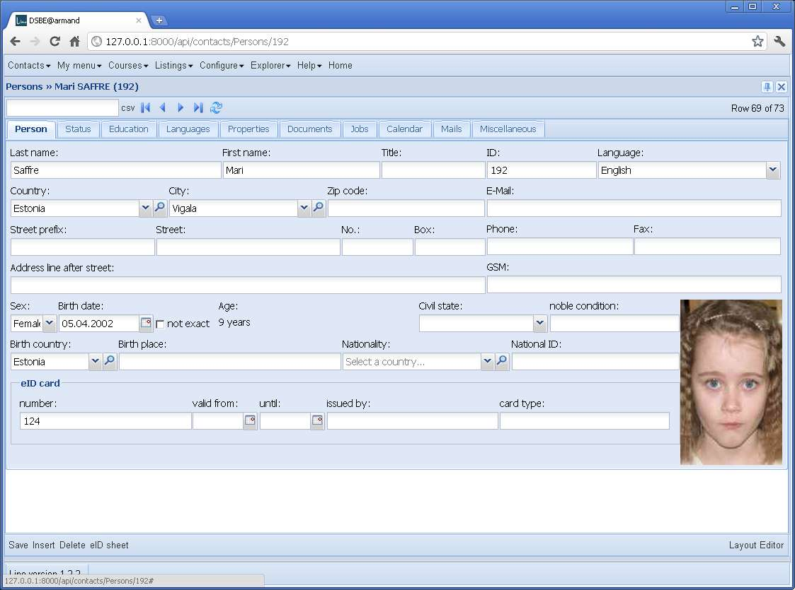

20110829
========

20110829a Export to remote calendars
------------------------------------

Continuing on remote calendars (:doc:`/tickets/47`).
So far Lino can import data from remote calendars, now I'll 
start the opposite direction: modifying an event through 
the Lino must trigger an update of the remote calendar.

Event.save() should not directly update the remote calendar,
just set a status flag to "ready to send" 
because the save should not fail when 
the calendar server has a problem.
Sending the modifications to the calendar server should be 
done by a background process.
:term:`watch_calendars` command can do both directions.

New special model method `on_user_change` gets called each 
time an instance of this model was changed 
(created, modified, deleted) *though a user interface*. 

First success after only one hour of programming!

.. todo::

  Recurring events are not yet handled correctly.
  When modifying a recurring event, Lino must decide 
  whether to modify (1) only this event, (2) this and 
  all future events or (3) all events of the series.
  
  Modifications in a RecurrenceSet are not yet sent back 
  to the calendar server.
  
  Attendees are currently neither sent nor received. 
  
  Google claims "Can only store an event with a newer DTSTAMP" 
  probably because of a timezone misunderstanding.
  
  
20110829b Field Sets
--------------------

Ich hatte eine spontane Vision, wie ich den folgenden 
todo-Punkt lösen kann:

#.  Field groups. Die Felder alarm_value und alarm_unit sollten 
    wirklich gruppiert sein. 
    
Am elegantesten wäre in der Model definition::
    
        alarm = fields.FieldGroup(_("Alarm"),'alarm_value alarm_unit')

Und siehe da, es funktioniert!
Noch nicht zufriedenstellend, aber cool dass das überhaupt so einfach ging.

20110829c Renamed "attendee" to "guest"
---------------------------------------

Google nennt die Teilnehmer eines Termins einfach "Gäste". 
Nicht "attendees" wie im RFC, und auch nicht "participants" 
wie man es oft sieht. Genial.

20110829d makeui
----------------

Ich habe noch nicht rausgefunden, wie ich es schaffe, 
dass :term:`makeui` und :term:`makedocs` für alle 
user interfaces funktionieren können.
Vielleicht muss ich eine neue Konvention beschließen:
dass das in :setting:`ROOT_URLCONF` angegebene Modul außer der 
von Django erwarteten Variablen ``urlpatterns`` 
für Lino auch eine Variable ``ui`` definieren muss. 
Hm... das ist nicht schön...

Oder könnten wir es so machen: in der :xfile:`urls.py` stünde nur::

  from django.conf import settings
  urlpatterns = settings.LINO.urlpatterns

Aber das geht momentan noch nicht, weil kernel.analyze_models 
den parameter make_messages hat...
Lassen wir das mal was reifen...

20110829e Field Sets
--------------------

Lino now offers a way to define fieldsets.
A fieldset is a group of fields that are visually together in an extra box 
than can have a label for the group. The labels of the fields are not displayed by 
default but can optionally be overridden.

This change wasn't trivial because it required a few fundamental internal 
changes in :mod:`lino.ui.extjs3.ext_elems`.

First usage case was the detail of an Event. 
This model has several fields like this::

    duration_value = models.IntegerField(_("Duration value"),null=True,blank=True) # iCal:DURATION
    duration_unit = DurationUnit.field(_("Duration unit"),null=True,blank=True) # iCal:DURATION
    
Now we can add a :class:`lino.fields.FieldSet` below that declaration::

    duration = fields.FieldSet(_("Duration"),'duration_value duration_unit')

Here is the corresponding `.dtl` file::

  main = 
    summary user project 
    start end duration alarm
    status place priority access_class transparent rset
    created:20 modified:20 user_modified  
    description GuestsByEvent

Another example is :attr:`lino.apps.dsbe.models.Person.eid`,
a fieldset that defines labels for its children::

    eid = fields.FieldSet(_("eID card"),
        "card_number card_valid_from card_valid_until card_issuer card_type",
        card_number=_("number"),
        card_valid_from=_("valid from"),
        card_valid_until=_("until"),
        card_issuer=_("issued by"),
        card_type=_("card type"),
        )

