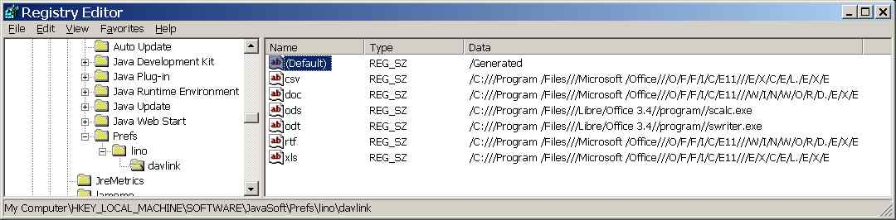

20111023
========

First success with ticket :doc:`/tickets/45`
--------------------------------------------

New files :srcref:`/media/applets/davlink_test.html` and 
:srcref:`/java/davlink/DavLink.java`.
The applet now uses `java.utils.Preferences` to store the paths 
of the applications to launch for each supported document extension.
System administrators can either set these associations 
themselves (using regedit for windows clients... to be documented), 
but usually the applet scans the clients hard disk once when it 
gets invoked the frist time.

Added lines to include the DavLink Applet in 
:meth:`lino.ui.extjs3.ext_ui.ExtUI.html_lines`
Added function `Lino.davlink_open` 
in :xfile:`linolib.js`.

New attribute :attr:`lino.mixins.printable.BuildMethod.use_webdav`
(set to `True` for build methods 
:class:`.rtf <lino.mixins.printable.AppyRtfBuildMethod>`,
:class:`.odt <lino.mixins.printable.AppyOdtBuildMethod>` and
:class:`.doc <lino.mixins.printable.AppyDocBuildMethod>`).

Todo:

- users must confirm a security exception
- regedit displays strange values for the paths:

  