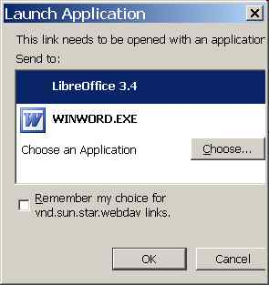

20111025
========

Using custom URL protocol handler?
----------------------------------

Oho, if I have the following links::

  <a href="vnd.sun.star.webdav://test.rtf">test.rtf</a>
  <a href="vnd.sun.star.webdav:/lino/media/webdav/test/test.doc">test.doc</a>
  
then FF asks me:

My decision is save in Firefox's 
:menuselection:`Tools --> Options --> Applications` 
where I can also later change it again.

When I do the same with a fictive protocol ``foofoo:`` ::

  <a href="foofoo://test.rtf">test.rtf</a>
  <a href="foofoo:/lino/media/webdav/test/test.doc">test.doc</a>

The I get another reaction:

HKEY_CLASSES_ROOT\vnd.sun.star.webdav

Found problem with DavLink
--------------------------

The mysterious problem with the DavLink applet was that 
the following exception was not displayed in the Java console::

  [20:45:47.095] uncaught exception: java.security.AccessControlException: access denied ("java.lang.RuntimePermission" "getenv.SystemDrive")

But it was visible in the JavaScript console.
Don't ask me why but after modifying the SecurityManager
to irgnore also this AccessControlException, it works again.
