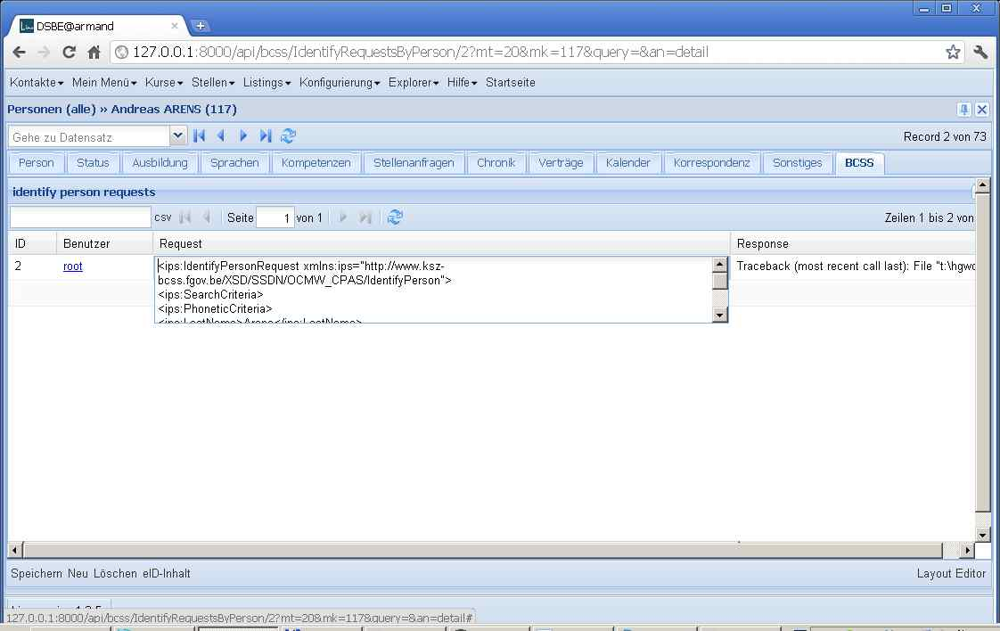
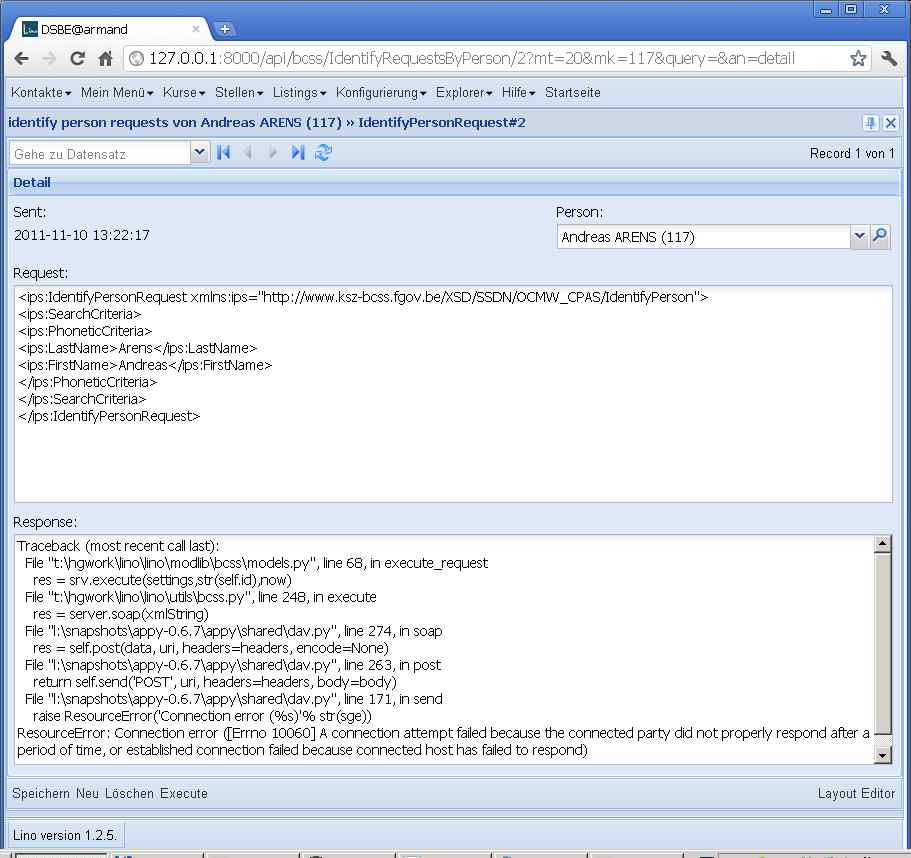

20111110
========

:term:`BCSS` connection (continued)
-----------------------------------

The next step in connection to the :term:`BCSS` is done!
The idea is to have a kind of "BCSS explorer" which serves in a first 
phase to experiment with real requests to the BCSS test server.

Concretely we have now a new model 
:class:`lino.modlib.bcss.models.IdentifyPersonRequest` 
which is a slave of Person and becomes visible as a new tab "BCSS"
in the Person's Detail window.
This tab shows a list of "IdentifyPerson" requests about this person.

  
Users can manually create a request.

For the IdentifyPerson service there's no need for additional user input.
If the Person has her `national_id` field filled, 
the request whill do a *verification* of the personal data,
Otherwise it does a search request on the person's last_name, 
first_name and (if filled) birth_date and gender fields.

When the user clicks on the "Execute" row action, Lino will 

- fill the `request_xml` field with the XML that has been sent
- try a connection to the BCSS server (as configured in :attr:`lino.Lino.bcss_user_params`
  and :attr:`lino.Lino.bcss_soap_url`)
- upon success, write the response's raw XML to `response_xml` field
- if the connection fails, Lino writes the exception traceback 
  into the XML response field

A first test from my workstation failed of course because the 
connection is secured and will work only when run from 
the customers network. :

  
New module :mod:`lino.modlib.bcss`.
Note that this remains separated from :mod:`lino.utils.bcss` 
for people who don't use Lino but want to make BCSS requests using Python).
The docstrings of :mod:`lino.utils.bcss` and :mod:`lino.utils.xmlgen` 
contain a general Lino-independant test suite.

TODO: write also tests for :mod:`lino.modlib.bcss`.

Release in Eupen
----------------

Installed :doc:`/releases/2011/1110` in Eupen.

- Es fehlten noch ein paar Übersetzungen

- Remove "-", " " and "=" from national_id before performing the request.
  Because the length of a NISS appearently must be 11 numeric positions.
  
- The following traceback was not solved by upgradying :term:`appy` to 0.7.0::

    Traceback (most recent call last):
      File "/var/snapshots/lino/lino/modlib/bcss/models.py", line 70, in execute_request
        res = srv.execute(settings,str(self.id),now)
      File "/var/snapshots/lino/lino/utils/bcss.py", line 246, in execute
        server = Resource(settings.LINO.bcss_soap_url,measure=True)
      File "/var/snapshots/appy-current/appy/shared/dav.py", line 142, in __init__
        else: raise 'Wrong URL: %s' % str(url)
    TypeError: exceptions must be old-style classes or derived from BaseException, not str
    
  The bugfix is to replace, in `appy/shared/dav.py`, the following line::

    urlRex = re.compile(r'http://([^:/]+)(:[0-9]+)?(/.+)?', re.I)
    
  by::
  
    urlRex = re.compile(r'http[s]?://([^:/]+)(:[0-9]+)?(/.+)?', re.I)
    
Now I reached the point where I get "An error occurred during the 
parsing of the request header. Please check your message format."
Added a log info message that logs the complete raw XML request.

Now it would be helpful to ask whether the BCSS team can provide 
a more detailed error message.
  
