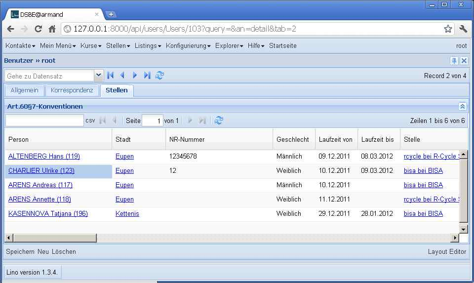

20120109
========

I discovered that my first implementation of the new 
"remote fields"  feature
(part of :doc:`/tickets/54`)
was too simple. Worked another 5 hours to get it running:

  
The screenshot shows fields city, national_id  and gender from 
the Person of each Contract. Remote fields are always 
read-only.

Another nice detail:
ChoiceList fields always had a hard-coded 
default `preferred_width` of 20, which was too much for the 
Gender field, for example.
New class attribute 
:attr:`preferred_width <lino.utils.choicelists.ChoiceList.preferred_width>` 
which is automatically set to the maximum length of the choices 
texts (using default site language). 
Currently you cannot manually force it to a lower 
value than that. And it might guess wrong if the user language 
is not the default site language.

