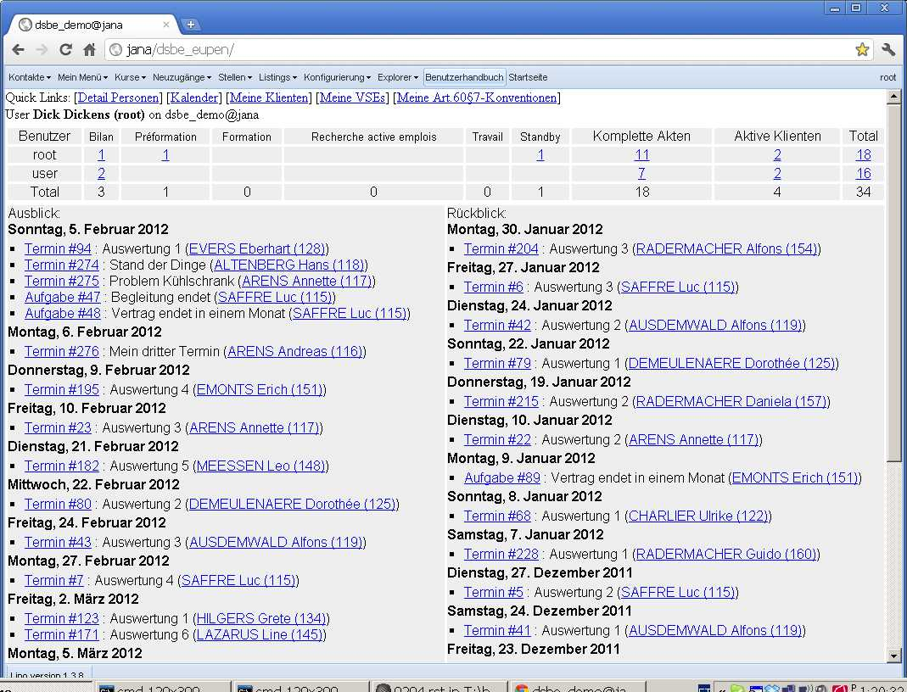
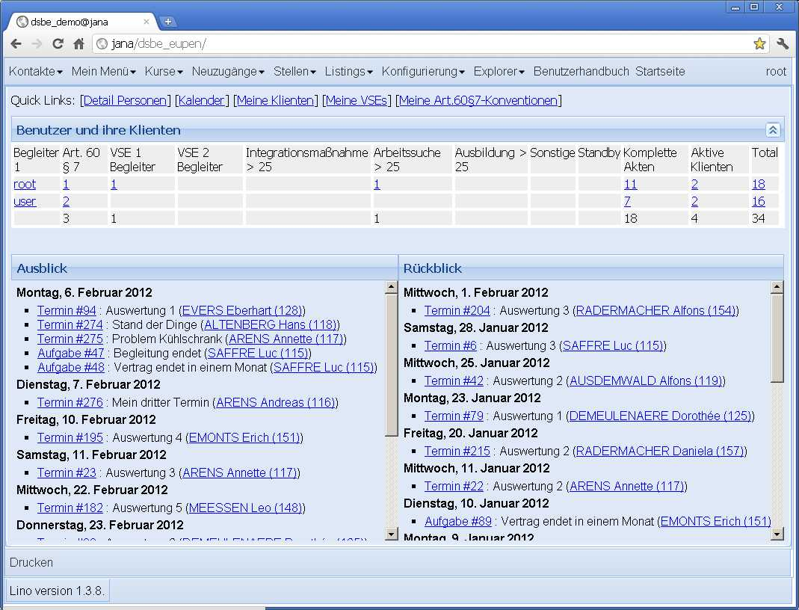

20120204
========

Letzte Bugs
-----------

In der Nacht habe ich die letzten Bugs rausgeholt. Checkin um 4.00 Uhr.

Außerdem war mir aufgefallen, dass die drei Aktionen 
CREATE, UPDATE und DELETE 
nicht für jede Tabelle separat instanziert 
zu werden brauchen.
Von denen gibt es jetzt nur noch eine Instanz, 
die direkt im :mod:`lino.core.actions` 
definiert wird.

Und wieso keine general action für READ? 
Weil wir die bisher nicht brauchen. 
Um zu testen, ob ein READ erlaubt ist, 
nimmt er :attr:`lino.core.actors.Actor.default_action`, 
die (zumindest momentan) pro Actor instanziert wird, 
weil sie ihren Actor kennen muss, 
um den Namen der globalen Handler-Funktion in der lino.js zu generieren.

Außerdem folgende Benutzeranfragen erledigt:

- Fachbereiche Feld “body” kann weg

- Neue Checkbox-Kolonne "Dringend" 
  in :class:`Kursanfragen <lino.apps.pcsw.models.CourseRequest>`, 
  die anzukreuzen ist, wenn der Kurs für die Arbeitssuche benötigt wird.
  Eine Combobox mit konfigurierbarer Auswahlliste wäre auch möglich,
  aber ich warte dazu auf euer Feedback, denn das wäre dann mindestens 
  ein Klick pro Eingabe mehr.

Und somit beginnt der Endspurt vor dem Release 
:doc:`/releases/1.3.8`.

Die 
:func:`Datenmigration <lino.apps.pcsw.migrate.migrate_from_1_3_7>`
war nicht schwer.

Neuer Look für die Startseite
-----------------------------

Am Wochenende habe ich dann noch mal wieder was Unvernünftiges gemacht: 
ich habe die Startseite renoviert.

Ein Bild vorher:

Und eins nachher:

Was mir noch nicht gefällt: die Höhen des Quicklinks-Bereichs und des Panels
  :class:`Benutzer und ihre Klienten <lino.apps.pcsw.models.UsersWithClients>` 
  sollten automatisch ausgerichtet werden. Aber das ist für später. 
  
Notfalls kann der neue Look übrigens durch Auskommentieren einer einzigen Zeile wieder rückgängig gemacht werden.

:doc:`/releases/1.3.8` raus und in Eupen installiert.

Ein Bug, den ich erst nach dem Release entdeckt habe: 
beim *erneuten* Öffnen einer Grid machte er kein Refresh.
Man musste selbst zunächst auf den Refresh-Button klicken.

linolib.js Zeilen 3160ff manuell rauskommentiert::

    //~ if (!this.isVisible()) { 
      //~ console.log('calculatePageSize : not visible');
      //~ return false; }
