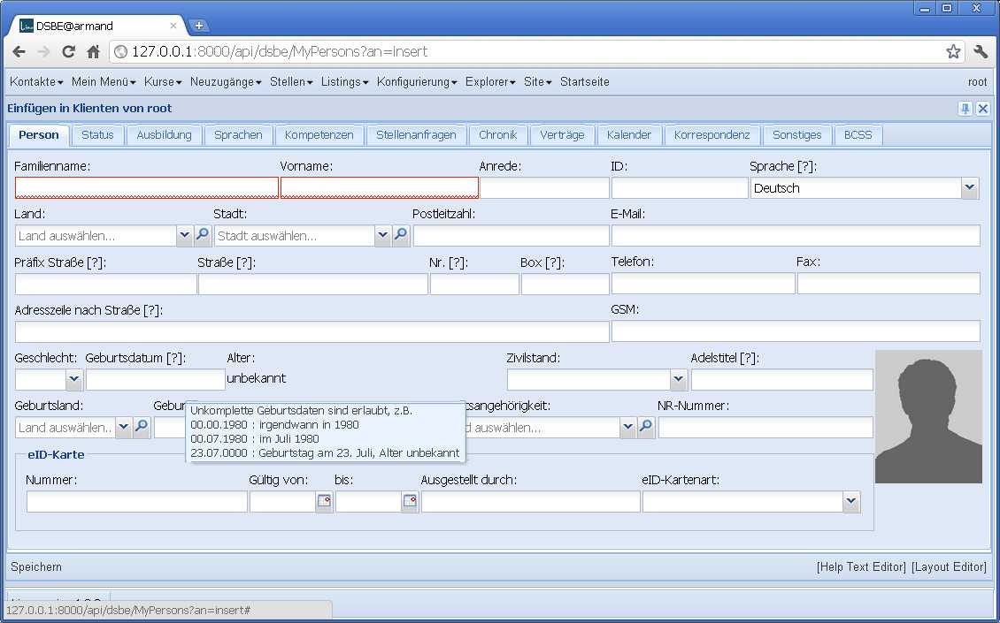
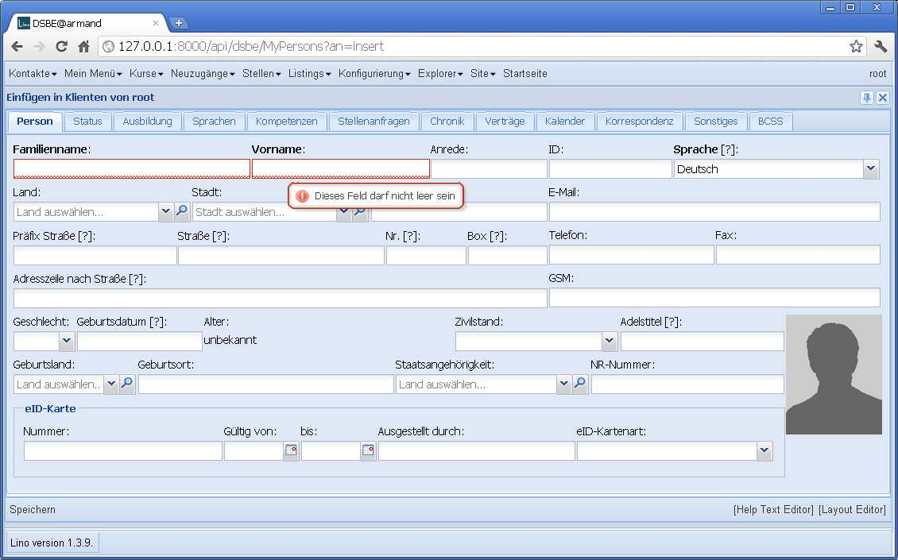
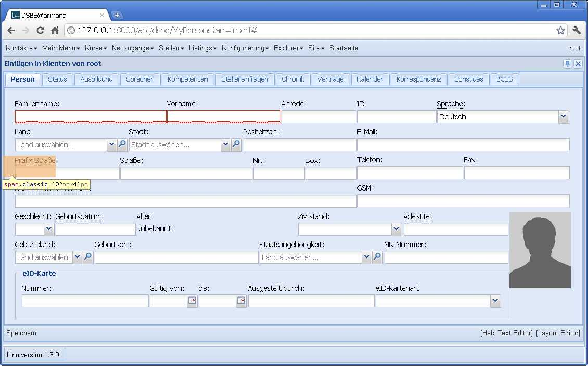
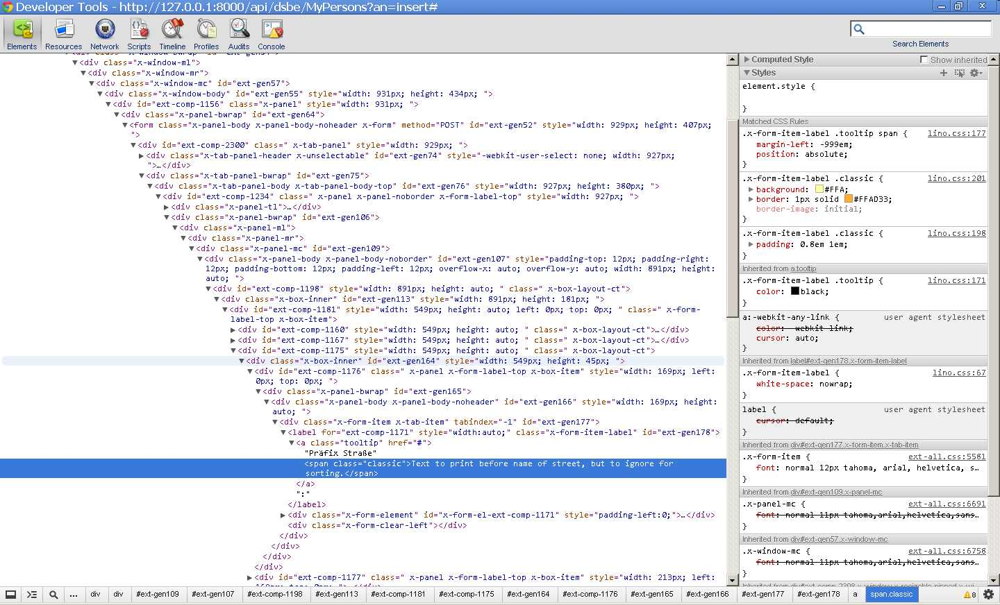

20120214
========

Gerd hat mich auf den Blogeintrag 
`Mark Required Fields in a ExtJS Form
<http://www.marcusschiesser.de/2009/05/mark-required-fields-in-a-extjs-form/>`_
aufmerksam gemacht.

Das hat mich gleich zu folgendem Experiment inspiriert. Erstens 
kriegen die Felder `Name` und `Vorname` einer Person 
mal `blank=False`. Damit nicht die `Sprache` das einzige 
required field ist.

Hier ein Sschnappschuss der momentanen Situation 
(seit gestern macht Lino ein "[?]" hinter die Label der Felder, 
die einen Hilfetext haben):

Stimmt, man kann momentan nicht auf den ersten Blick erkennen, 
dass auch das Feld `Sprache` ausgefüllt sein muss, 
weil es einen Default-Wert hat und deshalb nicht rot 
umrandet ist.
Aber wer auf die Idee kommt, es zu leeren, der kriegt dann auch 
dort den roten Rand zu sehen.
Auch haben alle Felder mit rotem Rand einen Tooltip 
"Dieses Feld darf nicht leer sein".

Hier eine kleine Änderung: die Labels aller obligatorischen 
Felder sind jetzt zusätzlich fett formatiert:

  
Aber selbst das finde ich eigentlich unnötig. 
Das kommentiere ich wieder raus.

Was insgesamt fehlt, ist ein bisschen mehr Freiraum und Struktur.
Das hat aber nichts mit den required fields zu tun,
und die Lösung dafür habe ich noch nicht gefunden.

Hier noch mal die Stelle, bis zu der ich gestern 
mit den `CSS tooltips
<http://sixrevisions.com/css/css-only-tooltips/>`_
gekommen bin.
Der HTML-Code ist scheinbar korrekt, aber weil ExtJS eine 
komplexe Sammlung von CSS rules hat, kommen die 
neuen Anweisungen nicht zur Anwendung.
Die gepunktete Unterstreichung wohl. 
Der Help-Cursor auch.
Aber der eigentliche tooltip nicht.

  

  

Hier ein paar Links:

- :srcref`/media/extjs/lino.css`.
- `z-index <http://de.selfhtml.org/css/eigenschaften/positionierung.htm#z_index>`_

Neue Konfigurationsoption :attr:`lino.Lino.use_quicktips` : 
True bedeutet, dass die Quicktipps von ExtJS benutzt werden 