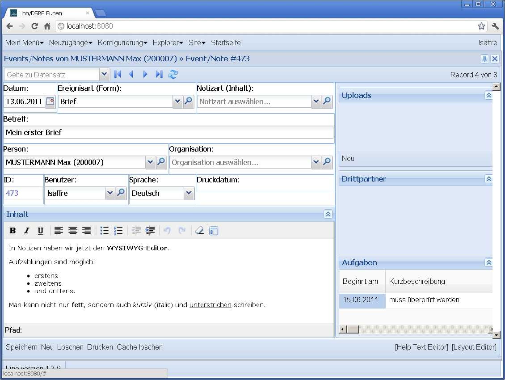
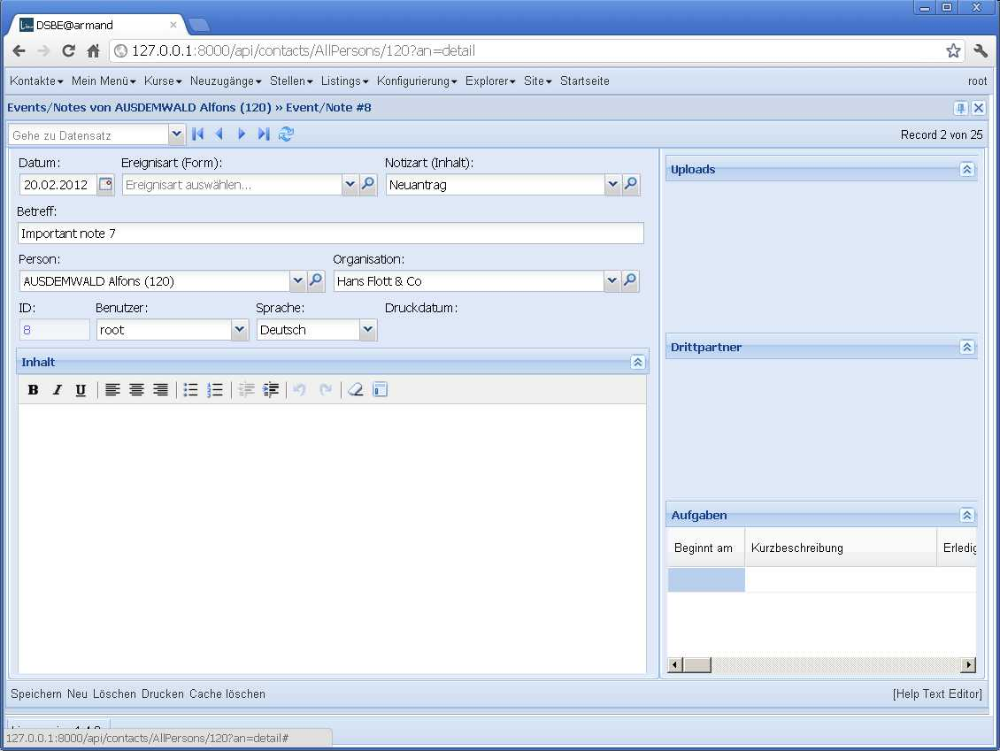

20120217
========

Wednesday I started another avalanche of code changes.
The triggering reason was that we wanted 
to define field sets and their labels in a 
form's layout, not on the model.

Lino was under narcose for two days and now is waking up 
with some fundamental parts replaced by a shiny new approach.
That's why we switch to version 1.4.0.

lino.core.fields.FieldSet has been completely removed 

Detail Layouts are no longer defined in separate `.dtl` files, 
and not even in separate `.py` files, they are just defined 
in the code.

One short-term disadvantage is that the "[Layout editor]" 
button is no longer possible since the definition can 
be more complex and spread across several source code 
files.
But I'm dreaming about a new button "Show Source Code" 
that would open a "Source Code Inspector" with 
optional "Edit" buttons...

Advantages:

- There is now a comprehensible solution for defining labelled field groups

- Using inheritance and writing "intelligent" layouts are now possible.
  Examples are 
  :class:`lino.modlib.jobs.models.JobProviderDetail`
  and
  :class:`lino.apps.dsbe.models.CourseProviderDetail`
  who inherit from
  :class:`lino.apps.dsbe.models.CompanyDetail`.

- For simple cases, e.g. :class:`lino.modlib.notes.models.EventType` 
  it easier to just say::
  
    detail_template = """
    id name
    remark:60x3
    notes.NotesByEventType:60x6
    """
  
  than to create a file :file:`/lino/modlib/notes/config/notes/Note/1.dtl` 
  with basically the same content.

Another side effect is that I finally found a solution for longterm layout bug.
Here is how the detail of a note has been looking "from the beginning":
  

 
Now it finally looks as it always should have :

  
