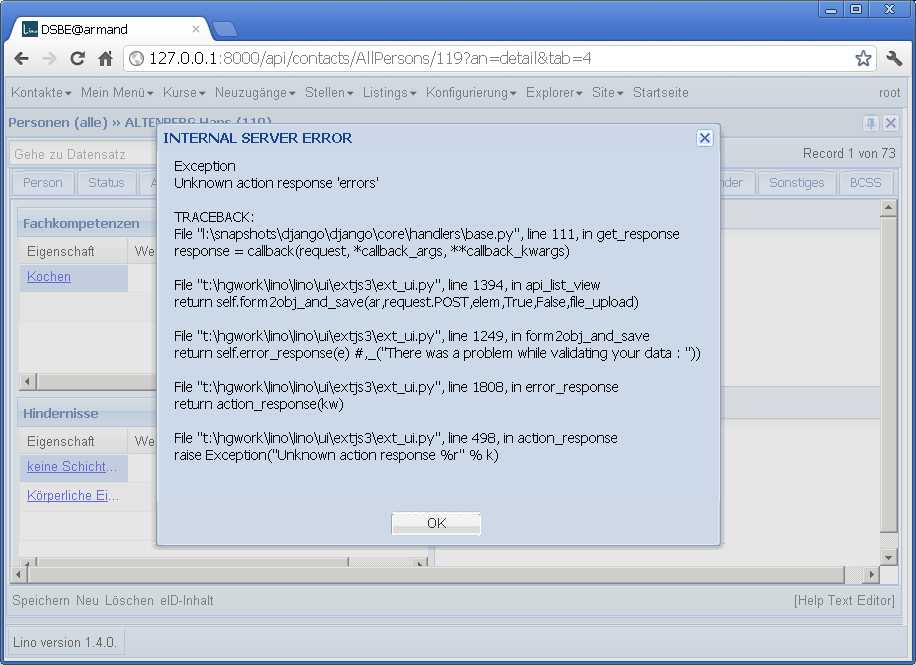

20120218
========

Aufräumen nach der großen Operation: Test-Suite wieder ans Laufen kriegen.

Wenn GridPanel.on_afteredit einen Traceback auf dem Server verursachte, 
dann bekam der Benutzer keine Fehlermeldung, 
sondern seine Grid blieb im Zustand "Bitte warten..." stecken.
Jetzt macht Lino dann eine komplette Meldung.
Mal sehen, sie die Benutzer darauf reagieren, 
wenn sie so einen kompletten Traceback am Bildschirm sehen:

 
Das ParameterPanel wurde noch nicht angezeigt. 

Problem mit der Interaktion von getRowClass und editable.
ContractsSearch, Persons usw. zeigten eine 
Null in allen numerischen Kolonnen der Phantomzeile.
Hatten getRowClass in der viewConfig nicht gesetzt.
Lag daran, dass der Code in js_render_GridPanel_class() 
ungefähr das Gleiche macht wie ext_elems.GridPanel.

Man konnte den Kursanbieter eines Kursangebotes nicht eingeben; 
die Auswahlliste blieb leer, weil der Server dann ein traceback machte::

  AttributeError 'TableRequest' object has no attribute 'queryset'"
  TRACEBACK:
  File "l:\snapshots\django\django\core\handlers\base.py", line 111, in get_response
    response = callback(request, *callback_args, **callback_kwargs)
  File "t:\hgwork\lino\lino\ui\extjs3\ext_ui.py", line 2030, in choices_view
    qs = chooser.get_request_choices(request,rpt)
  File "t:\hgwork\lino\lino\utils\choosers.py", line 165, in get_request_choices
    return self.get_choices(**kw)
  File "t:\hgwork\lino\lino\utils\choosers.py", line 124, in get_choices
    return self.meth(*args)
  File "t:\hgwork\lino\lino\utils\choosers.py", line 222, in wrapped
    return fn(*args)
  File "t:\hgwork\lino\lino\apps\dsbe\models.py", line 1807, in provider_choices
    return CourseProviders.request().queryset

