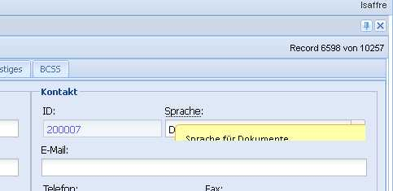

20120224
========

xmlgen
------

Statt was Sichtbares zu produzieren, habe ich die Dokumentation von 
:mod:`lino.utils.xmlgen` aktualisiert...
und auch noch Änderungen hinzugefügt: 

- ANY, CDATA und TEXT sind jetzt ebenfalls Elemente.
- Paradigma für `validate` geändert.
- Neue Methoden 
  :meth:`parse_value <lino.utils.xmlgen.Element.parse_value>` 
  :meth:`badValue <lino.utils.xmlgen.Element.badValue>` 

css tooltips
------------

Hier ein Bild des Problems:

  

Gerd und ich haben jetzt immerhin nachgewiesen, dass es am `overflow` liegt.

Hier der (um unwichtige Informationen bereinigte) HTML-Code::

  

    

      

        

          

            

              

                

                  <label class="x-form-item-label" for="ext-comp-1205" id="ext-gen289">ID:</label>
                  

                    <input type="text" id="ext-comp-1205" class="x-form-text x-form-field x-form-num-field x-item-disabled">
                  

                  

                

              

            

          

          

            

              

                

                  <label class="x-form-item-label" style="width:auto;" for="ext-comp-1202" id="ext-gen291">
                    <a href="#" class="tooltip">SpracheSprache für Dokumente</a>:
                  </label>
                  

                    

                      <input type="hidden" id="ext-gen294" name="languageHidden" value="de">
                      <input type="text" name="language" id="ext-comp-1202" class="x-form-text x-form-field">
                      
                    

                  

                  

                

              

            

          

        

      

    

  

For ``div`` tags:

  x-panel 
  x-panel-noborder
  x-panel-bwrap
  x-panel-body 
  x-panel-body-noheader 
  x-panel-body-noborder 
  x-box-layout-ct
  x-box-inner
  x-form-label-top 
  x-box-item
  x-form-item 
  x-tab-item
  x-form-element
  x-form-clear-left

For ``input`` tags:

  x-form-text 
  x-form-field 
  x-form-num-field 
  x-item-disabled

For ``label`` tags:

  x-form-item-label

But after another few hours of fiddling without success, I give up.

Also tried to set Ext.QuickTips.dismissDelay to 0 as documented: doesn't work.

