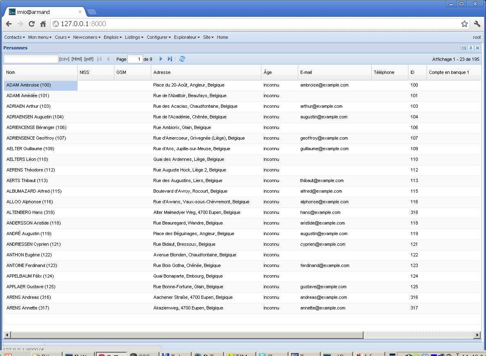
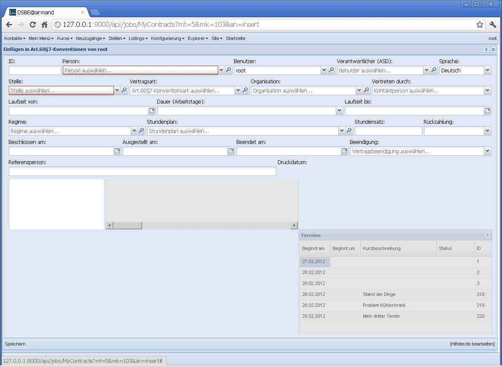
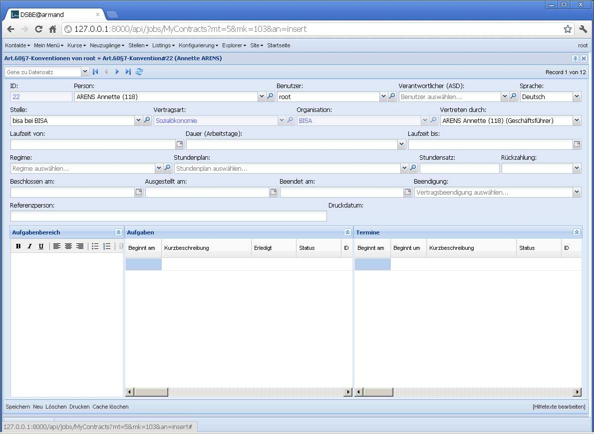
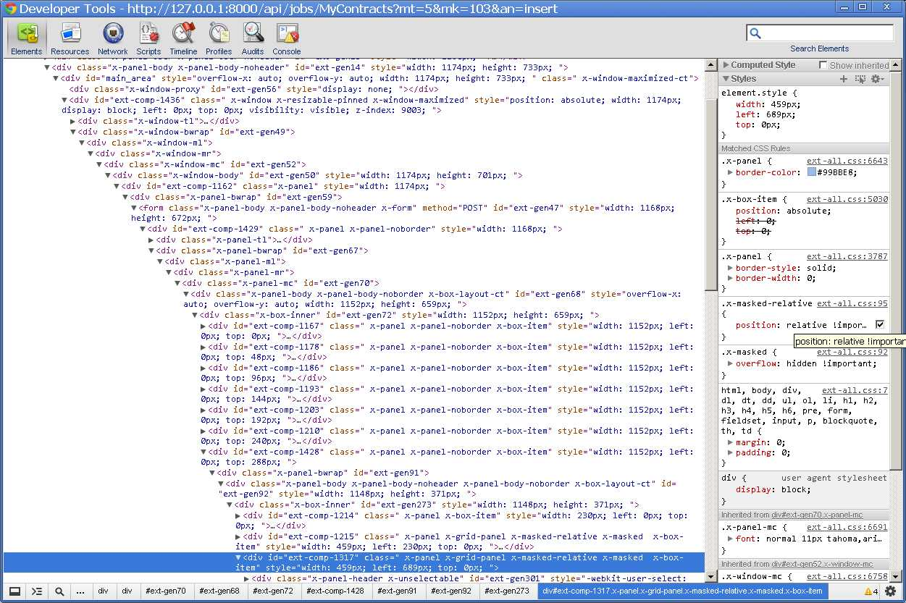
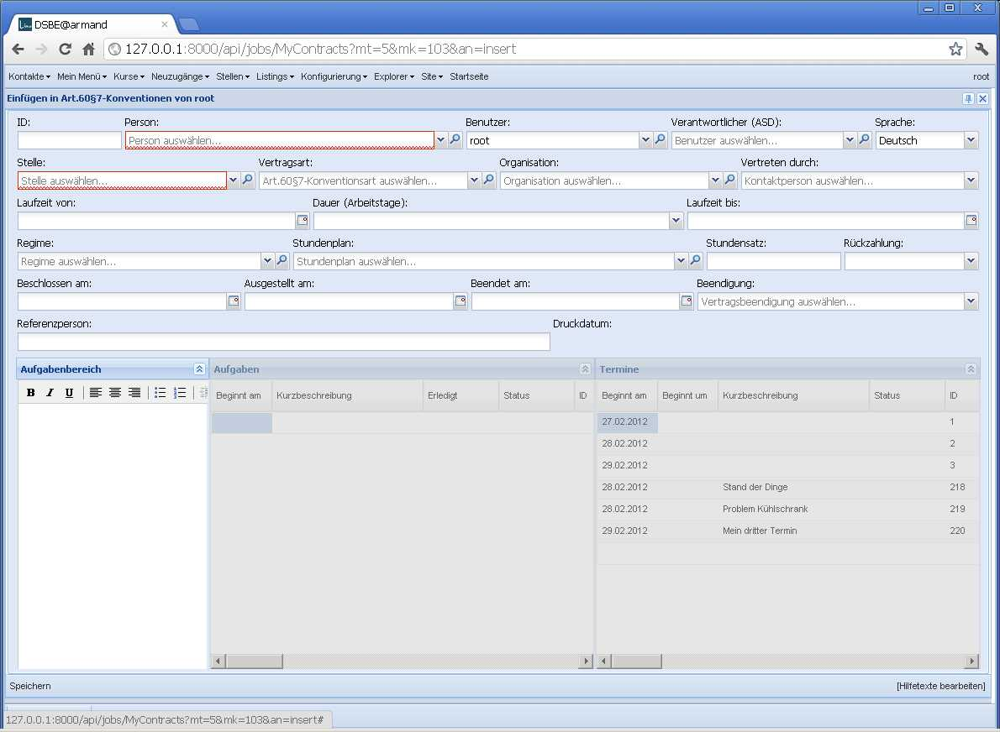
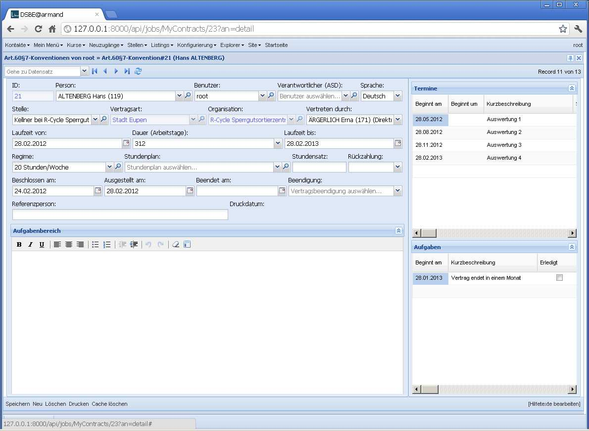

20120228
========

Site de démonstration IMIO
--------------------------

Début des travaux pour un site de démonstration en collaboration 
avec l'`IMIO <http://www.imio.be>`_.
Pour avoir des données de démonstration un peu réalistes, j'ai 
pris une `liste des noms de familles belges <http://www.lavoute.org/debuter/Belgique.htm>`_,
une `liste des prénoms classiques en France
<http://meilleursprenoms.com/site/LesClassiques/LesClassiques.htm>`_
et une `liste des rues de Liège
<http://fr.wikipedia.org/wiki/Liste_des_rues_de_Li%C3%A8ge>`_, 
j'en fais un mix aléatoire pour obtenir 200 personnes fictives habitant 
dans la région de Liège...

  
(Il y a de quoi fignoler: générer également des NISS, des n° de GSM,...)

Voici aussi le code source de cette *fixture* dans le repository de Lino: 
:srcref:`/lino/modlib/contacts/fixtures/demo_fr.py`.

No more `x-masked-relative`
---------------------------

The following effect happens in Lino/DSBE 1.4.2 in the insert window of a 
:class:`Job Contract <lino.modlib.jobs.models.Contract>` (and only there):

  
After clicking `Speichern`, Lino switches to the detail window where the effect 
does *not* happen, although both windows use the same class 
`Lino.jobs.Contracts.FormPanel`:
  

  
The difference is that the two grids in the lower hbox are 
**disabled** in the "insert" version of our FormPanel.

Let's go back to the insert window and inspect those misplaced grids.
Aha. The effect comes because the two disabled grids have 
a css class `x-masked-relative` which sets their 
`position` to "relative":

Manually disabling the rule visibly solves the problem: 

The class `x-masked-relative` is defined in :file:`core.css` 
and does nothing else than overriding that
`position` property to "relative"::

  .x-masked-relative {
      position: relative !important;
  }

Why do disabled panels have a class `x-masked-relative`?
Can I tell ExtJS to not use it? 
It is applied to elements during the `mask()` method, when 
their position was "static"::

  mask : function(msg, msgCls) {
      ...
      if (!(/^body/i.test(dom.tagName) && me.getStyle('position') == 'static')) {
          me.addClass(XMASKEDRELATIVE);  // 20120228
      }
      ...
      mask = dh.append(dom, {cls : "ext-el-mask"}, true);
      ...      
      return mask;
  },

When I remove the 
``me.addClass(XMASKEDRELATIVE)`` instruction 
in above `Ext.Element.mask()`, everything seems to work fine.
The future will tell us whether this hack causes side-effects.

Since I don't want to tell every Lino user to patch their ExtJS sources, 
I overwrite that method in :xfile:`linolib.js`.

But what was the purpose of that operation? 
Why does the css class `x-masked-relative` exist? 
I have no idea...

Independently of that problem, I modified the general layout 
of that FormPanel after this :

  

Und noch ein Bug
----------------

Hackerzacker, kaum habe ich nach fast zweistündigem Wursteln obigen Bug gelöst, 
finde ich noch einen. Diesmal im Kalender-Panel und in meinem eigenen Code. 
Für die Benutzer sah es so aus, dass das Popup-Fenster zum Einfügen eines 
Termins sich nicht schloss, wenn man bestätigte.
Lag daran, dass 
:meth:`lino.modlib.cal.models.ExtAllDayField.set_value_in_object`
selber ein `save()` aufrief.

Preparing to release 1.4.3 
--------------------------

:func:`lino.apps.dsbe.migrate.migrate_from_1_4_2`

Zwischendurch auch noch ein ganz einfacher Bug:

- Wenn man einen Kolonnenfilter setzte, kam auf dem Server ein Traceback
  "global name 'json' is not defined"
  
Und dann wollte ich eigentlich endlich die strenge Version des 
:class:`OverlappingContractsTest <lino.modlib.isip.models.OverlappingContractsTest>`
aktivieren, aber dann fand er doch noch eine ganze Serie von 
Beanstandungen bei Datenimport.
Wieso denn das? 
Die Datenkontrollliste war doch leer?
Tilt! Die Datenkontrollliste zeigte nur deshalb keine Fehlermeldungen an, 
weil die Antwort des Servers mehr als 30 Sekunden brauchte.
Das ist der Defaultwert für `Ext.Ajax.timeout`
(ein Parameter, den ich gerade erst entdeckt habe).
Statt den Timeout jetzt einfach zu erhöhen, sollte ich wohl besser mal 
überlegen, wie Lino solche längeren Prozesse verwalten sollte. 
Es gibt ja den `Ext.ProgressBar`.
Jedenfalls bleibt der 
:class:`OverlappingContractsTest <lino.modlib.isip.models.OverlappingContractsTest>`
zunächst mal noch in der 
Datenkontrollliste.

Et voilà: released :doc:`/releases/1.4.3`.