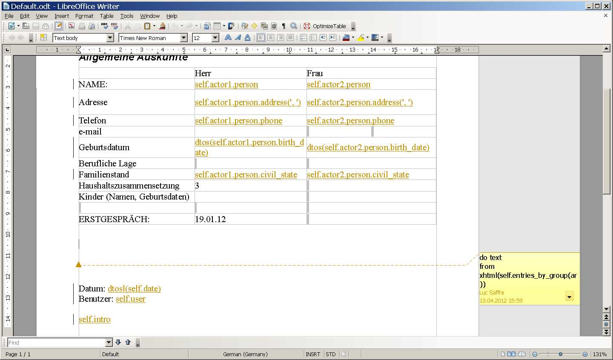
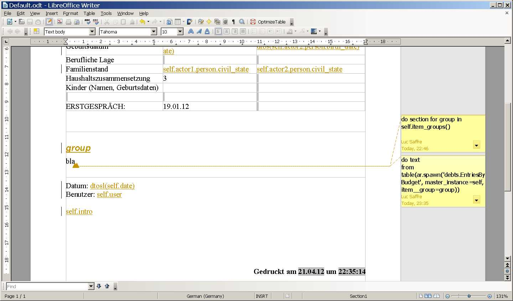
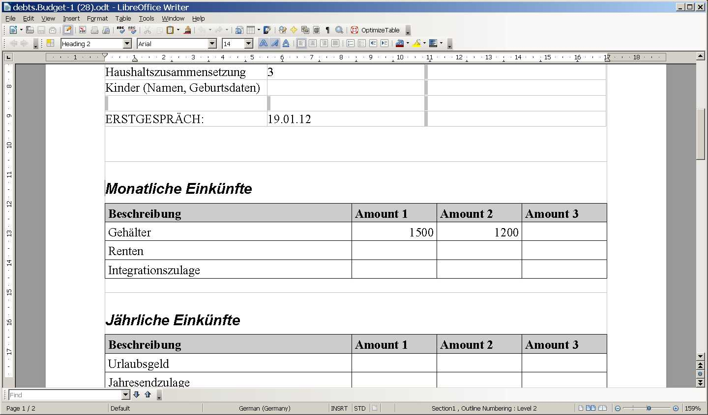

20120421
========

How to generate chunks of ODF XML
---------------------------------

(Continued from :doc:`yesterday <0420>`).

I rewrote :meth:`lino.utils.appy_pod.Renderer.insert_table` 
completely so that now it uses :mod:`lino.utils.xmlgen.odf`
to generate the chunks. 

See the source at :srcref:`/lino/utils/appy_pod.py`.

- Don't just compare the number of lines with yesterday's snippet:
  `insert_table()` has become much more sophisticated 
  since I also started to use more automatic styles to get a 
  decently formatted table). 

- The code using :term:`ODFPy` remains more beautiful,
  at least for the moment...  one day I'll maybe start
  `Using custom Element classes in lxml 
  <http://lxml.de/element_classes.html>`_
  to make :mod:`lino.utils.xmlgen.odf` more elegant.
  But that's not really a priority since Lino application 
  developers won't need to struggle with this code.
  

So yes, it seems that :term:`ODFPy` won't get it into Lino.
My :doc:`first impression <0414>` turned out to be wrong.
It is possible to *not* use :term:`ODFPy`, 
and I *will* do it because it is one dependency less for Lino. 

I remain open to the idea of getting back to ODFPy 
in case it turns out that Søren continues to maintain ODFPy,
because my method is not as beautiful and because :term:`lxml` 
has a disadvantage of not playing well with mod_wsgi in certain 
configurations (see :doc:`0407`).

:checkin:`c7fdd9107495`

Continued with debts.Budget template
------------------------------------

Internal changes: 
The actor of ActionRequests and TableHandles was internally still stored in an attribute `report`.
Changed to `actor`.
Renamed ActionRequest.spawn_request to :meth:`spawn <lino.core.actions.ActionRequest.spawn>`.

Adapted the default template to the new possibility.
Here  is how it looked before:

  
An `entries_by_group` method (see :doc:`0413`) is no longer necessary.
Here is the new template:

And a result (where the important evolution against 
:doc:`last week  <0413>` is the formatting of tables):

:checkin:`a37aa3269612`.

