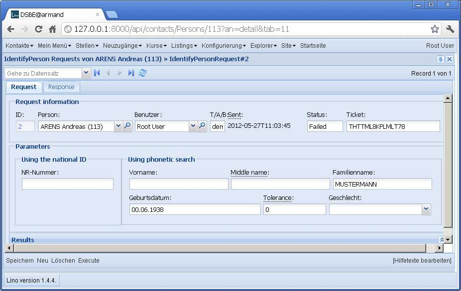
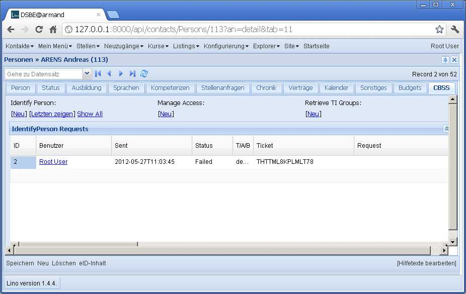

20120527
========

Oops, Lino hatte einen auffallenden Bug, der mir aber jetzt erst aufgefallen ist: 
das Detail einer Person zeigte das Detail des Partners.
Das lag an :meth:`lino.core.actors.Actor._collect_actions`. 
Die `detail_action` und `insert_action` müssen für jeden Actor eigens instanziert werden

Und noch ein subtiler Bug: 

  
Jetzt ist es richtig:

`lino.ui.extjs3.ext_elems.DisplayElement` muss das Ext.form.displayField 
mit einem Defaultwert von `` ``
generieren, denn in einem Layout wo nur solche Felder in einer Zeile stehen,
gibt er ansonsten beim Rendern die falsche Höhe an, so dass das GridElement 
sich zu viel Platz einnimmt. Das Ganze passiert nur dann, wenn wir den Bildschirm 
über den permalink laden.

Zur eigentlichen Sache. Der `[Add]`-Link dort unter :guilabel:`Manage Access` hat folgende URL::

  javascript:Lino.cbss.ManageAccessRequestsByPerson.insert_action(null,{ "data_record": { "phantom": true, "data": { "sector": 0, "statusHidden": null, "last_name": "", "national_id": "", "response_xml": "", "result": "", "id_card_no": "", "actionHidden": null, "id": null, "first_name": "", "query_registerHidden": null, "sis_card_no": "", "query_register": null, "userHidden": 2, "personHidden": 113, "environment": "", "disabled_fields": {  }, "start_date": null, "sent": null, "status": null, "end_date": null, "disable_editing": false, "birth_date": "", "user": "Root User", "ticket": "", "person": "ARENS Andreas (113)", "action": null, "purpose": 0 }, "title": "ManageAccess Requests von ARENS Andreas (113)" }, "base_params": { "mt": 20, "mk": 113 } })
  
Was ich da vermisse, sind die Defaultwerte für last_name, first_name, query_register usw. 
Das kommt daher, dass ich die in einer `on_create` setze. 
Aber on_create ist gefährlich, weil man Vererbung selbst regeln muss. 
Sie kann ja kein `super()` rufen, weil Model so eine Methode nicht hat.
Lino rief dann die on_create von AutoUser auf und die NISS.on_create blieb ungerufen.
Also `on_create` ist eine lästige Mausefalle, aber ich sehe momentan 
keine bessere Lösung. Ist auch nicht so dringend.

  javascript:Lino.cbss.ManageAccessRequestsByPerson.insert_action(null,{ "data_record": { "phantom": true, "data": { "sector": 0, "statusHidden": null, "last_name": "Arens", "national_id": "", "response_xml": "", "result": "", "id_card_no": "", "actionHidden": null, "id": null, "first_name": "Andreas", "query_registerHidden": null, "sis_card_no": "", "query_register": null, "userHidden": 2, "personHidden": 113, "environment": "", "disabled_fields": {  }, "start_date": null, "sent": null, "status": null, "end_date": null, "disable_editing": false, "birth_date": "", "user": "Root User", "ticket": "", "person": "ARENS Andreas (113)", "action": null, "purpose": 0 }, "title": "ManageAccess Requests von ARENS Andreas (113)" }, "base_params": { "mt": 20, "mk": 113 } })

Ein anderes Problem ist die Tatsache, das der `default`-Wert meiner 
:class:`ChoiceListField <lino.utils.choicelists.ChoiceListField>` 
offenbar ignoriert wird. Bei näherer Untersuchung sehe ich, dass 
wenn ein Feld einen `default` hat, Django diesen bei der Instanzierung 
des Models *in einen String umwandelt*::

    def get_default(self):
        """
        Returns the default value for this field.
        """
        if self.has_default():
            if callable(self.default):
                return self.default()
            return force_unicode(self.default, strings_only=True)
        if (not self.empty_strings_allowed or (self.null and
                   not connection.features.interprets_empty_strings_as_nulls)):
            return None
        return ""

    def force_unicode(s, encoding='utf-8', strings_only=False, errors='strict'):
        """
        ...
        If strings_only is True, don't convert (some) non-string-like objects.
        """
        ...
        if strings_only and is_protected_type(s):
            return s
            
    def is_protected_type(obj):
        return isinstance(obj, (
            types.NoneType,
            int, long,
            datetime.datetime, datetime.date, datetime.time,
            float, Decimal)
        )
            
Der `default`-Wert meiner Felder ist nun aber eine 
:class:`lino.utils.choicelists.BabelChoice`-Instanz,
Django kennt die nicht und ruft folglich deren unicode() 
auf. Doof. Also auch z.B. eine Model-Instanz könnte man 
nicht als default-Wert angeben. Wie die Django-Entwickler 
auf *diese* Idee  kamen, ist mir unklar. 
Und so wie ich die kenne, werden sie wohl kaum was daran ändern.
Interessanterweise macht er das `force_unicode()` *nicht*, 
wenn `default` ein *callable* ist.

Workarounds:

- Ich setze keinen default-Wert, sondern fülle das Feld in 
  meiner `on_create`.
  
- Ich mache :class:`lino.utils.choicelists.BabelChoice` callable::

    def __call__(self):
        return self

Beide Workarounds funktionieren, und ich entscheide mich bis auf 
Weiteres für den Zweiten. Bin zwar noch nicht sicher, ob das nicht 
Nebenwirkungen hat. Aber das scheint mir eleganter.

Miscellaneous:

- Moved :class:`ChoiceListField <lino.utils.choicelists.ChoiceListField>` 
  from :mod:`lino.core.fields`
  to :mod:`lino.utils.choicelists` because that's the only module which uses it directly.
  
  