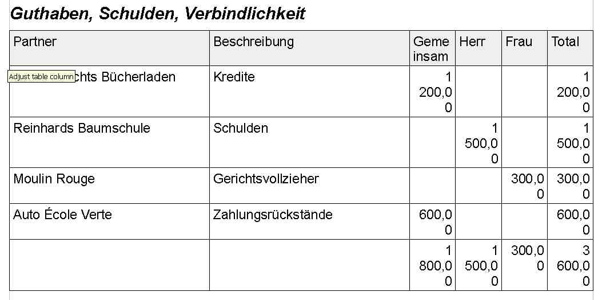
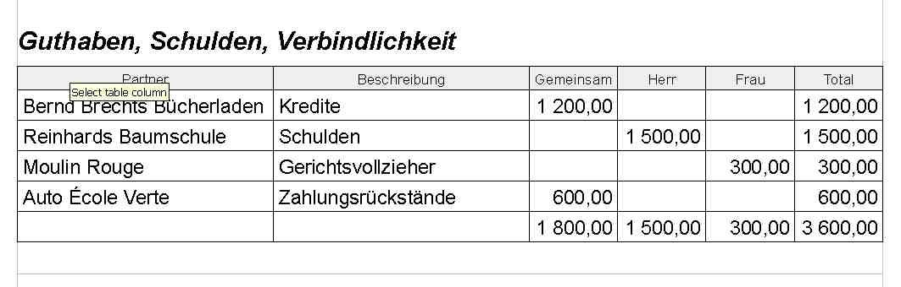

20120611
========

Die Auswahlliste von Sprachen (aller Sprachen) ist jetzt alphabetisch sortiert.

Alle Partner: Ankreuzfeld "is ein Haushalt" muss heißen "isT ein Haushalt".

Systemverwalter sind solche mit `UserLevel.manager` 
(im allgemeinen Feld `User.level`). 
`UserLevel.expert` 
wird momentan in der Praxis nicht gebraucht und kommt vielleicht irgendwann ganz weg.

Only System admins may change the `User.profile` field. 
Normal users cannot even change their own profile.

Diverse kleinere Layout-Probleme beim Ausdruck eines Budgets. 
Vorher:

  
Nachher:  
  

Die Formatierung der Tabellenkolonnentitel war subtil. 
Ich benutze dazu einen Style mit dem displayName 
"Table Column Header". 
Weil es so einen Style normalerweise nicht gibt, 
erstellte :meth:`lino.utils.appy_pod.Renderer.insert_table` 
sich den bisher immer einfach. 
Aber was ist, wenn der Benutzer selber sagen will, wie 
Tabellenkolonnentitel formatiert werden sollen?
Logische Lösung: er sorgt dafür, dass ein Style mit diesem Namen 
in der Vorlage existiert. Indem er einen versteckten Paragraphen 
(mit Kommentar "do text if False") mit diesem Style formatiert.
Bevor das aber funktionieren konnte, 
musste :meth:`lino.utils.appy_pod.Renderer.insert_table` 
die bereits im Dokument definierten Styles konsultieren und 
den "Table Column Header" ggf. *nicht* erstellen.

:class:`BudgetSummary <lino.modlib.debts.models.BudgetSummary>` 
druckte zu viele Nachkommastellen, teilte die jährlichen Beträge einmal 
zu viel durch 12, und vergaß alle "andersperiodischen" Einträge 
(mit Werten wie 2, 3 oder 4 für `periods`).
