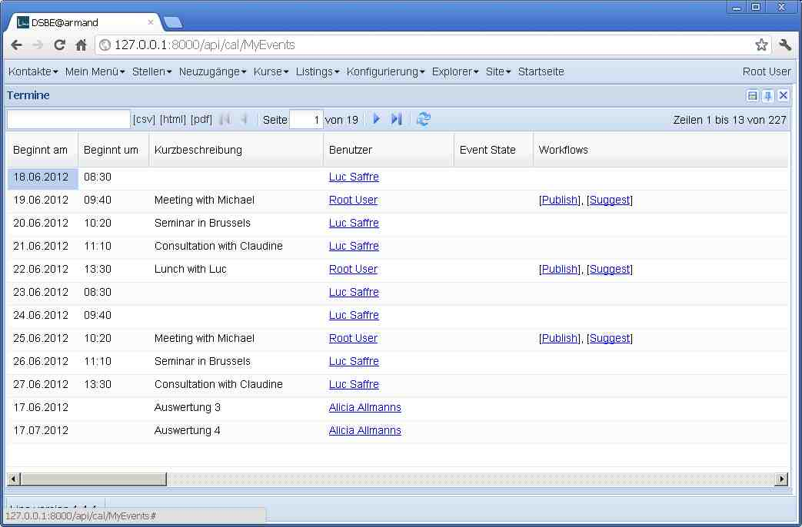

20120618
========

Bua, das mit den Workflows ist komplexer (und interessanter) 
als ich :doc:`Freitag <0616>` gedacht hatte. 
Aber jetzt scheint das Wichtigste zu stehen.
Danke an Gerd, Gaëtan, Joël und Marc für eure beharrliche Geduld.
Kleiner Screenshot als Andenken an den großen Moment:

  
Jede Tabelle kann jetzt ein Attribut 
:attr:`workflow_state_field <lino.core.actors.Actor.workflow_state_field>`
setzen. Dieses Attribute enthält den Namen des Feldes, 
das den Zustand eines Objektes in dieser Tabelle speichert,
der die Workflows regiert.

Solche Tabellen haben dann ein virtuelles Feld 
:meth:`workflow_buttons <lino.core.actors.Actor.workflow_buttons>` 
(die Kolonne "Workflows" im Screenshot oben).

Die Workflow-Regeln kann man einerseits 
programmatisch im Anwendungs-Code definieren, 
indem man die neuen Aktionsparameter 
:attr:`required_states <lino.core.actions.Action.required_states>`
und optional 
:attr:`owned_only <lino.core.actions.Action.owned_only>`
setzt (letztere wird ignoriert, wenn nicht auch 
:attr:`workflow_owner_field <lino.core.actors.Actor.workflow_owner_field>` 
gesetzt ist).
Zum Beispiel die Aktion "Publish" wurde so definiert::

    @dd.action(_("Publish"),
        owned_only=True,
        required_states=['',EventState.draft,EventState.suggested])
    def publish(self,ar):
        print 'TODO: would publish', self
        self.state = EventState.published
        
Andererseits gibt es ein neues Modul :mod:`lino.modlib.workflows`, 
das eine Datenbanktabelle "Workflow Rules" hinzufügt.
In dieser Tabelle kan man lokale Regeln definieren, 
die die anwendungsspezifisch vorprogrammierten Regeln überschreiben.
Dieses Modul ist allerdings eher als Studie zu betrachten, 
denn bisher sehe ich noch keine praktische Anwendung dafür.
Zumindest ist es pädagogisch interessant und gut für Aha-Effekte.

Jetzt fehlt "nur noch der richtige Klick": wenn man auf einen der 
Workflow-Buttons "Publish" klickt, kommt eine Fehlermeldung 
"Uncaught TypeError: Object #<Object> has no method 'publish'".
Das ist logisch weil `Publish` ja keine window action ist.
Aber ich mach hier mal ein Checkin und eine Atempause.
:checkin:`7b887149fc92`.

22.30 Uhr : Voilà, jetzt funktioniert auch "der Klick".

Beim Spielen mit dem neuen Feature kommen noch einige 
Verbesserungen im Modul :mod:`lino.modlib.outbox`.