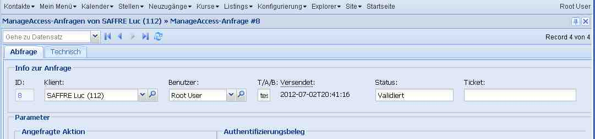
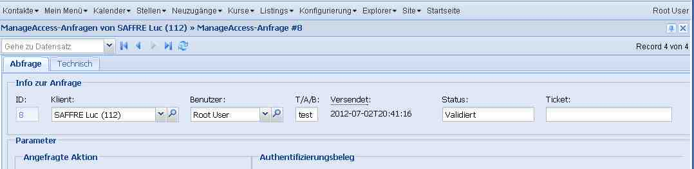

20120702
========

Endspurt vor dem Release
------------------------

- Behoben: vorzeitige Vertragsbeendigung muss man auch in einem 
  ausgedruckten Vertrag noch ändern können.

- Behoben: Wenn man versuchte eine Notiz per E-Mail zu verschicken, 
  und wenn die Notiz für einen Klienten war, der keine E-Mail-Adresse hatte,
  dann kam auf dem Server ein Traceback::
                
    Traceback (most recent call last):
      File "/usr/local/django/test_dsbe/using/lino/lino/ui/extjs3/ext_ui.py", line 1760, in api_element_view
        rv = a.run(elem,ar)
      File "/usr/local/django/test_dsbe/using/lino/lino/modlib/outbox/models.py", line 163, in run
        r.full_clean()
      File "/usr/local/django/test_dsbe/using/lino/lino/modlib/outbox/models.py", line 262, in full_clean
        super(Recipient,self).full_clean()
      File "/var/snapshots/django/django/db/models/base.py", line 832, in full_clean
        raise ValidationError(errors)
    ValidationError: {'address': [u'Dieses Feld darf nicht leer sein.']}

- ManageAccess-Anfragen: [Neu] -> NRNr ist unformatiert.
  Das war Fehlanzeige. 
  Lag daran, dass die Nummer schon in den Stammdaten unformatiert stand. 
  Die NR-Nummern aus TIM werden momentan ja weder formatiert noch validiert.

- (ungemeldeter Bug behoben:) 
  Wenn man das Schnellsuche-Feld in der Listenansicht benutzt hatte, 
  um auf eine Person zu springen, 
  dann in deren Detail den KBSS-Reiter öffnete, so wurden dort keine KBSS-Anfragen 
  angezeigt, auch wenn es deren gab.
  Weil der Suchstring fälschlicherweise an die child requests weitergeleitet wurde.

- Wenn man einen bestehenden MAR (im Detail) dupliziert,
  dann kam "Keine weiteren Records vorhanden. Detail-Fenster wird geschlossen".
  
  Lag daran, dass duplicate() mit `set_status=dict(record_id=))` 
  antwortete, und dadurch wurden mt und mk aus dem Status gelöscht. 
  Die action response `set_status` habe ich also wieder ausrangiert, 
  stattdessen gibt es eine neue Antwort `goto_record_id`.
  

- Bestehenden MAR duplizieren: dann kommt: 
  Keine weiteren Records vorhanden. Detail-Fenster wird geschlossen

Field Level Permission Control
------------------------------

Gedanken über `get_row_permission` und `disabled_fields`.

Für 
:class:`CachedPrintable <lino.mixins.printable.CachedPrintable>`
hatte ich mir ja folgendes ausgedacht::

    def get_row_permission(self,user,state,action):
        """
        Cached printables may not be edited after they have been printed.
        """
        if self.build_time and not action.readonly:
            return False
        return super(CachedPrintable,self).get_row_permission(user,state,action)
      

Aber das war ein bisschen zu viel des Guten, denn z.B. eine 
vorzeitige Vertragsbeendigung muss man auch in einem ausgedruckten 
Vertrag noch ändern können.

Weil `get_row_permission` nur pauschal für den ganzen Record denkt, 
müssen wir das wie bisher über `disabled_fields` regeln. 
Man kann nicht generell sagen, dass alle 
:class:`CachedPrintable <lino.mixins.printable.CachedPrintable>`
readonly werden, bloß weil sie ausgedruckt worden sind.

`disabled_fields` gibt ja
eine Liste von Feldnamen zurück, die auf dem betreffenden Record 
schreibgeschützt sein sollen. 
Das ist natürlich sinnlos, 
wenn durch `get_row_permission` 
schon der gesamte Record schreibgeschützt ist.
Insofern ist dieses System mit einer separaten Method 
`disabled_fields` ein bisschen unlogisch.
Logischer (leichter zu dokumentieren) wäre es, 
wenn wir `get_row_permission` 
ersetzten durch eine Methode 
`get_field_permission(self,user,state,action,field)`.
Aber in der Praxis wäre das 
(1) fies zu warten, 
und (2) technisch uneffizienter.

Also `disabled_fields` ist sozusagen eine 
pragmatische Lösung für *field level permission control*. 

Standard-Anzeigebreite von Feldern
----------------------------------

Es gab noch ein subtiles Layout-Problem, das jetzt eine politisch 
vorbildliche Lösung gefunden hat. 

Betrachten wir folgenden Ausschnitt aus dem Detail eines MAR.
Das Feld "T/A/B" (`environment`) ist deklariert mit `max_length=4. 
Aber in der hier gezeigten Fenstergröße und Auflösung
(das Problem kam nur, "wenn es eng wird")
war es nicht breit genug, um diese vier Buchstaben anzuzeigen:

Ein erster Woraround war, dass ich im Layout die Breite 
manuell auf 5 setze::

  class CBSSRequestDetail(dd.DetailLayout):
      main = 'request technical'
      
      request = """
      info
      parameters
      result
      """
      
      ...
      
      info = """
      id person user environment:5 sent status ticket
      """
      
Ja, das geht... 

... aber es ist nur eine Frickelslösung. 

Lino müsste so was eigentlich automatisch korrekt handhaben.
Das kommt, weil ich in einer hbox die Feldbreiten einfach in hflex-Werten formuliere. 
Das ist zu einfach gedacht. 
Lino ignoriert die Tatsache, dass "große" Felder mehr Spielraum zum Sparen haben. 
Wenn es eng wird, ist es ungerecht, dass die Kleinen
erdrückt werden, während die Großen weiterhin mehr als gut über die Runden kommen. 

In der Welt draußen ist das nicht so leicht zu implementieren, 
aber in Lino benutze ich jetzt `boxMinWidth` um das zu verhindern:

- `CharField` mit `max_length` bis 10 Zeichen (momentan ein hardkodierter Schwellenert) 
  kriegen eine solche `boxMinWidth`.
- `Lino.DateField` und `Lino.IncompleteDateField` haben jetzt ebenfalls 
  (schon in der :xfile:`linolib.js`)
  eine hardcodierten `boxMinWidth`. 
  Der Wert 11 von `Lino.DateField` ist experimentell. 
  Eigentlich sollte es mit 10 auskommen, aber entweder ist meine `Lino.chars2width` 
  nicht ganz richtig, oder ExtJS rechnet den Trigger-Button mit in die `minBoxWidth` 
  hinein.

