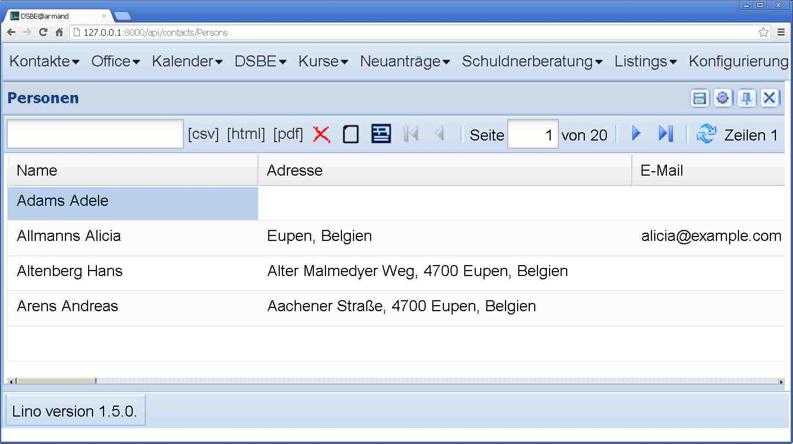

20121020
========

changes and mti
---------------

Voilà: the changes framework now logs changes in MTI children to their master, 
including delete_child and create_child.

get_action_permission
---------------------

Changed signature of :meth:`lino.core.actions.Action.get_action_permission`: 
first argument is an action request, not only a user.
This is necessary for 
:class:`lino_welfare.modlib.newcomers.models.AssignCoach`::

    def get_action_permission(self,ar,obj,state):
        if not pcsw.is_valid_niss(ar.master_instance.national_id):
            #~ logger.info("20121016 %s has invalid NISS ",ar.master_instance)
            return False
        return super(AssignCoach,self).get_action_permission(ar,obj,state)

Wer die Wahl hat, hat die Qual
------------------------------

Momentan gilt die Regel, dass Klienten im Status "Begleitet" 
auch eine gültige NISS haben müssen. 
Klienten (Neuanträge) mit ungültiger NISS können folglich keinem 
Begleiter zugewiesen werden, 
weil sie dadurch in den Status "Begleitet" wechseln würden.

Erste Implementierung dieser Regel war, dass Lino eine 
Fehlermeldung "Kann Klient X mit ungültiger NISS nicht zuweisen"
macht, wenn man es trotzdem versucht.
Aber das ist nicht zumutbar, weil die Meldung erst kommt 
wenn man schon die Begründung ausgefüllt hat.
Folglich muss die Aktion `[Zuweisen]` deaktiviert werden.

Aber auch das ist nicht so super. Wozu brauche ich überhaupt 
eine Liste der eventuell in Frage kommenden Begleiter, wenn der 
Klient noch keine NISS hat.

Neues kleines Feature: wenn get_data_row eine `Warning` raist, 
dann ist die Grid leer und es kommt besagter Text als `emptyText`.
Wird in `ActionRequest.no_data_text` zwischengespeichert.

Gefällt mir!

Die ersten Bilder-Buttons
-------------------------

Samstagabend. Kinder im Bett, Frau unterwegs, da
habe ich mal zum Spaß Icons gemalt: 
ein rotes X für den Delete-Button,
ein unbeschriebenes Blatt für den Neu-Button,
eine Diskette für den Save-Button
und ein Detail-Fenster:

Ich wollte vor allem sehen, ob es überhaupt funktioniert. 
Eure Vorschläge für schönere Buttons sind willkommen!
Und außer diesen braucht Lino noch eine ganze Serie von Buttons!

:srcref:`/media/images/default/grid`
