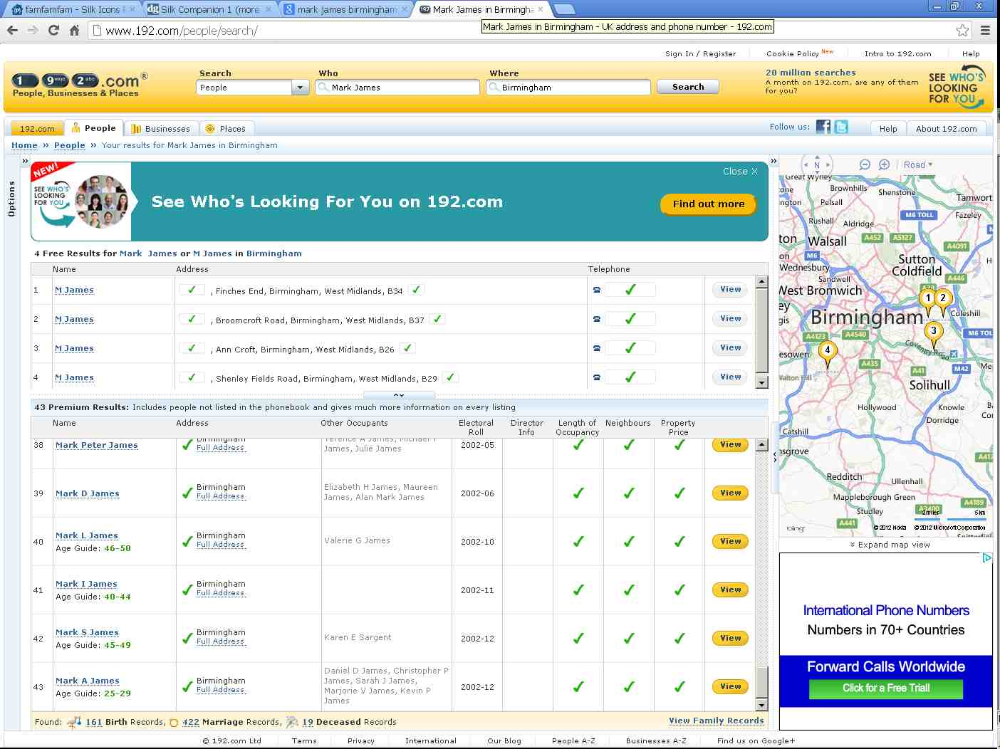

20121027
========

Who is Mark James?
------------------

I tried to say thanks to Mark James, the author of the 
Silk Icons...
but the email address mjames@gmail.com no longer exists.
And oops, according to `192.com <http://www.192.com/people/search/>`
there are about 43 people named Mark James in Birmingham:

  
And Jan Olsen obviously had similar problems, 
already back in 2009, before starting the 
`Silk Icons Evolved <http://code.google.com/p/famfamfam/>`_ project.

When updating my :doc:`/about/thanks` page I noticed that Lino 
included a file `pyuca_allkeys.txt` which is an unnecessary risk 
of having misinterpreted their copyright notice. People how want 
to use international French and Estonian sort 

