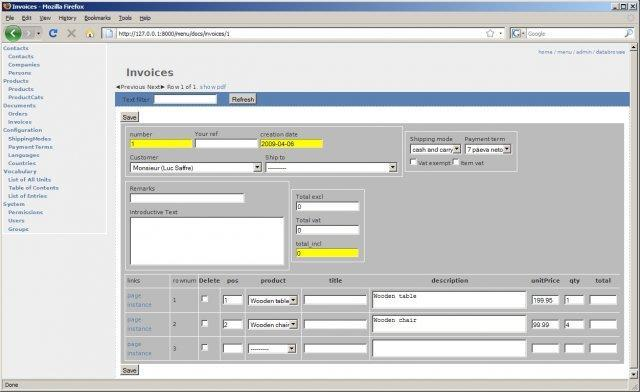
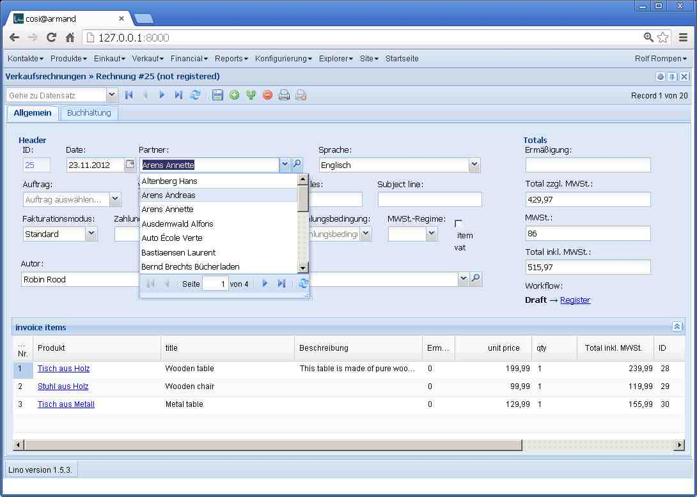

20121212
========

Read Belgian eID card
---------------------

- When the user clicked to read an eid card and the operation 
  failed because there was no card in the reader, this caused 
  a traceback on the server::

    MultiValueDictKeyError
    "Key 'nationalNumber' not found in <QueryDict: {u'an': [u'read_beid']}>"

  This was a simple plain bug in `Lino.list_action_handler` 
  and `Lino.row_action_handler`.

- Another bug:
  Wenn nach Aufruf des Befehls vom Hauptmenü aus ein Klient erfolgreich erstellt wurde, 
  dann wurde das Startfenster geschlossen.
  
- TODO: 
  Wenn Lino nach Aufruf des Befehls vom Hauptmenü aus 
  einen eindeutigen Kunden findet
  und Änderungen vorgeschlägt
  und der Benutzer diese nicht einlesen will (also "Nein" klickt), 
  dann sollte Lino dennoch das Detail-Fenster des gefundenen Klienten öffnen. 
  Eigentlich sollte er das schon tun, bevor er die Frage stellt.
  Ebenso sollte er auch die Erfolgmeldung anzeigen, 
  wenn nach Aufruf des Befehls vom Hauptmenü aus ein Klient erfolgreich erstellt wurde.
  

AJAX Confirmations
------------------

AJAX Confirmations had three buttons: Yes, No and Cancel. 
"No" and "Cancel" did the same, thus "Cancel" was useless.

Note about copyright
--------------------

Which year to include in my copyright notices?
According to Amy Gahran on 
`Copyright notice: Is the year really necessary?
<http://www.contentious.com/2007/01/07/copyright-notice-is-the-year-really-necessary/>`_
the copyright notice must state **The year of first publication**.
And according to `How to use GNU licenses for your own software
<http://www.gnu.org/licenses/gpl-howto.en.html>`_:

  For software with several releases over multiple years, it's okay 
  to use a range (“2008-2010”) instead of listing individual years (“2008, 2009, 2010”) 
  if and only if every year in the range, inclusive, really is a “copyrightable” 
  year that would be listed individually; and you make an explicit statement in 
  your documentation about this usage.
  
Consider this blog entry 
as my "explicit statement about this usage".
  
Personal side note:
Oh, wie ich es hasse, meine Zeit mit Fragen wie dieser zu vergeuden!
Ich wünschte, das Copyright auf Software wäre schon abgeschafft...

First of all: when did I start to work on Lino? 

Probably the first publication of my work was in August 2003 
on Sourceforge, but this 
repository has gone to Nirwana, there is only some news items 
witnessing my activity:

  **Lino now on Sourceforge** --- 
  I finally registered Lino as a project at sourceforge. Currently there is nothing to see, not even source code, because I must get started to use all these possibilities.
  (`2003-08-06 <https://sourceforge.net/p/lino/news/2003/08/lino-now-on-sourceforge/>`__)

  **imported source files to CVS** ---
  Uff, I finally managed to import the source tree into CVS. 
  But still there is nothing to see on lino.sourceforge.net 
  because I must now decide which CMS to use, and I must learn File Release System, too...
  (`2003-08-14 <http://sourceforge.net/p/lino/news/?source=navbar>`__)

The first import to the 
project's source tree was on 
`2004-08-18
<http://code.google.com/p/lino/source/detail?r=5d5848cb36c7>`__.
At this time Lino was still part of the TimTools project, 
but there was already a module ``lino`` and also a file `COPYING.txt` 
which (at this time) contained the text of the GPLv2.

At this time it was hosted at BerliOS.de (who no longer do hosting). 
Later I imported the complete tree to Googlecode.

There is also a historic screen shot "20090409 Invoice entry form":

Just for fun, here is a screenshot of Lino Così in a similar situation:

My work on Lino has evolved since 2003 through several repository 
hosters and through many different files. It happens that I paste file 
content from one place of the tree to another, rename files, remove 
whole trees of files... 

So what is a “copyrightable” year?

For me this means a year where I did (and published) some change to a file.
Each checkin is a publishing.

This also means that I may not automatically change the years in the copyright 
notes of all my files from "2012" to "2013" in two weeks!
If I want to proper hande copyright requirements, 
**I must take care *each time I do some change to some file*, 
to check whether the copyright years are appropriate!**
Yes, sir! 

For example, :srcref:`/lino/utils/choosers.py` is 
"Copyright 2009-2012 Luc Saffre" which means theoretically that 
I have published this file first in 2009 and have released 
changes to it every year since then.
You may check this by consulting that file's revision history.
To make it more funny, 
you'll see that this concrete file was first published
in revison `e5118fcd80e2
<http://code.google.com/p/lino/source/detail?r=e5118fcd80e2>`__ 
which is dated 2010-06-21.
So why did I write 2009 then? 
There are several possible explanations: 
(1) inadvertance after copying the file header from some other file, 
(2) I pasted the content of that file from another file which 
had been published in 2009
or 
(3) I moved it from another location.
Explanation (3) seems true since the same changeset also 
deletes a file `/src/lino/utils/choosers.py`. 
I'm not 100% sure because Mercurial or Google then seem to 
lose track of this predecessor...

Oh the poor guy who will have to check these things if ever I happen to 
get a law suit!

My personal opinion about all this is:

  | A spiritual work may never be private property. 
  | When the author of a spiritual work publishes it, it becomes property of humanity.
  | The author remains the author forever and must be honoured appropriately when his work is being used.
  | No fee, just honour: mentioning the author's name is enough. 

Since my above opinion is juristically irrelevant 
and not going to get a real implementation very soon, 
I'm meanwhile doing my best to have accurate and correct copyright notices...
