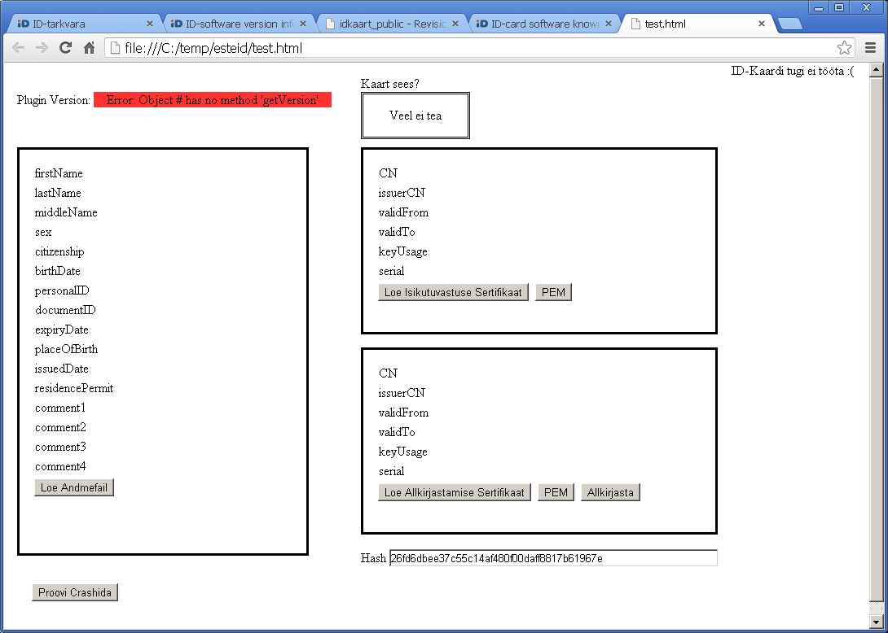

20121214
========

Defining custom AJAX actions
----------------------------

Yesterday and today I implemented
another important internal todo: I replaced the "confirmation" 
machinery be a new one which doesn't require a `step` variable and 
doesn't repeat code.
We can be glad that Lino isn't yet a popular framework,
because this was an important API change which 
caused some work to convert all existing `run` actions.
Before::

    def run(self,row,ar,**kw):
        ... code ...
        ar.confirm("Are you sure?")
        ... run after ok...

After::

    def run(self,row,ar,**kw):
        ... code ...
        def ok():
            ... run after ok...
        return ar.confirm(ok,"Are you sure?")

The overall system is still merely documented because not yet very stable.
The main things to document are:

- :meth:`prompt <lino.ui.base.UI.prompt>`
- :meth:`confirm <lino.ui.base.UI.confirm>`
- :meth:`success <lino.ui.base.UI.success>`
- :meth:`error <lino.ui.base.UI.error>`

How to read Estonian eid cards
------------------------------

Now that Lino can read `Belgian identity cards
<http://en.wikipedia.org/wiki/National_identity_cards_in_Belgium>`_
it should be interesting to do the same with
`Estonian <http://en.wikipedia.org/wiki/Estonian_ID_card>``_ 
cards as well,
and then compare the two environments.

Remember that we have a very decent requirement: 
we don't want to authenticate, 
we just want to read the "personal data" information 
on the card into our database.

The Estonian equivalent of Belgium's Middleware 
is a browser plugin released under LGPL license
at http://code.google.com/p/esteid/

The examples at 
http://code.google.com/p/esteid/source/browse/#svn/esteid-browser-plugin/trunk/testpage
told me how it seems to work.
Looked very promising.
Added :attr:`lino.Lino.use_esteid` and modified 
`linolib.js` and `ext_ui.py`...

... but then I discovered that even their example just doesn't work:

Google Chrome doesn't seem to be supported, and Firefox doesn't react at all,
causing the well-known image when I later try to shutdown my computer:

And then oops: 
the page at http://id.ee/index.php?id=34283
says that the source code is 
under 
https://svn.eesti.ee/projektid/idkaart_public/

What is the difference between the 
repositories at svn.eesti.ee and code.google.com?
Or rather why is there a project code.google.com/p/esteid? 

Lots of unanswered questions...

