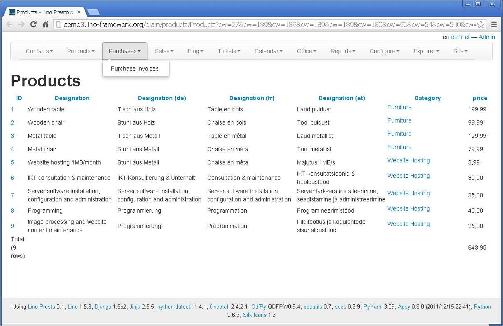

20121228
========

I decided to switch back to this blog because it 
will take more time than the Christmas holidays
before the entries in 
:srcref:`/lino/history/luc201212.py`
would become visible.

Lino and content management
---------------------------

:doc:`/tickets/66`.

During the Christmas days I learned a lot about 
the `Bootstrap CSS toolkit 
<http://twitter.github.com/bootstrap/>`__.

Before:

.. image:: 1228a.jpg
  :scale: 50
  
After:  

.. image:: 1228b.jpg
  :scale: 50

And these pictures are only the tip of the iceberg: 
I think I finally found a working solution for 
:mod:`lino.modlib.pages`
and :mod:`lino.apps.cms`.
 

But it's too early to write more about it...

Cannot assign "u''": "Event.assigned_to" must be a "User" instance
------------------------------------------------------------------

Creating an event in the Calendar Panel in 
http://demo2.lino-framework.org
caused a ValueError at /admin/restful/cal/PanelEvents:
"Cannot assign "u''": "Event.assigned_to" must be a "User" instance."
This was a plain simple bug.

Write a jQuery-based GUI?
-------------------------

Another example of how Lino now uses 
`Bootstrap <http://twitter.github.com/bootstrap/>`__
is the "plain HTML" view:
  

When I play with this I can't get resist to open a 
ticket and to dream at least about it:
:doc:`/tickets/67`.

