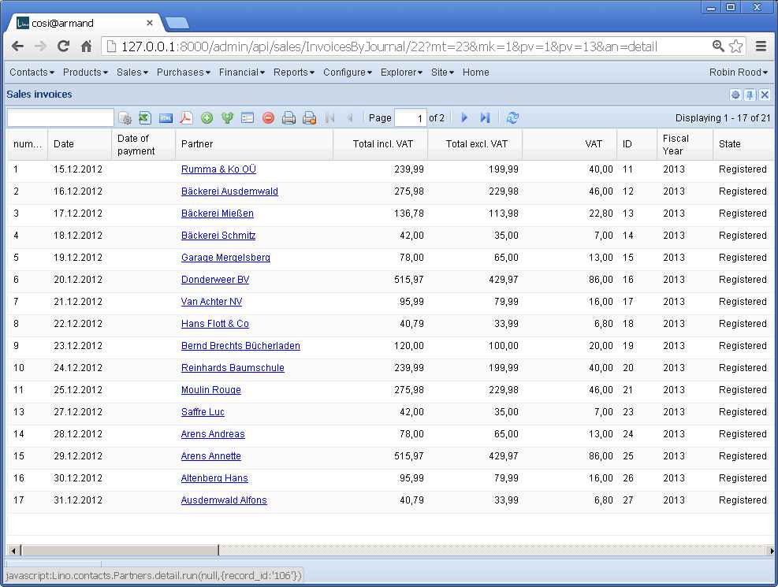
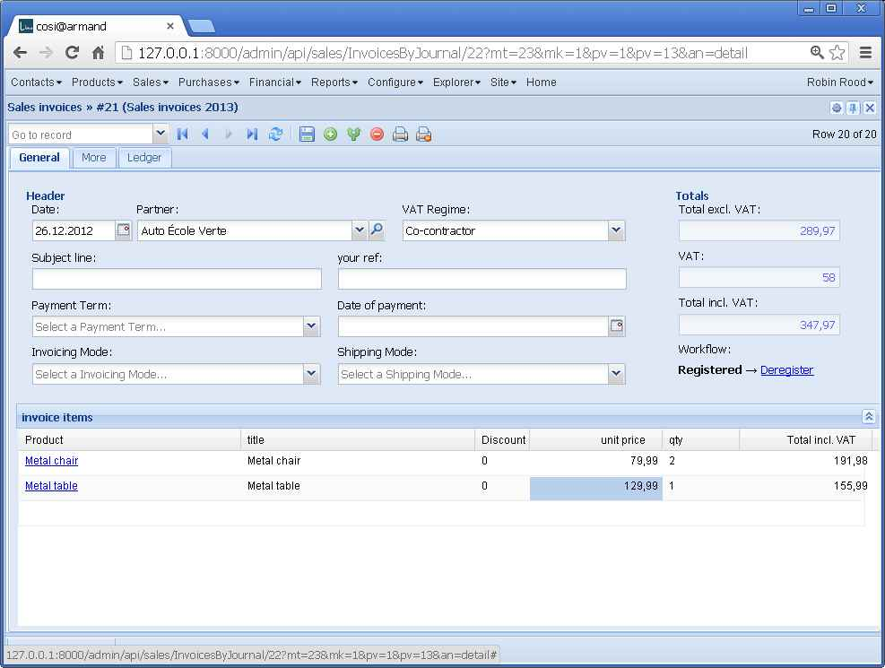
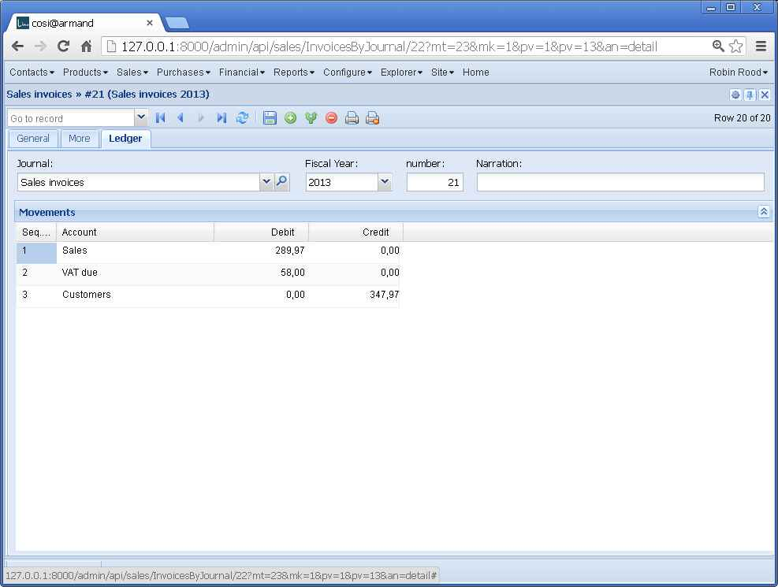

20130114
========

Sales invoices 
--------------

Today I had a bug-hunting tour in :mod:`lino.projects.cosi`,
more precisely at the sales invoices.

Saving a 
:class:`sales.Invoice <lino.modlib.sales.models.Invoice>`
whose state is   
:class:`draft <lino.modlib.sales.models.InvoiceStates>`
returned no available actions ("
<b>Draft</b>
")
in :meth:`workflow_buttons <lino.core.model.Model.workflow_buttons>`
while after clicking the `Refresh` button they showed up correctly.

This was because 
:meth:`get_workflow_actions <lino.core.actors.Actor.get_workflow_actions>` 
called 
:meth:`get_actions <lino.core.actors.Actor.get_actions>` 
with the requesting `ar.bound_action.action`
(for the `Refresh` button this is a `ShowDetailAction`
while for the `Save` button it's a  SubmitDetail` instance).

Solution:
Changed :meth:`lino.core.actors.Actor.get_workflow_actions` 

But, oops I almost forgot that we're in guinea pig testing mode.
And that's again a change to the framework which is not 
allowed until the definitive release.
Bend the rules once more and let this change pass?
Go back in time and release yesterday?
None of both: since the change is only one line of code, 
I manually restore the previous state, 
do the official releases, then continue.

Official release
----------------

So here they are: 
Lino :doc:`/releases/1.5.4` is there::

  running upload
  Submitting docs/dl\lino-1.5.4.tar.gz to http://pypi.python.org/pypi
  Server response (200): OK
  Submitting docs/dl\lino-1.5.4.zip to http://pypi.python.org/pypi
  Server response (200): OK

Oops, :welfare:`Lino-Welfare 1.0.8 </releases/1.0.8>`
didn't pass at the first attempt::

  Submitting ../lino/docs/dl\lino_welfare-1.0.8.tar.gz to http://pypi.python.org/pypi
  Upload failed (403): You are not allowed to edit 'lino_welfare' package information
  Submitting ../lino/docs/dl\lino_welfare-1.0.8.zip to http://pypi.python.org/pypi
  Upload failed (403): You are not allowed to edit 'lino_welfare' package information

This was because I called `setuptools.setup()` with a `name` of
`"lino_welfare"` instead of `"lino-welfare"`.

After the release, besides restoring 
:meth:`lino.core.actors.Actor.get_workflow_actions`,
I fiddled again with :xfile:`setup.py`.
Opened :doc:`/tickets/69`.

Sales invoices (continued)
--------------------------

Another subtle problem solved: 
the total fields of a 
:class:`sales.Invoice 
<lino.modlib.sales.models.Invoice>`
shouldn't be editable.

The total fields of a sales invoice should of course always 
be the sum of the invoice's items.
Opened new ticket :doc:`/tickets/68`.
Currently, users must hit the Save button of their invoice in 
order to see the updated totals.

Changed execution order of 
:meth:`full_clean <django.db.models.Model.full_clean>` 
and 
:meth:`before_ui_save <lino.core.model.Model.before_ui_save>`
because it makes a difference when 
**saving non-dirty records**.
We agree that `before_ui_save` should **not** run in this case,
but it was counter-intuitive that `full_clean` wasn't called either.

What should happen when the user hits the `Save` button 
of a detail form which has no modifications?
The intuitive meaning of this is "to make sure everything is really 
okay with that record".

Why should users doubt about whether "everything is okay"?
One case where this makes sense is to update the totals 
of a sales invoice when you have modified some item.
At least as long as Lino doesn't do this automatically.

Added a new parameter
:attr:`auto_fit_column_widths 
<lino.core.tables.AbstractTable.auto_fit_column_widths>`
which will set the `forceFit` config option
of ExtJS's `Ext.grid.GridView`.

Added `.x-form-num-field { text-align: right;}` to 
:srcref:`/media/extjs/lino.css` after reading
`NumberField and Right Alignment 
<http://www.sencha.com/forum/showthread.php?70195-NumberField-and-Right-Alignment>`__

[23:00] I start to be satisfied. Some quick screenshots:

