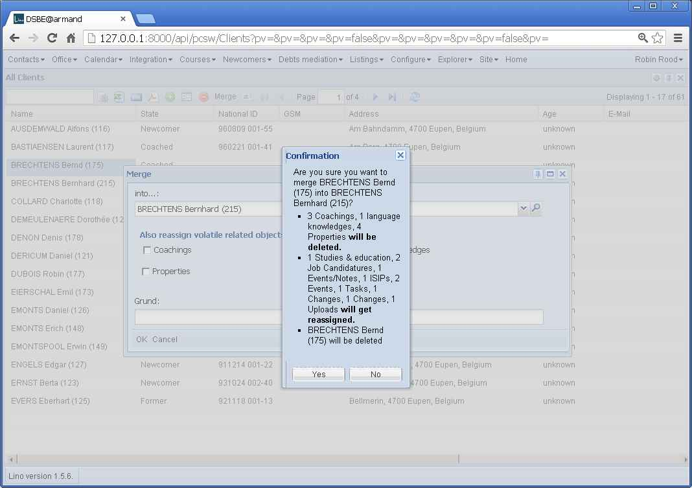

20130122
========

write() got an unexpected keyword argument 'method'
---------------------------------------------------

Going to /plain/accounts/Group/1
caused a TypeError "write() got an unexpected keyword argument 'method'" 
on a server with Python 2.6.

The method="html" argument isn't available in Python 2.6, only 2.7.
It is useful to avoid side effects in case of empty elements:
the default method (xml) writes an empty E.div() as "
"
while in HTML5 it must be "

" (the ending / is ignored).

Since I don't want to upgrade the Python on that server and the 
"plain" view is anyway experimental, I simply remove it.

Merge two database rows 
-----------------------

Just to have a trace of what I have been doing today...

  

`merge_test.py`::

  from django.conf import settings
  from lino import dd
  from lino.core.merge import MergePlan
  from lino.utils.xmlgen import html

  settings.LINO.startup()

  Client = dd.resolve_model('pcsw.Client')
  obj = Client.objects.get(pk=175)
  merge_to = Client.objects.get(pk=118)

  mp = MergePlan(obj,merge_to)
  print "MergePlan.logmsg():"
  print mp.logmsg()
  print "MergePlan.build_confirmation_message()"
  print html.E.tostring(mp.build_confirmation_message())
      
  
Output:

.. code-block:: bash
  
  
  $ python manage.py run merge_test.py --traceback
  INFO Starting Lino...
  INFO Analyzing models...
  INFO Lino Site 'DSBE@armand' started. Languages: de, fr, en. 91 models, 290 actors.
  INFO Using Lino Welfare 1.0.9, Lino 1.5.6, Django 1.6.dev20130119072716, Jinja 2.6, 
  Sphinx 1.1.3, python-dateutil 1.5, Cheetah 2.4.4, OdfPy ODFPY/0.9.4, docutils 0.10, 
  suds 0.4.1, PyYaml 3.08, Appy 0.8.0 (2011/12/15 22:41), Python 2.7.1, Silk Icons 1.3.
  MergePlan.logmsg():
  - 3 volatiles pcsw.Coaching rows using client : 67 68 69
  - 1 volatiles cv.LanguageKnowledge rows using person : 115
  - 4 volatiles properties.PersonProperty rows using person : 57 122 187 252
  - 1 related jobs.Study rows using person : 3
  - 2 related jobs.Candidature rows using person : 28 33
  - 1 related notes.Note rows using project : 111
  - 1 related isip.Contract rows using client : 12
  - 2 related cal.Event rows using project : 58 122
  - 1 related cal.Task rows using project : 15
  - 1 generic_related lino.Change rows using object : 4
  - 1 generic_related lino.Change rows using master : 4
  - 1 generic_related uploads.Upload rows using owner : 2
  MergePlan.build_confirmation_message()
  

Are you sure you want to merge BRECHTENS Bernd (175) into COLLARD Charlotte (118)?
<ul><li>3 Begleitungen, 1 Sprachkenntnisse, 4 Eigenschaften <b>will be deleted.</b></li><li>1 Ausbildungen und Studien, 2 Stellenanfragen, 1 Ereignisse/Notizen, 1 VSEs,
  2 Termine, 1 Aufgaben, 1 &#196;nderungen, 1 &#196;nderungen, 1 Uploads <b>will get reassigned.</b></li><li>BRECHTENS Bernd (175) will be deleted</li></ul>
  

