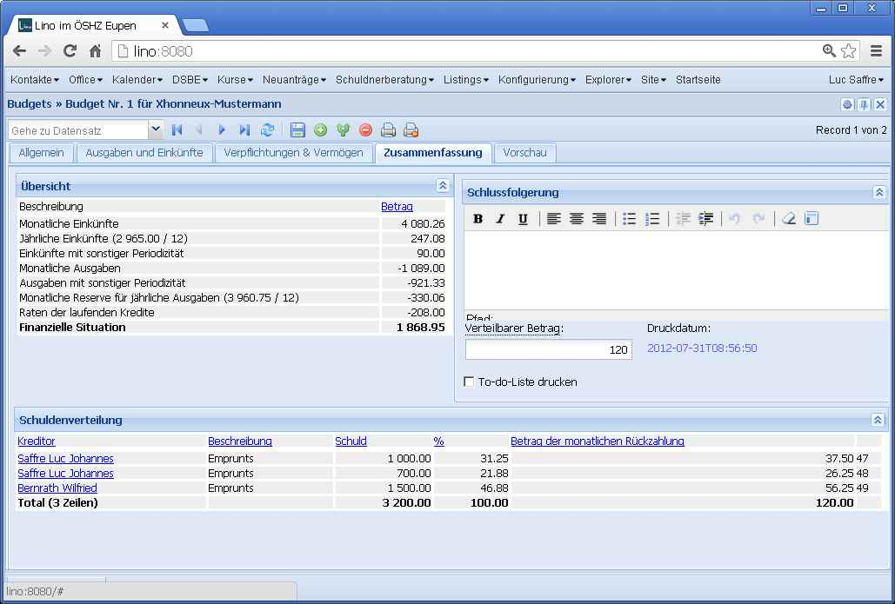

20130130
========

This morning we released Lino 1.5.7 and Lino-Welfare 1.0.10.

Warum man `auto_now_add` nicht benutzen sollte
----------------------------------------------

Hier was Lustiges: ich hatte einen :term:`ddt` gemacht, 
bei dem die `a.py` kurz vor Mitternacht und die `b.py` kurz danach erstellt worden war.
Daraufhin meldete ``diff``::

  lsaffre@lino:/usr/local/django/testlino$ diff fixtures/a.py fixtures/b.py
  34914,34915c34914,34915
  <     yield create_outbox_mail(1,notes_Note,3545,200067,200007,date(2013,1,29),u'Ereignis/Notiz #3545',u'<h1></h1>\r\n
\r\nAktennotiz / Lebenslauf\r\n
\r\n
\r\n\r\n
\r\n
User: Luc Saffre
',dt(2012,7,30,18,25,9))
  <     yield create_outbox_mail(2,notes_Note,3545,200067,200007,date(2013,1,29),u'Ereignis/Notiz #3545',u'<h1></h1>\r\n
\r\nAktennotiz / Lebenslauf\r\n
\r\n
\r\nPlease see the attached file.\r\n
\r\n
User: Luc Saffre
',None)
  ---
  >     yield create_outbox_mail(1,notes_Note,3545,200067,200007,date(2013,1,30),u'Ereignis/Notiz #3545',u'<h1></h1>\r\n
\r\nAktennotiz / Lebenslauf\r\n
\r\n
\r\n\r\n
\r\n
User: Luc Saffre
',dt(2012,7,30,18,25,9))
  >     yield create_outbox_mail(2,notes_Note,3545,200067,200007,date(2013,1,30),u'Ereignis/Notiz #3545',u'<h1></h1>\r\n
\r\nAktennotiz / Lebenslauf\r\n
\r\n
\r\nPlease see the attached file.\r\n
\r\n
User: Luc Saffre
',None)
  
Der Unterschied ist das siebte Feld, `date`, das bisher mit `auto_now_add=True` war.
Jetzt habe ich das ersetzt durch eine Methode `on_create`::
  
    def on_create(self,ar):
        self.date = datetime.date.today()
        super(Mail,self).on_create(ar)

Eine Reparatur der bestehenden Daten ist nicht nötig, 
weil bisher erst zwei solcher manuellen Mails von Lino aus verschickt wurden.

Miscellaneous
-------------

- :class:`lino.utils.dumpy.Serializer` now raises an exception if it finds a field
  with `auto_now_add`::

    $ python manage.py dumpdata --format py
    ...
    Error: Unable to serialize database: outbox.Mail.date.auto_now_add is True : values will be lost!
  
  
- I recently had changed IntegerFieldElement and DecimalFieldElement 
  to use `xtype` instead of `value_template`. That wasa bad idea, it caused
  "Uncaught TypeError: Object #<Object> has no method 'getValue'" 
  when such fields were used in a parameter panel.
  
- :class:`lino_welfare.modlib.isip.models.ContractBase`: `update_reminders` 
  ignored premature ending (`date_ended`) when creating the reminder "Contracts ends in a month".
  
- Im BudgetSummary fehlten jährliche Einnahmen sowie 
  Ausgaben und Einnahmen "mit sonstiger Periodizität".
  
- Der Text der letzten Zeile der Übersicht eines Budgets lautet jetzt nicht 
  mehr "Total (5 Zeilen)" sondern 
  
- Summenzeilen werden jetzt in Fett gedruckt.  

- Die goodbye-Meldung in atexit, die bisher nur von watch_tim gemacht 
  wurde, wird jetzt für alle Prozesse in kernel.site_startup gemacht.
  

After the release
-----------------

After the release some optimizations and one enlightment in Lino-Welfare:

  
- Wenn eine Tx25 gefehlt hat weil die Person nicht integriert ist, 
  dann meldete Lino beim bloßen Anschauen dieser Tx25 (im Detail) 
  einen AttributeError "reply instance has no attribute 'rrn_it_implicit'  "
  an die Admins.
  
- Das Ankreuzfeld "Chronik" einer neuen Tx25 ist jetzt par défaut *angekreuzt*.

- Erleuchtung: Nach den neuesten Erfahrungen würde ich sagen: der 
  Bearbeitungszustand "Ungültig" für Klienten kommt komplett raus, basta. 
  Die Gültigkeit der INSS hat keinerlei Einfluss auf irgendwelche Workflows.

Much work for little visible result
-----------------------------------

Look at the table "Schuldenverteilung" in the screenshot below:

The last column (without header and containing numbers 47, 48 and 49) was too much.
This bug came because of a design mistake: the `ar2html` 
method worked using the fields of the store 
and not using the columns of the grid.
Don't remember what mosquito had bitten me when I had written this.
I had seen this mistake already some time ago but knew that 
it would improve only the inner beauty and take much time.
Now I finally did it. 
Took only two hours.
Python is great! 
Such important code changes would be much more painful in Java.

The :mod:`show <lino.management.commands.show>` management command 
-------------------------------------------------------------------

To test the above change I added a new management command 
:mod:`show <lino.management.commands.show>`.
Usage examples:

.. code-block:: bash

  $ python manage.py show users.UsersOverview
  ============== ======================================= =========
   Benutzername   Benutzerprofil                          Sprache
  -------------- --------------------------------------- ---------
   alicia         Begleiter im DSBE                       fr
   caroline       Berater Neuanträge                      de
   hubert         Begleiter im DSBE                       de
   kerstin        Schuldenberater                         de
   melanie        Integrations-Assistent (Dienstleiter)   fr
   robin          Verwalter                               en
   rolf           Verwalter                               de
   romain         Verwalter                               fr
  ============== ======================================= =========  

  $ python manage.py show pcsw.UsersWithClients
  ====================== ======= =========== =========== ========= ========= ====================== ================= ========
   Begleiter              Bilan   Formation   Recherche   Travail   Standby   Primäre Begleitungen   Aktive Klienten   Total
  ---------------------- ------- ----------- ----------- --------- --------- ---------------------- ----------------- --------
   Alicia Allmanns                2           1                     1         4                      3                 10
   Hubert Huppertz        3       2           3           4         1         4                      12                22
   Mélanie Mélard         4       5           4           4         6         20                     17                24
   **Total (3 Zeilen)**   **7**   **9**       **8**       **8**     **8**     **28**                 **32**            **56**
  ====================== ======= =========== =========== ========= ========= ====================== ================= ========

The bootstrap UI is getting better
----------------------------------

Lino's "plain html" UI is getting better:

- Detail forms 
- Pagination bar

The current internal name "plain" is misleading. 
It's not very plain html because it uses
bootstrap

django-extensions
-----------------

Ich habe mir mal das Modul 
:doc:`/reviews/django-extensions`
angeschaut.

