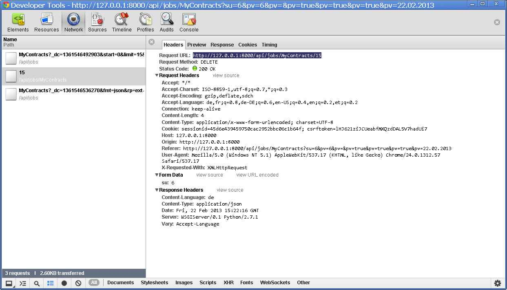

20130222
========

Release
-------

So, now finally I can release the new version in Eupen:

- Release notes:
  :doc:`Lino 1.5.1 </releases/1.5.10>`
  :welfare:`Welfare 1.0.13 </releases/1.0.13>`
  
While trying to make it offcial by uploading it to PyPI, I got::

  Submitting docs/dl\lino-1.5.10.tar.gz to http://pypi.python.org/pypi
  Upload failed (401): Incorrect password
  
Yes of course, I had changed my password in the web interface 
after the `attacks from 
January 2013 <http://wiki.python.org/moin/WikiAttack2013>`__.
But where does my setuptools store my old password?
Answer: it's in the :file:`.pypirc` file which is in my $HOME directory.

Next problem::

  Submitting docs/dl\lino-1.5.10.tar.gz to http://pypi.python.org/pypi
  Upload failed (502): Bad Gateway

This problem occured once, but the second attempt passed.

UnresolvedModel instance has no attribute 'Xyz'
-----------------------------------------------

Another surprise during 
:mod:`watch_tim <lino_welfare.modlib.pcsw.management.commands.watch_tim>`::

  ERROR UnresolvedModel instance has no attribute 'DoesNotExist'
  Traceback (most recent call last):
    File "t:\hgwork\welfare\lino_welfare\modlib\pcsw\management\commands\watch_tim.py", line 865, in watch
      process_line(ln)
    File "t:\hgwork\welfare\lino_welfare\modlib\pcsw\management\commands\watch_tim.py", line 837, in process_line
      m(**kw)
    File "t:\hgwork\welfare\lino_welfare\modlib\pcsw\management\commands\watch_tim.py", line 409, in PUT
      obj = self.get_object(kw)
    File "t:\hgwork\welfare\lino_welfare\modlib\pcsw\management\commands\watch_tim.py", line 618, in get_object
      except Client.DoesNotExist:
  AttributeError: UnresolvedModel instance has no attribute 'DoesNotExist'

This bug is due to my change to 
:func:`resolve_model 
<lino.core.modeltools.resolve_model>` 
two days ago:

  The :func:`resolve_model <lino.core.modeltools.resolve_model>`
  function may not use `seed_cache=True` (which causes Django 
  to populate the models cache before looking for the model)
  since we want to have it usable at the top-level of ``models`` 
  modules.
  Which is what :mod:`lino.projects.homeworkschool` did.
  This caused a recursive populate, leading to very confusing error messages.

The easiest workaround is to add the following line somewhere *before* the first call::

  settings.LINO.startup()
  
Should I make the `strict=True` as default?
No, because this would raise an `ImportError` 
instead of returning `UnresolvedModel`.

More bugs 
---------

- Some more edge cases occured in 
  :mod:`watch_tim <lino_welfare.modlib.pcsw.management.commands.watch_tim>`.
  Added them to 
  :mod:`watchtim_tests <lino_welfare.modlib.pcsw.tests.watchtim_tests>`.

- When manually creating a Coaching, 
  the default value for the `user` field wasn't 
  correctly set to the requesting user
  (leading to a "DoesNotExist at /api/pcsw/CoachingsByClient" traceback).
  
Deleting a UserAuthored as somebody else
----------------------------------------

Lino had a problem when a user working as somebody else 
tried to delete a UserAuthored record of this other user.
The button was enabled, but after clicking and confirming 
it you nevertheless got a warning 
"You have no permission to delete this row.".

The picture shows what happens:

The client correctly sends an HTTP DELETE with ``su=7`` as form data 
(7 being the id of the substituted user in our example),
but the server didn't yet parse any data in the `body` 
of DELETE requests. Now it does.

