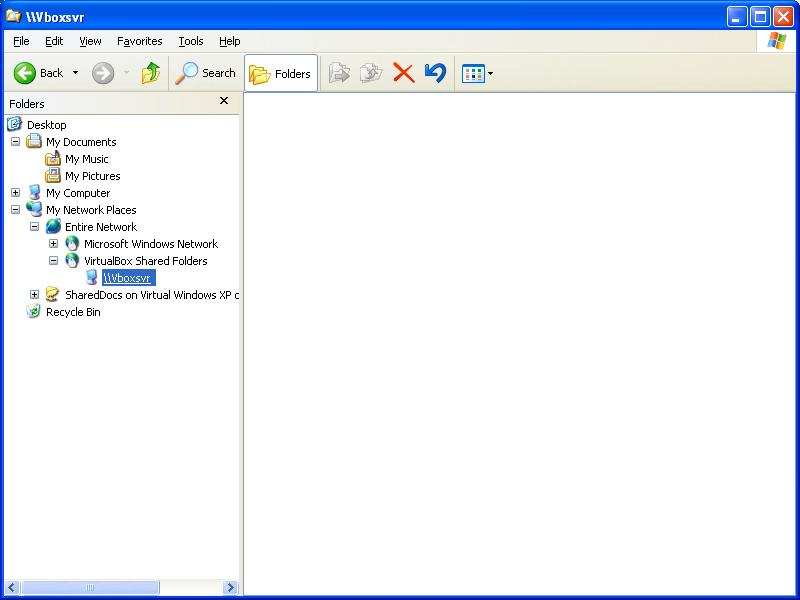

==============================
20130503 (Friday, 03 May 2013)
==============================

Python fixtures and big databases
---------------------------------

Yesterday evening I saw for the first time that the process of 
the `initdb` command got killed by the OS
while loading a backup `b20130502_201829.py` that was 18 MB big::

    (dev)$ python manage.py initdb b20130502_201829
    ...
    We are going to flush your database (test_dsbe).
    Are you sure (y/n) ?y
    Creating tables ...
    ...
    INFO Loading /var/log/lino/backups/b20130502_201829.py...
    Killed
    (dev)$    

Note that this happens before any data is actually stored in the database.
Looks as if the mere compilation of the .py file requires so much memory 
that the OS decides to kill the process.

Yes, a :ref:`Python fixture <dpy>` 
needs to write the whole database content into a single file
(at least as long as we use it as a `Django serializer
<https://docs.djangoproject.com/en/dev/topics/serialization/>`_).
And of course when you import a Python source file with 
more than 18 MB of code text, then this will use some memory 
resources of your computer.

If I stop Apache and watch_tim and try the same command again, 
then it works.

Then I tried to reproduce this situation:

.. literalinclude:: 0502/a.py

Trying to run this script will of course exhaust memory after 
some time... but in a different way::

    153000000
    Traceback (most recent call last):
      File "0502.py", line 5, in <module>
        L.append(time.time())
    MemoryError

Then I found the `Process "Killed" 
<http://bytes.com/topic/python/answers/833603-process-killed>`__
thread asked by dieter in August 2008.
Where Eric Wertmann wrote:

  This is the behavior you'll see when your os has run out of some
  memory resource. The kernel sends a 9 signal. I'm pretty sure that
  if you exceed a soft limit your program will abort with out of memory
  error.
  
Conclusion:

The above problem was due to the server resources being exhausted, 
and was solved by a simple restart of some long-running processes.

If one day it appears that the single file is a problem when working 
with huge databases, then I'll probably write 
two separate commands "dump" and "load" that work with 
separate text files to hold the raw data.
But that day has still to come.

Miscellaneous
-------------

- The directory :file:`/var/log/lino/backups`
  contained 108 files, all named like `b20130503_020101.py`.
  Deleted 70 of them.
  (Yes, one day I want to write a cron job which does that automatically.)

- Upgraded on :ref:`lf`.

- fixed a bug in watch_tim

Installing Guest Additions for VirtualBox
-----------------------------------------

A beginner discovering the world of virtual boxes...

I have many files which I'd like to see from both 
operating systems (Ubuntu and Windows XP).
What I need is `Shared Folders
<http://www.virtuatopia.com/index.php/VirtualBox_Shared_Folders>`.

To access shared folders from a virtual machine I need 
the `Guest Additions <http://www.virtualbox.org/manual/ch04.html>`_.
But I cannot install them because I don't have a "Devices" menu.

A problem which has been reported before me:
`Where is the Devices menu of a Windows virtual machine?
<http://askubuntu.com/questions/179799/where-is-the-devices-menu-of-a-windows-virtual-machine>`_

Seems that I installed the wrong version 
(downloaded directly from Oracle, but apparently there's a more 
free one).
There is VirtualBox and VirtualBox, don't mix them up!

Removed the following line from :file:`/etc/apt/sources.list`::

  deb http://download.virtualbox.org/virtualbox/debian oneiric contrib

::

  $ sudo aptitude purge virtualbox-4.2
  The following packages will be REMOVED:  
  dkms{u} libsdl-ttf2.0-0{u} python-central{u} virtualbox-4.2 
  0 packages upgraded, 0 newly installed, 4 to remove and 5 not upgraded.
  
  $ sudo aptitude install virtualbox-ose
  $ sudo aptitude install virtualbox-guest-additions
  
  
Now I have::  

    $ aptitude search virtualbox
    i A virtualbox                                                          - x86 virtualization solution - base binaries                                  
    p   virtualbox-dbg                                                      - x86 virtualization solution - debugging symbols                              
    i A virtualbox-dkms                                                     - x86 virtualization solution - kernel module sources for dkms                 
    p   virtualbox-fuse                                                     - x86 virtualization solution - virtual filesystem                             
    i   virtualbox-guest-additions                                          - transitional package for virtualbox-guest-additions-iso                      
    i A virtualbox-guest-additions-iso                                      - guest additions iso image for VirtualBox                                     
    p   virtualbox-guest-dkms                                               - x86 virtualization solution - guest addition module source for dkms          
    p   virtualbox-guest-source                                             - x86 virtualization solution - guest addition module source                   
    p   virtualbox-guest-utils                                              - x86 virtualization solution - non-X11 guest utilities                        
    p   virtualbox-guest-x11                                                - x86 virtualization solution - X11 guest utilities                            
    i   virtualbox-ose                                                      - transitional package for virtualbox                                          
    p   virtualbox-ose-dbg                                                  - transitional package for virtualbox-dbg                                      
    p   virtualbox-ose-dkms                                                 - transitional package for virtualbox-dkms                                     
    p   virtualbox-ose-fuse                                                 - transitional package for virtualbox-fuse                                     
    p   virtualbox-ose-guest-dkms                                           - transitional package for virtualbox-guest-dkms                               
    p   virtualbox-ose-guest-source                                         - transitional package for virtualbox-guest-source                             
    p   virtualbox-ose-guest-utils                                          - transitional package for virtualbox-guest-utils                              
    p   virtualbox-ose-guest-x11                                            - transitional package for virtualbox-guest-x11                                
    p   virtualbox-ose-qt                                                   - transitional package for virtualbox-qt                                       
    p   virtualbox-ose-source                                               - transitional package for virtualbox-source                                   
    i A virtualbox-qt                                                       - x86 virtualization solution - Qt based user interface                        
    p   virtualbox-source                                                   - x86 virtualization solution - kernel module source  

    $ vboxmanage --help
    Oracle VM VirtualBox Command Line Management Interface Version 4.1.12_Ubuntu
    (C) 2005-2013 Oracle Corporation
    All rights reserved.

    $ sudo apt-get install linux-headers-$(uname -r)
    Reading package lists... Done
    Building dependency tree       
    Reading state information... Done
    linux-headers-3.5.0-28-generic is already the newest version.
    0 upgraded, 0 newly installed, 0 to remove and 5 not upgraded.

Now I get the following error message when I try to open my VM:

    Failed to open a session for the virtual machine Windows XP.

    The virtual machine 'Windows XP' has terminated unexpectedly during startup with exit code 1.

    Result Code: NS_ERROR_FAILURE (0x80004005)
    Component: Machine
    Interface: IMachine {5eaa9319-62fc-4b0a-843c-0cb1940f8a91}

Once again::

    (py27)luc@hoppel:~$ sudo aptitude install virtualbox
    The following NEW packages will be installed:
      dkms{a} libgsoap1{a} python-central{a} virtualbox virtualbox-dkms{a} virtualbox-qt{a} 
    0 packages upgraded, 6 newly installed, 0 to remove and 5 not upgraded.
    Need to get 23.7 MB of archives. After unpacking 71.3 MB will be used.
    Do you want to continue? [Y/n/?] 
    Get: 1 http://ee.archive.ubuntu.com/ubuntu/ precise-updates/main dkms all 2.2.0.3-1ubuntu3.1 [73.2 kB]
    Get: 2 http://ee.archive.ubuntu.com/ubuntu/ precise/universe libgsoap1 i386 2.8.4-2 [518 kB]
    Get: 3 http://ee.archive.ubuntu.com/ubuntu/ precise-updates/universe python-central all 0.6.17ubuntu2 [41.4 kB]
    Get: 4 http://ee.archive.ubuntu.com/ubuntu/ precise-proposed/universe virtualbox i386 4.1.12-dfsg-2ubuntu0.3 [15.8 MB]
    Get: 5 http://ee.archive.ubuntu.com/ubuntu/ precise-proposed/universe virtualbox-dkms all 4.1.12-dfsg-2ubuntu0.3 [676 kB]                              
    Get: 6 http://ee.archive.ubuntu.com/ubuntu/ precise-proposed/universe virtualbox-qt i386 4.1.12-dfsg-2ubuntu0.3 [6,523 kB]                             
    Fetched 23.7 MB in 24s (985 kB/s)                                                                                                                      
    Selecting previously unselected package dkms.
    (Reading database ... 277271 files and directories currently installed.)
    Unpacking dkms (from .../dkms_2.2.0.3-1ubuntu3.1_all.deb) ...
    Selecting previously unselected package libgsoap1.
    Unpacking libgsoap1 (from .../libgsoap1_2.8.4-2_i386.deb) ...
    Selecting previously unselected package python-central.
    Unpacking python-central (from .../python-central_0.6.17ubuntu2_all.deb) ...
    Selecting previously unselected package virtualbox.
    Unpacking virtualbox (from .../virtualbox_4.1.12-dfsg-2ubuntu0.3_i386.deb) ...
    Selecting previously unselected package virtualbox-dkms.
    Unpacking virtualbox-dkms (from .../virtualbox-dkms_4.1.12-dfsg-2ubuntu0.3_all.deb) ...
    Selecting previously unselected package virtualbox-qt.
    Unpacking virtualbox-qt (from .../virtualbox-qt_4.1.12-dfsg-2ubuntu0.3_i386.deb) ...
    Processing triggers for man-db ...
    Processing triggers for ureadahead ...
    Processing triggers for shared-mime-info ...
    Processing triggers for hicolor-icon-theme ...
    Processing triggers for bamfdaemon ...
    Rebuilding /usr/share/applications/bamf.index...
    Processing triggers for desktop-file-utils ...
    Processing triggers for gnome-menus ...
    Setting up dkms (2.2.0.3-1ubuntu3.1) ...
    Setting up libgsoap1 (2.8.4-2) ...
    Setting up python-central (0.6.17ubuntu2) ...
    Setting up virtualbox (4.1.12-dfsg-2ubuntu0.3) ...
     * Stopping VirtualBox kernel modules                                                                                                           [ OK ] 
     * Starting VirtualBox kernel modules                                                                                                           [ OK ] 
    Processing triggers for python-central ...
    Setting up virtualbox-dkms (4.1.12-dfsg-2ubuntu0.3) ...
    Loading new virtualbox-4.1.12 DKMS files...
    First Installation: checking all kernels...
    Building only for 3.5.0-28-generic
    Building initial module for 3.5.0-28-generic
    Done.

    vboxdrv:
    Running module version sanity check.
    Error! Module version 4.1.12_Ubuntu for vboxdrv.ko
    is not newer than what is already found in kernel 3.5.0-28-generic (4.2.12).
    You may override by specifying --force.

    vboxnetadp.ko:
    Running module version sanity check.
    Error! Module version 4.1.12_Ubuntu for vboxnetadp.ko
    is not newer than what is already found in kernel 3.5.0-28-generic (4.2.12).
    You may override by specifying --force.

    vboxnetflt.ko:
    Running module version sanity check.
    Error! Module version 4.1.12_Ubuntu for vboxnetflt.ko
    is not newer than what is already found in kernel 3.5.0-28-generic (4.2.12).
    You may override by specifying --force.

    vboxpci.ko:
    Running module version sanity check.
    Error! Module version 4.1.12_Ubuntu for vboxpci.ko
    is not newer than what is already found in kernel 3.5.0-28-generic (4.2.12).
    You may override by specifying --force.

    depmod....

    DKMS: install completed.
     * Stopping VirtualBox kernel modules                                                                                                           [ OK ] 
     * Starting VirtualBox kernel modules                                                                                                           [ OK ] 
    Setting up virtualbox-qt (4.1.12-dfsg-2ubuntu0.3) ...
    Processing triggers for libc-bin ...
    ldconfig deferred processing now taking place

    $ sudo apt-get purge linux-headers-$(uname -r)
    Reading package lists... Done
    Building dependency tree       
    Reading state information... Done
    The following packages will be REMOVED:
      linux-generic-lts-quantal* linux-headers-3.5.0-28-generic* linux-headers-generic-lts-quantal*
    0 upgraded, 0 newly installed, 3 to remove and 5 not upgraded.
    After this operation, 11.3 MB disk space will be freed.
    Do you want to continue [Y/n]? 
    (Reading database ... 277874 files and directories currently installed.)
    Removing linux-generic-lts-quantal ...
    Removing linux-headers-generic-lts-quantal ...
    Removing linux-headers-3.5.0-28-generic ...
    (py27)luc@hoppel:~$ sudo apt-get install linux-headers-$(uname -r)
    Reading package lists... Done
    Building dependency tree       
    Reading state information... Done
    The following NEW packages will be installed:
      linux-headers-3.5.0-28-generic
    0 upgraded, 1 newly installed, 0 to remove and 5 not upgraded.
    Need to get 949 kB of archives.
    After this operation, 11.3 MB of additional disk space will be used.
    Get:1 http://ee.archive.ubuntu.com/ubuntu/ precise-updates/main linux-headers-3.5.0-28-generic i386 3.5.0-28.48~precise1 [949 kB]
    Fetched 949 kB in 1s (936 kB/s)                         
    Selecting previously unselected package linux-headers-3.5.0-28-generic.
    (Reading database ... 269004 files and directories currently installed.)
    Unpacking linux-headers-3.5.0-28-generic (from .../linux-headers-3.5.0-28-generic_3.5.0-28.48~precise1_i386.deb) ...
    Setting up linux-headers-3.5.0-28-generic (3.5.0-28.48~precise1) ...
    Examining /etc/kernel/header_postinst.d.
    run-parts: executing /etc/kernel/header_postinst.d/dkms 3.5.0-28-generic /boot/vmlinuz-3.5.0-28-generic
    Error! Could not locate dkms.conf file.
    File:  does not exist.

    $ sudo apt-get install linux-headers-$(uname -r)
    (...)

    $ sudo dpkg-reconfigure virtualbox-dkms --force
    
    
The above gave no success.    
But here, 
http://forum.ubuntu-fr.org/viewtopic.php?pid=13274751
another hope::

    $ sudo apt-get remove --purge virtualbox*
    $ sudo apt-get clean
    $ sudo rm /lib/modules/3.5.0-28-generic/updates/dkms/vbox*
    $ sudo reboot
    $ sudo aptitude install virtualbox
    
This time it worked.
"It worked" means that I am back to where I was 2 hours ago: 
a virtual machine without guest additions and thus no shared folders.
And no "Devices" menu.

Now at least the following works without error messages::

    $ sudo aptitude install virtualbox-guest-additions
    The following NEW packages will be installed:
      virtualbox-guest-additions virtualbox-guest-additions-iso{a} 
    0 packages upgraded, 2 newly installed, 0 to remove and 5 not upgraded.
    Need to get 40.7 MB of archives. After unpacking 50.9 MB will be used.
    Do you want to continue? [Y/n/?] 
    Get: 1 http://ee.archive.ubuntu.com/ubuntu/ precise/multiverse virtualbox-guest-additions-iso all 4.1.12-1 [40.7 MB]
    Get: 2 http://ee.archive.ubuntu.com/ubuntu/ precise/multiverse virtualbox-guest-additions all 4.1.12-1 [5,546 B]                                       
    Fetched 40.7 MB in 38s (1,068 kB/s)                                                                                                                    
    Selecting previously unselected package virtualbox-guest-additions-iso.
    (Reading database ... 277869 files and directories currently installed.)
    Unpacking virtualbox-guest-additions-iso (from .../virtualbox-guest-additions-iso_4.1.12-1_all.deb) ...
    Selecting previously unselected package virtualbox-guest-additions.
    Unpacking virtualbox-guest-additions (from .../virtualbox-guest-additions_4.1.12-1_all.deb) ...
    Setting up virtualbox-guest-additions-iso (4.1.12-1) ...
    Setting up virtualbox-guest-additions (4.1.12-1) ...
      
Although it doesn't seem to change anything...
But ha! `dpkg --listfiles virtualbox-guest-additions-iso` shows me that 
this package just adds an `.iso` file in :file:`/usr/lib/virtualbox`.
Mounted this as new a CD drive under "Storages" in the Settings, 
which became visible in the VM as a new CD drive, 
then ran the autorun installer on this CD from inside Windows.
Yes, that seems to work.

Now I have a `\\vboxsrv` server visible in my network environment.

But it is empty. Trying to access it with `net use` gives 
a system error 67::

  C:\>net use v: \\vboxsvr\vbshared
  
  System error 67 has occured
  
  The network name cannot be found
  
Another problem is that the clipboard doesn't seem to communicate. 
I tried both bidirectional and Guest to Host, but in the end I 
typed (!) myself the above text.

Bref: I don't see the share which I had already defined in 
the "Shared Folders" section of the settings of the VM.
  
Aha, seems that I must mark my folder as "shared". 
Nautilus, right click on that folder... now, there are two 
possibilities: choose "Sharing Options" from the context menu, 
or choose "Properties" and then the  "Share" tab.
Seems that they both do the same.

Marked them all as shared, giving read and write permission to 
everybody: nothing. Later even a `chmod -R a+w vbshared2`
Restart the Guest, restart the Host: nothing.
The `\\vboxsrv` server is visible in my network environment, 
but it is empty:

  

All this is happening on Ubuntu LTS 12.04 and I just 
did an `aptitude safe-upgrade`. 

One observation: when I start the VM from a shell, then I see 
a "Permission denied" error message::

  $ virtualbox --startvm "Windows XP"
  Error opening file for reading: Permission denied
  

