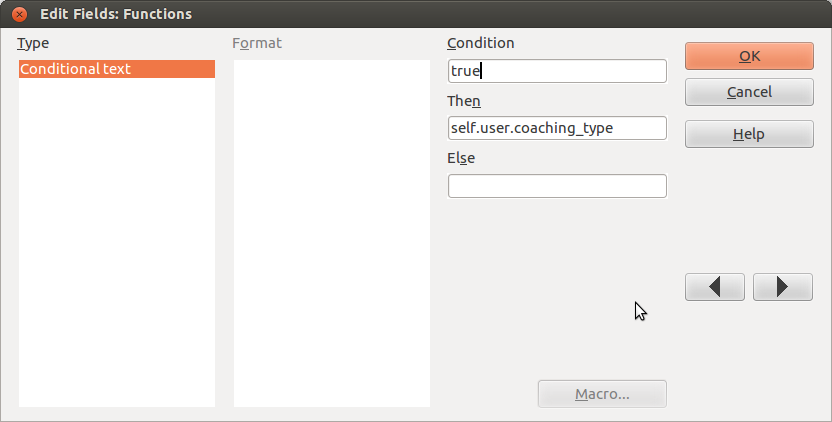

=================================
20130809 (Friday, 09 August 2013)
=================================

Continued to work on :ref:`welfare.reception`.
Now it is time to insert some real attestations.
Here we go with the devils in the detail!

LibreOffice & :term:`appy.pod` : Using conditional fields to insert Python expressions
--------------------------------------------------------------------------------------

I was glad to discover that :term:`appy.pod`
now uses conditional fields. 
I used to believe that 
"defining Python expressions with pod was done via text inserted 
in 'track changes' mode".
But "conditional fields (as explained `here <http://appyframework.org/podWritingTemplates.html>`_) 
have become the preferred 
way to insert Python expressions."
This is very nice because now it is possible to copy 
and paste them. Thanks, Gaëtan, for your work!

One pitfall however (in LibreOffice, not in :term:`appy.pod`) 
took me more than two hours of my life:
All my conditional fields contained the word "true" in 
the "Condition" part and a Python expression to be evaluated by 
:term:`appy.pod` in the "Then" part. 
Here is how this looked:

I had six fields with the following expressions:

#. sc.site_company.city.name.upper()
#. **self.user**
#. self.user.coaching_type
#. **dtos(self.date)**
#. self.user.initials
#. **self.subject**

Only the second, the fourth and the sixth 
(those who are marked in bold) actually worked.

Do you want to know why?
Then read 
`Bug #58533 <https://bugs.freedesktop.org/show_bug.cgi?id=58533>`_
at `freedesktop.org`.
(Summary:
LibreOffice doesn't actually just insert the `Then` or `Else` 
part depending on the condition, 
but uses artificial intelligence: 
if the text contains two periods, 
then it is expected to be a database field. 
To avoid this magic behaviour, simply include it within quotes.
Good to know...

Avoiding recursive `.odt` templates
-----------------------------------

So we are going to generate many different documents using many 
templates. But they should share some common base. 
And that common base contains variables 
(i.e. Python expressions to be rendered by :term:`appy.pod`).
Tried with a base template `base.ott` which would get inherited by
a `letter.odt` which would serve as template for :term:`appy.pod`.
But that doesn't work: once `letter.odt` is created, its contents won't 
be updated when the content of the `base.ott` changes.

Another observation is that the content of these templates is mostly 
the same for every centre. If some formulation in the content of 
some certification changes in one centre, it is likely that the other 
centres also want this change.

I think the best solution is to add a new field 
`NoteType.body_template` which points to a `*.body.html` 
file.
And then give a context variable "body" to the appy.pod renderer.

