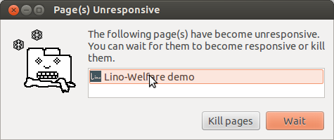

=================================
20130816 (Friday, 16 August 2013)
=================================

Reading the picture from a Belgian eID card
-------------------------------------------

Johan has fixed issue #5 
(`getPicture() works in FF 16 but not in Chrome 23
<http://code.google.com/p/eid-javascript-lib/issues/detail?id=5>`_)
and asks me to verify it.

Using a development server and either Chrome or Firefox on my Ubuntu 12.04, 
there seems to 
be another problem: getPicture() doesn't return any picture at all.

Since nobody except me can see my development server, I first
must get it running on the public demo site 
(http://welfare-demo.lino-framework.org/).
And since we have been working on the user interface, 
I first updated to the latest development version of 
Lino-Welfare and wrote the following 
updated instructions on how to reproduce the problem:

- Go to http://welfare-demo.lino-framework.org

- Log in as robin (password "1234")

- Open the Javascript console of your browser

- In the menu, select :menuselection:`Reception --> Clients`
  (or use the permalink http://welfare-demo.lino-framework.org/api/reception/Clients).
  Lino shows a list of fictive clients. 
  In the top toolbar there's a button "Read eID card".

- Insert some Belgian eID card. Click the button.

But the above instructions don't yet work.

CSRF cookie not set
-------------------

First of all, clicking the button activated the loadMask ("Please wait...") 
and remained there. The server log said::

  201308-16 05:21:22 WARNING csrf : Forbidden (CSRF cookie not set.): /api/reception/Clients/116

Obviously I unconsiously somehow had activated Django's latest security 
evolutions `CSRF middleware
<https://docs.djangoproject.com/en/dev/ref/contrib/csrf/>`_.
I say "unconsiously" because according to the docs 
CSRF should not be activated since I don't include the 
`django.middleware.csrf.CsrfViewMiddleware`.
I suppose that Django in a motherly way decided that 
*not* protecting against CSRF is just too dangerous and thus 
protects me against my will...
Okay... anyway one day I would have had to face this. 
And the solution wasn't too difficult.
I just added to :xfile:`linoweb.js`  a snippet found on
`How do I include Django 1.2's CSRF token in a Javascript-generated HTML form?
<http://stackoverflow.com/questions/3764589/how-do-i-include-django-1-2s-csrf-token-in-a-javascript-generated-html-form/5485616#5485616>`_
(thanks to 
`huuze <http://stackoverflow.com/users/10040/huuuze>`_ for the question
and to 
`chrisv <http://stackoverflow.com/users/683808/chrisv>`_
for the answer)::
 
    Ext.Ajax.on('beforerequest', function (conn, options) {
       if (!(/^http:.*/.test(options.url) || /^https:.*/.test(options.url))) {
         if (typeof(options.headers) == "undefined") {
           options.headers = {'X-CSRFToken': Ext.util.Cookies.get('csrftoken')};
         } else {
           options.headers.extend({'X-CSRFToken': Ext.util.Cookies.get('csrftoken')});
         }                        
       }
    }, this);

Applet not found!
-----------------

The first problem (appearently) solved, now it is saying 
"Applet not found!".
I guess that this is another security problem, since my Java 
console says::

    $ less ~/.icedtea/log/java.stderr 
    Gonna disable the security manager...
    java.lang.SecurityException: Changing the SecurityManager is not allowed.
        at net.sourceforge.jnlp.runtime.JNLPSecurityManager.checkPermission(JNLPSecurityManager.java:270)
        at java.lang.System.setSecurityManager0(System.java:295)
        at java.lang.System.setSecurityManager(System.java:286)
        at davlink.DavLink.init(DavLink.java:228)
        at sun.applet.AppletPanel.run(AppletPanel.java:436)
        at java.lang.Thread.run(Thread.java:722)

I have to tell my client that it can trust this site by adding the 
following lines to my 
:file:`/etc/java-7-openjdk/security/java.policy` file::

    grant codeBase "http://welfare-demo.lino-framework.org/-" {
            permission java.security.AllPermission;
    };
    
    
Now it appearently gets the requested permission, but freezes the 
browser:

to be continued...

Newcomers are green
-------------------

A customer request aas to use colors in the 
:ref:`welfare.reception.Clients` table to visually enhance 
newcomers.

Furthermore I'd like to find an interface for doing this 
in a GUI-transparent manner. 
We have already :attr:`lino.core.actors.Actor.apply_cell_format`
but this works only in plain html and cannot easily be rendered 
to ExtJS.

Solution: new actor attribute 
:attr:`get_row_class <lino.core.actors.Actor.get_row_classes>`
(EDIT: renamed to `get_row_classes` on :blogref:`20130819`)

TODO: have plain renderer use it too, deprecate 
:meth:`lino.core.actors.Actor.apply_cell_format` 
and convert existing application code.

The "Not enough rows" bug
-------------------------

Fixed an old bug which Joe described as follows:

- When you open table, only 15 rows are loaded and if the table is large 
  enough (screen big enough), there is white space at the bottom. When you 
  resize or reload the grid, the problem is gone. This happens every time.
  
The reason was that Lino tries to retrieve exactly the right number 
of data rows when displaying an ExtJS `EditorGridPanel`
(which is the main element of the window).
But the height of an individual row is known only when at least one row 
is present. 
Which is not the case before the first load of the grid's store. 
So `Lino.GridPanel.calculatePageSize` 
(defined in :xfile:`linoweb.js`)
now constructs a fake row with one 
empty data cell using the grid's HTML templates and CSS styles, just to 
call it's getHeight() before throwing it away.
That's brute force but I didn't yet see any other solution.

