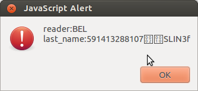

====================================
20130821 (Wednesday, 21 August 2013)
====================================

EIDReader learning to read Belgian eID cards
--------------------------------------------

Continued from :blogref:`20130819`.

Where to find the command APDUs for Belgian eID cards? 
The Belgians don't seem to provide as good technical documentation
as the Estonians...

Ha! But the source code of `eid-applet 
<https://code.google.com/p/eid-applet/>`_ 
contains answers to most of my questions!
For example
`Controller.java <https://code.google.com/p/eid-applet/source/browse/trunk/eid-applet-core/src/main/java/be/fedict/eid/applet/Controller.java>`_

Since `eid-applet` is LGPL and Lino GPL, I can AFAIK simply copy and 
paste the relevant excerpts from their code into my EIDReader applet
(after adapting the copyright notice).

Voilà: EIDReader can now read *both* Estonian *and* Belgian eID cards.
It does already recognize that it is a Belgian cards and even reads some data.
But I must still doing something wrong because it shows only the 
*number* of my eID card (not all the public data as I'd like it to):

Discovered and reported a bug in appy pod
-----------------------------------------

Ha! Lino is so cool! I had no problem to reproduce an error which 
occured now and then in a production site. 
This was the traceback produced by the above snippet::

    Traceback (most recent call last):
      (...)
      File "lino/mixins/printable.py", line 314, in f
        Renderer(ar,tpl, context, target,**settings.SITE.appy_params).run()
      File "/home/luc/pythonenvs/py27/local/lib/python2.7/site-packages/appy/pod/renderer.py", line 394, in run
        self.finalize()
      File "/home/luc/pythonenvs/py27/local/lib/python2.7/site-packages/appy/pod/renderer.py", line 546, in finalize
        output = self.callLibreOffice(resultName, resultType)
      File "/home/luc/pythonenvs/py27/local/lib/python2.7/site-packages/appy/pod/renderer.py", line 430, in callLibreOffice
        Converter(resultName, resultType, self.ooPort).run()
      File "/home/luc/pythonenvs/py27/local/lib/python2.7/site-packages/appy/pod/converter.py", line 243, in run
        self.loadDocument()
      File "/home/luc/pythonenvs/py27/local/lib/python2.7/site-packages/appy/pod/converter.py", line 214, in loadDocument
        self.updateOdtDocument()
      File "/home/luc/pythonenvs/py27/local/lib/python2.7/site-packages/appy/pod/converter.py", line 167, in updateOdtDocument
        indexes = self.doc.getDocumentIndexes()
    AttributeError: 'NoneType' object has no attribute 'getDocumentIndexes'

Here is how I discovered the reason.

.. note:: 

    While writing this blog post I tested it using::

      $ python -m doctest docs/blog/2013/0821.rst`

    It is not part of the standard test suite because it fails when there 
    is no LibreOffice server running.

>>> import os
>>> os.environ['DJANGO_SETTINGS_MODULE'] = 'lino_welfare.settings.test'
>>> from lino.runtime import *
>>> from pprint import pprint
>>> ses = settings.SITE.login('rolf')
>>> ses.set_language('de')
>>> obj = jobs.Contract.objects.get(pk=1)
>>> obj.clear_cache()
>>> obj.responsibilities = '
 
'
>>> obj.save()
>>> pprint(ses.run(obj.do_print)) #doctest: +NORMALIZE_WHITESPACE
{'message': u'Dokument Art.60\xa77-Konvention#1 (Charlotte Collard) wurde generiert.',
 'open_url': u'/media/cache/appypdf/jobs.Contract-1.pdf',
 'refresh': True,
 'success': True}
 
Until here it works. The problem comes when `responsibilities`
contains certain "invalid" chunk of HTML.

>>> obj.responsibilities = '
\n
\n<ul>\n<li><strong>Unterhalt und Reinigung der B&uuml;ros, Versammlungsr&auml;ume, Pausenr&auml;ume, Flure, Sanit&auml;ren Anlagen.</strong></li>\n</ul>\n
\n
'
>>> obj.save()
>>> obj.clear_cache()
>>> pprint(ses.run(obj.do_print)) #doctest: +NORMALIZE_WHITESPACE +ELLIPSIS
Traceback (most recent call last):
...
AttributeError: 'NoneType' object has no attribute 'getDocumentIndexes'

The culprit in our case seems to be the (superfluous) `
` 
tag, probably inserted by TinyMCE.
Removing the complete `
` tag makes it work:

>>> obj.responsibilities = '
\n<ul>\n<li><strong>Unterhalt und Reinigung der B&uuml;ros, Versammlungsr&auml;ume, Pausenr&auml;ume, Flure, Sanit&auml;ren Anlagen.</strong></li>\n</ul>\n
'
>>> obj.save()
>>> obj.clear_cache()
>>> pprint(ses.run(obj.do_print)) #doctest: +NORMALIZE_WHITESPACE +ELLIPSIS
{'message': u'Dokument Art.60\xa77-Konvention#1 (Charlotte Collard) wurde generiert.',
 'open_url': u'/media/cache/appypdf/jobs.Contract-1.pdf',
 'refresh': True,
 'success': True}
 
Now we try to further identify the culprit.
Restore the `
` tag and remove only the 
attributes "background-image: initial; background-attachment: initial; 
background-origin: initial; background-clip: initial;"
from the `
` still doesn't work (so these are not the reason):

>>> obj.responsibilities = '
\n
\n<ul>\n<li><strong>Unterhalt und Reinigung der B&uuml;ros, Versammlungsr&auml;ume, Pausenr&auml;ume, Flure, Sanit&auml;ren Anlagen.</strong></li>\n</ul>\n
\n
'
>>> obj.save()
>>> obj.clear_cache()
>>> pprint(ses.run(obj.do_print)) #doctest: +NORMALIZE_WHITESPACE
Traceback (most recent call last):
...
AttributeError: 'NoneType' object has no attribute 'getDocumentIndexes'

The `color: blue !important;` part also is not the culprit:

>>> obj.responsibilities = '
\n
\n<ul>\n<li><strong>Unterhalt und Reinigung der B&uuml;ros, Versammlungsr&auml;ume, Pausenr&auml;ume, Flure, Sanit&auml;ren Anlagen.</strong></li>\n</ul>\n
\n
'
>>> obj.save()
>>> obj.clear_cache()
>>> pprint(ses.run(obj.do_print)) #doctest: +NORMALIZE_WHITESPACE
Traceback (most recent call last):
...
AttributeError: 'NoneType' object has no attribute 'getDocumentIndexes'

Tilt! *Inverting the ordering* of `` and `
` tags 
finally does make it work:
 
>>> obj.responsibilities = '

\n\n<ul>\n<li><strong>Unterhalt und Reinigung der B&uuml;ros, Versammlungsr&auml;ume, Pausenr&auml;ume, Flure, Sanit&auml;ren Anlagen.</strong></li>\n</ul>\n\n

'
>>> obj.save()
>>> obj.clear_cache()
>>> pprint(ses.run(obj.do_print)) #doctest: +NORMALIZE_WHITESPACE
{'message': u'Dokument Art.60\xa77-Konvention#1 (Charlotte Collard) wurde generiert.',
 'open_url': u'/media/cache/appypdf/jobs.Contract-1.pdf',
 'refresh': True,
 'success': True}

So this is the reason. Let's simplify the HTML and formulate our statement: 
appy_pod has a problem with the following chunk:
 
>>> obj.responsibilities = '

Some text

'
>>> obj.save()
>>> obj.clear_cache()
>>> pprint(ses.run(obj.do_print)) #doctest: +NORMALIZE_WHITESPACE
Traceback (most recent call last):
...
AttributeError: 'NoneType' object has no attribute 'getDocumentIndexes'
 
Test cases like this one should not modify the demo database because
the test suite runner doesn't reinisitialize the database for each case.
So we restore the original value (which was an empty string):

>>> obj.responsibilities = ''
>>> obj.save()

Wrote another page for Gaëtan to reproduce all this without Lino 
installed: :doc:`0821/bug`.

As explained there, I then understood that 
a `
` inside a `` is simply invalid XHTML, 
so instead of filing a bug for Gaëtan
I fixed it and added a test case in my own code:
:mod:`lino.utils.html2xhtml`.

