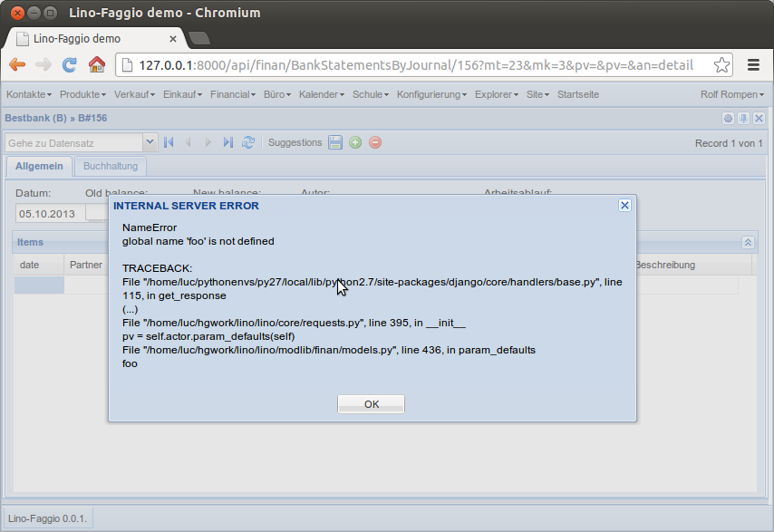
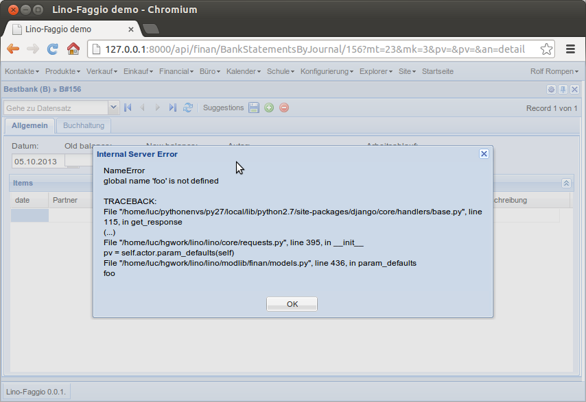

====================================
20131005 (Saturday, 05 October 2013)
====================================

Continued on :ref:`faggio`.
Generating more demo data.
:mod:`lino.modlib.ledger.fixtures.mini` now generates simple 
monthly sales invoices with 3 products Foo, Bar and Baz.

Added a "basic accounting truths" section to 
:ref:`faggio.tested.faggio`. 
These things are still evolving.
For example a **Sales** journal has its `dc` field set to **Debit**,
but what exactly does that mean?
It means that a voucher with a non-negative total amount will 
debitate the **partner account** (and thus creditate the sales account).

Since :class:`DebitOrCreditField <lino.modlib.accounts.models.DebitOrCreditField>` 
is basically just a BooleanField, it used to be rendered as a checkbox.
Now we have a new magic attribute "lino_atomizer_class".
We don't want to define this as a core atomizer because this 
implementation is just one possible choice.

I wasted one hour into something which was absolutely not 
necessary:
when an internal server error occurs I wanted Lino to not "shout" 
at the user, i.e. to say "Internal Server Error" 
instead of "INTERNAL SERVER ERROR"
as the title of the alert message.

Since that title is the "response status text", which is not really 
easy to customize, I let the client to the work. 
Added a function toCamel to the Javascript `String` class::

    String.prototype.toCamel = function(){
      return this.replace(/([A-Z])([A-Z]+)/g, function(match,p1,p2,offset,string){
          return p1 + p2.toLowerCase();});
    };

Here is a screenshot after and another before:

:mod:`lino.modlib.ledger.fixtures.mini` now also generates 
monthly payment orders and bank statements.

The trade_type of a financial journal was ignored until now.
But now it is used to limit the suggestions made.
A side effect is that "Payment orders" moves from "Financial" menu 
to "Purchases" menu.

BankStatements now get their balance1 filled with balance2 from 
previous statement.

TODO:

- Lino should update the `total` of a PaymentOrder (or the `balance2` 
  of a BankStatement) after filling suggestions.
- possibility to toggle selection modes (cell/row) dyamically
- possibility to delete all items of a voucher at once (but not the 
  voucher)
  
- Layout of the Detail of a BankStatement when there's not much room:
  The workflow_buttons is a DisplayField and gets "as much as
  possible" width, that's okay but Lino seems to set inadequate 
  `minWidth` values for certain widget types (Dates).   
  
