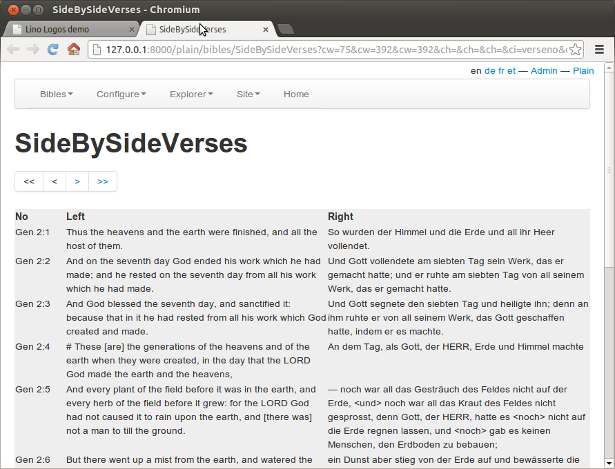

====================================
20131012 (Saturday, 12 October 2013)
====================================

:xfile:`setup_info.py` replaced by :xfile:`project_info.py`
-----------------------------------------------------------

:ref:`atelier` 
expected a file 
:xfile:`setup_info.py`
which contains the `SETUP_INFO` dictionary.
This file is now named :xfile:`project_info.py`.
The reason for this is simply that 
most of my projects also have a `settings` 
subdirecory, and that I had to type 4 letters 
to get command-line expansion to understand waht I mean...

Context-sensitive chooser on a ChoiceListField
----------------------------------------------

Until now it was not possible to define a context-sensitive chooser on 
a ChoiceListField.
Changed :meth:`lino.utils.choosers.Chooser.get_data_elem`,
but that wasn't enough.

Lino-Logos, a new submarine project
-----------------------------------

I started to write a prototype for Lino Logos.
This is a personal voluntary project to write an application 
for managing bible editions. 
It started last week when I read a blog post `SacredPy seeking collaborators
<http://catherinedevlin.blogspot.com/2013/10/sacredpy-seeking-collaborators.html>`_,
where Catherine described the needs for a platform into which they can

- Upload texts in their original language
- Let users suggest translations for the text, verse-by-verse
- Debate and discuss the suggestions
- Vote on them
    
Later I had a 30 minutes phone call with Kai Schraml
(from Estonia to California).
This was the beginning of Lino Logos...

... which is not yet published, but I thought that the SideBySideVerses 
table is worth two screenshots:

.. image:: 1012a.png
  :scale: 80

