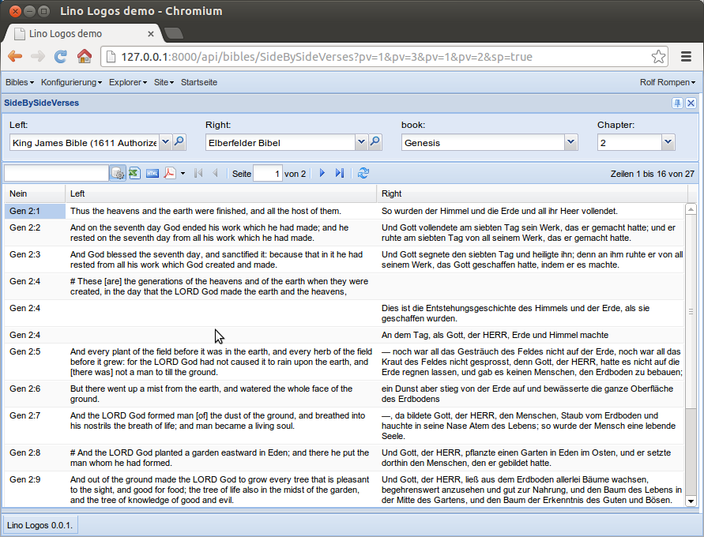

==================================
20131014 (Monday, 14 October 2013)
==================================

Variable row height
-------------------

The :ref:`logos` project caused a new feature for Lino:
the new class attribute 
:attr:`variable_row_height <lino.core.tables.AbstractTable.variable_row_height>`.

Before and after:

.. image:: 1012a.png
  :scale: 45

  
  
Comments
--------

And another new Lino feature caused 
by the :ref:`logos` project:
:mod:`lino.modlib.comments`.
This will be Lino's custom solution to replace
`Django's comments framework
<https://docs.djangoproject.com/en/dev/ref/contrib/comments/>`_
which has  been deprecated because "Most users will be better served 
with a custom solution, or a hosted product like Disqus."

:mod:`lino.modlib.comments` in turn caused another new feature:
Lino now supports `insert_layout` with only one element:
it uses then a hard-coded height of 10 lines.
You can always specify your own window_size.

Where to get free bibles
------------------------
  
Should :ref:`logos` have its own copy of bibles? 
Or is it enough to generate links to existing online bible servers?

For example here is how "1Mos 1:2" is being served by two German 
online bibles:

- die-bibel.de 
  (documented `here <http://www.die-bibel.de/online-bibeln/link-service/bibel-link-service/>`_)
  : http://www.die-bibel.de/bibelstelle/1.Mose%201%2C2/
  
-   bibel-online.net : http://bibel-online.net/buch/elberfelder_1905/1_mose/1/#2

Answer: no we can't simply rely on external links.
:ref:`logos` should come with its own copies 
of the different bible editions and install them into its database. 

- One reason for this is simply performance:
  a web request is still more expensive than a database lookup.
  
- Another reason is that we certainly want 
  to offer text searching, and I don't know about any service who 
  would do that for us (which is of course a pity because full-fledged 
  text searching (with e.g. language-specific fuzzy matches) 
  is a whole chapter on its own).

The `bibel-online.net` site looks more open-minded. 
It also features a cool `dual view
<http://bibel-online.net/buch/dual/biblia_hebraica/1_mose/2/elberfelder_1905/1_mose/2>`_.

Oh, and I am sorry to see that they have had problems caused by copyright:

    Aufgrund zunehmender Kommerzialisierung und Konzentrationsbestrebungen 
    christlicher Quellenanbieter wurde auch uns vom Rat der EKD, vertreten 
    durch die Deutsche Bibelgesellschaft Stuttgart, die seit 1996 bestehende 
    und unbefristete Lizenz für die Fortführung des Angebots der 
    "Luther-Bibel 1984" zum 31.12.2007 ohne Angabe von Gründen entzogen. 

    (`Stellungnahme zum Lizenzentzug der Luther 1984 durch den Rat der EKD
    <http://bibel-online.net/luther1984/>`_)

For me this is just another confirmation of my belief that copyright 
should be abolished... 

Unfortunately my belief about copyright won't change the world:
Copyright is here to stay with us for at least the next years.

So :ref:`logos` is going to serve only those bible editions who 
*want* us to serve them. 
Which means that copyrighted editions are out 
of question, at least as long as there is no patron to sponsor the 
different license fees (and the wage for me or my successor 
because i wouldn't continue to work for free on the project in that case).

And yes, I *cannot* yet publish the source code 
of my :ref:`logos` project (nor setup an online server) 
because the screenshots are partly based on **illegaly** downloaded 
material.
If I'd publish these fixtures, I'd risk a legal pursuit.
No thanks.

I wrote a script `get_eb.py` which uses BeautifulSoup to extract 
the 1905 version of the German Elberfelder bible from 
`bibel-online.net`. 
That looks promising but needs some more work,
and I'm not even sure whether they like it
(even though they seem open-minded).

So the next question is: 
where can i find non-copyrighted bible editions?
Answer:
Welcome to the `Open English Bible <http://openenglishbible.org/>`_,
lead by Russell Allen.
Read the `Frequently Asked Questions
<http://forum.openenglishbible.org/FAQ-Frequently-Asked-Questions-td4.html>`_

Get the usfm files from https://github.com/openenglishbible/Open-English-Bible.

"Good enough" is good enough
----------------------------

Note à part:
Alex Martelli explains why 
`"Good enough" is good enough! 
<http://www.youtube.com/watch?v=gHG9FRSlPxw>`_.
This is Richard Gabriel's
`Worse is Better <http://en.wikipedia.org/wiki/Worse_is_Better>`_
idea about
simplicity,
correctness,
consistency
and completeness.

:ref:`davlink` and :file:`/usr/bin/X11`
---------------------------------------

:ref:`davlink` fails to scan the file system of a machine 
running Ubuntu and SUN Java 1.6::

    java.io.IOException: Cannot run program
    "/usr/bin//X11/X11/X11/X11/X11/X11/X11/X11/X11/X11/X11/X11/X11/X11/X11/X11/X11/X11/X11/X11/X11/X11/X11/X11/X11/X11/X11/X11/X11/X11/X11/X11/X11/X11/X11/X11/X11/X11/X11/libreoffice":
    error=40, Zu viele Ebenen aus symbolischen Links

This is because :file:`/usr/bin/X11` is 
a symlink to :file:`/usr/bin`. (And it seems that some parts of the system 
rely on this, so we cannot change it).

http://stackoverflow.com/questions/813710/java-1-6-determine-symbolic-links

The EIDReader applet got independant
------------------------------------

I moved :ref:`eidreader` to its own repository at
https://github.com/lsaffre/eidreader

Which BTW is my first GitHub project.

The applet compiles, the Estonian reader works, the Belgian reader 
*might* work but obviously has a problem::

    OpenJDK Runtime Environment (IcedTea 2.3.10) (7u25-2.3.10-1ubuntu0.12.04.2)
    OpenJDK Server VM (build 23.7-b01, mixed mode)
    java.lang.reflect.InvocationTargetException
        at sun.reflect.NativeMethodAccessorImpl.invoke0(Native Method)
        at sun.reflect.NativeMethodAccessorImpl.invoke(NativeMethodAccessorImpl.java:57)
        at sun.reflect.DelegatingMethodAccessorImpl.invoke(DelegatingMethodAccessorImpl.java:43)
        at java.lang.reflect.Method.invoke(Method.java:606)
        at sun.applet.PluginAppletSecurityContext$4.run(PluginAppletSecurityContext.java:670)
        at java.security.AccessController.doPrivileged(Native Method)
        at sun.applet.PluginAppletSecurityContext.handleMessage(PluginAppletSecurityContext.java:667)
        at sun.applet.AppletSecurityContextManager.handleMessage(AppletSecurityContextManager.java:68)
        at sun.applet.PluginStreamHandler.handleMessage(PluginStreamHandler.java:235)
        at sun.applet.PluginMessageHandlerWorker.run(PluginMessageHandlerWorker.java:78)
    Caused by: java.lang.NoClassDefFoundError: be/fedict/eid/applet/service/Identity
        at src.eidreader.BelgianReader.<init>(EIDReader.java:275)
        at src.eidreader.EIDReader.readCard(EIDReader.java:447)
        ... 10 more
    Caused by: java.lang.ClassNotFoundException: be.fedict.eid.applet.service.Identity
        at net.sourceforge.jnlp.runtime.JNLPClassLoader.loadClass(JNLPClassLoader.java:1404)
        ... 12 more
    Error on Java side: be/fedict/eid/applet/service/Identity 

AFAICS this is because of some security restriction. 
My self-signed code tries to load classes from the 

Saldenlisten drucken
--------------------

Ly schlief schon, da fiel mir ein, dass Lino noch gar keine 
buchhalterischen Ausdrucke machen kann. 
Buchhalter, zumindest die belgischen, wollen ja dann doch irgendwann
eine Saldenliste auf Papier sehen.

Zuerst musste ich mal ein bisschen Wortschatz nachforschen:

================== =============== ======================
English            Deutsch         Français
================== =============== ======================
Accounts Balance   Saldenliste     Balance des comptes
General ledger     Hauptbuch       Grand livre 
================== =============== ======================

Und dann, nach weniger als zwei Stunden Programmierung schon
ein Screenshot:

Ist er denn nicht süß, unser Lino!
