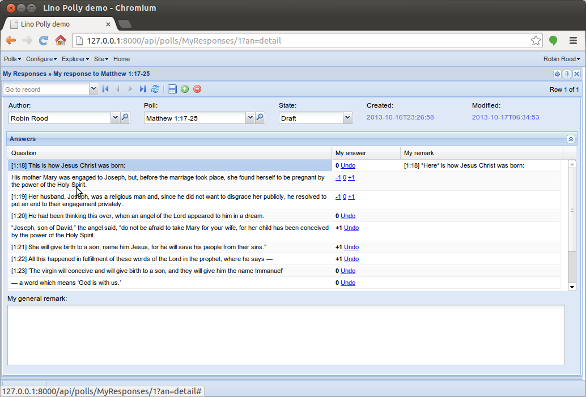

====================================
20131017 (Thursday, 17 October 2013)
====================================

Cool, Lino has two new features (needed for :ref:`polly` 
but probably useful for many other projects):

- The clickable "-1", "0" and "+1" links are a usage example for 
  :meth:`lino.core.requests.BaseRequest.put_button`
  
- New overrideable class method :meth:`lino.core.actors.Actor.get_detail_title`.
  This was used to replace the window title 
  
    "My responses > Robin Rood's response to Matthew 1:17-25"
    
  by
  
    "My responses > My response to Matthew 1:17-25"
    
    
Miscellaneous
-------------

- After reading
  `Translated text images for lazy programmers
  <http://www.nomadblue.com/blog/django/translated-text-images-for-lazy-programmers/>`_
  and the comments, I updated my :ref:`mldbc_tutorial` page 
  and did some internal tidy-up in the source code.

- Adapted test suite after this tidy-up  (and the changes for :ref:`polly`).

- Fixed a bug: Invoking `lino.modlib.reception.GoneVisitors` 
  caused a "FieldError: Invalid order_by arguments: ['gone_since-']" 
  
    

To-Do-Liste Sven
----------------

- Kalenderansicht: 
  Klick auf einen Tag im date picker (dem kleinen Monatskalender oben links) 
  sollte auf den betreffenden Tag springen, tut er aber nicht.
  Behoben.

- Kurse mit ausgefülltem Datum "Endet am" taten nicht unbedingt das was 
  man gedacht hatte, weil ich da fälschlicherweise zwei Bedeutungen ins 
  gleiche Feld gepackt hatte. Jetzt haben wir zwei Felder:
  
  - `Endet am` : wann der Termin endet. Dieses Feld sollte leer bleiben, 
    wenn der Termin am gleichen Tag endet. Wird gebraucht bei 
    mehrtägigen Veranstaltungen sowie für Ferientermine.
    
  - `Termine generieren bis` : bis wann Termine generiert werden. 
    Also wann der Kurs endet.
  
- Die Liste der "Kalender" in der Kalender-Ansicht entsteht aus der 
  Liste der "Abonnements", die jeder Benutzer selber anlegt. 
  Jedes Abonnement ergibt einen Kalender.
  Neues Filterkriterium "Raum".

- Der Button "Team-Ansicht" war unnütz und wurde entfernt.

