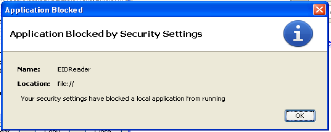

====================================
20131119 (Tuesday, 19 November 2013)
====================================

Today I continued to Work on :ref:`eidreader`, 
looking for the explanation for yesterday's last problem:

    But trying to read my Belgian card gives a new error::

      java.lang.SecurityException: trusted loader attempted to 
      load sandboxed resource from 
      file:/t:/applets/eid-applet-service.jar

    I added `Trusted-Library: true` to my `Manifest.txt` and
    re-signed.  Now there's neither an error message nor a result, nor
    any output to the Java console!  The applet just exits and that's
    all.  This happens as soon as it calls `TlvParser.parse()` (which
    has been imported from
    `be.fedict.eid.applet.service.impl.tlv.TlvParser`.

I am married with Python, 
and before diving into documents like
`Mixing Privileged Code and Sandbox Code
Ensuring Application and Applet Security
<http://docs.oracle.com/javase/7/docs/technotes/guides/jweb/mixed_code.html>`_
I always  need first to put on my mental diving dress ;-)
No, I was kidding: I won't say that programming a Java applet 
is *frustrating*, it's just... *different*.

If any experienced Java programmer has mercy with me, please have a look 
at `my code <https://github.com/lsaffre/eidreader>`_,
maybe you need just a few moments to see what I am doing wrong. 
I have it working on an IcedTea client, but Sun Java keeps
to nag me with problems that are difficult to reproduce. 

Today I tried with different constellations of
`Trusted-Only: true` and
`Trusted-Library: true`.
Also with ``*`` instead of ``T=0`` after reading
`this <http://h30499.www3.hp.com/t5/General/Communicating-with-Smart-card-on-Linux-machine-Fedora-8/td-p/4329253#.UoudtN84JPI>`_.

And I am completely lost because I even don't manage to clearly document
the problems I saw today.

For example here is a mysterious console output::

    Java Plug-in 10.45.2.18
    Using JRE version 1.7.0_45-b18 Java HotSpot(TM) Client VM
    User home directory = C:\Documents and Settings\Luc Saffre
    ----------------------------------------------------
    c:   clear console window
    f:   finalize objects on finalization queue
    g:   garbage collect
    h:   display this help message
    l:   dump classloader list
    m:   print memory usage
    o:   trigger logging
    q:   hide console
    r:   reload policy configuration
    s:   dump system and deployment properties
    t:   dump thread list
    v:   dump thread stack
    x:   clear classloader cache
    0-5: set trace level to <n>
    ----------------------------------------------------
    javax.smartcardio.CardException: connect() failed
	    at sun.security.smartcardio.TerminalImpl.connect(Unknown Source)
	    at src.eidreader.EIDReader$2.run(EIDReader.java:452)
	    at java.security.AccessController.doPrivileged(Native Method)
	    at src.eidreader.EIDReader.readCard(EIDReader.java:438)
	    at sun.reflect.NativeMethodAccessorImpl.invoke0(Native Method)
	    at sun.reflect.NativeMethodAccessorImpl.invoke(Unknown Source)
	    at sun.reflect.DelegatingMethodAccessorImpl.invoke(Unknown Source)
	    at java.lang.reflect.Method.invoke(Unknown Source)
	    at sun.plugin.javascript.Trampoline.invoke(Unknown Source)
	    at sun.reflect.NativeMethodAccessorImpl.invoke0(Native Method)
	    at sun.reflect.NativeMethodAccessorImpl.invoke(Unknown Source)
	    at sun.reflect.DelegatingMethodAccessorImpl.invoke(Unknown Source)
	    at java.lang.reflect.Method.invoke(Unknown Source)
	    at sun.plugin.javascript.JSClassLoader.invoke(Unknown Source)
	    at sun.plugin2.liveconnect.JavaClass$MethodInfo.invoke(Unknown Source)
	    at sun.plugin2.liveconnect.JavaClass$MemberBundle.invoke(Unknown Source)
	    at sun.plugin2.liveconnect.JavaClass.invoke0(Unknown Source)
	    at sun.plugin2.liveconnect.JavaClass.invoke(Unknown Source)
	    at sun.plugin2.main.client.LiveConnectSupport$PerAppletInfo$DefaultInvocationDelegate.invoke(Unknown Source)
	    at sun.plugin2.main.client.LiveConnectSupport$PerAppletInfo$3.run(Unknown Source)
	    at java.security.AccessController.doPrivileged(Native Method)
	    at sun.plugin2.main.client.LiveConnectSupport$PerAppletInfo.doObjectOp(Unknown Source)
	    at sun.plugin2.main.client.LiveConnectSupport$PerAppletInfo$LiveConnectWorker.run(Unknown Source)
	    at java.lang.Thread.run(Unknown Source)
    Caused by: sun.security.smartcardio.PCSCException: SCARD_E_PROTO_MISMATCH
	    at sun.security.smartcardio.PCSC.SCardConnect(Native Method)
	    at sun.security.smartcardio.CardImpl.<init>(Unknown Source)
	    ... 24 more

Some screenshots:

And here another console log::

    It's a Belgian card
    BelgianReader() constructor started
    identityData has been read
    com.sun.deploy.security.BlockedException: Your security settings have blocked a local application from running
	at com.sun.deploy.security.SandboxSecurity.showBlockedDialog(Unknown Source)
	at com.sun.deploy.security.SandboxSecurity.checkRunLocal(Unknown Source)
	at com.sun.deploy.security.SandboxSecurity.checkUnsignedSandboxSecurity(Unknown Source)
	at com.sun.deploy.security.SandboxSecurity.isPermissionGranted(Unknown Source)
	at sun.plugin2.applet.Plugin2ClassLoader.isTrustedByTrustDecider(Unknown Source)
	at sun.plugin2.applet.Plugin2ClassLoader.getPermissions(Unknown Source)
	at sun.plugin2.applet.Applet2ClassLoader.getPermissions(Unknown Source)
	at java.security.SecureClassLoader.getProtectionDomain(Unknown Source)
	at java.security.SecureClassLoader.defineClass(Unknown Source)
	at java.net.URLClassLoader.defineClass(Unknown Source)
	at sun.reflect.NativeMethodAccessorImpl.invoke0(Native Method)
	at sun.reflect.NativeMethodAccessorImpl.invoke(Unknown Source)
	at sun.reflect.DelegatingMethodAccessorImpl.invoke(Unknown Source)
	at java.lang.reflect.Method.invoke(Unknown Source)
	at sun.plugin2.applet.Plugin2ClassLoader.defineClassHelper(Unknown Source)
	at sun.plugin2.applet.Plugin2ClassLoader.access$100(Unknown Source)
	at sun.plugin2.applet.Plugin2ClassLoader$2.run(Unknown Source)
	at java.security.AccessController.doPrivileged(Native Method)
	at sun.plugin2.applet.Plugin2ClassLoader.findClassHelper(Unknown Source)
	at sun.plugin2.applet.Applet2ClassLoader.findClass(Unknown Source)
	at sun.plugin2.applet.Plugin2ClassLoader.loadClass0(Unknown Source)
	at sun.plugin2.applet.Plugin2ClassLoader.loadClass(Unknown Source)
	at sun.plugin2.applet.Plugin2ClassLoader.loadClass(Unknown Source)
	at java.lang.ClassLoader.loadClass(Unknown Source)
	at src.eidreader.BelgianReader.<init>(EIDReader.java:234)
	at src.eidreader.EIDReader$2.run(EIDReader.java:461)
	at java.security.AccessController.doPrivileged(Native Method)
	at src.eidreader.EIDReader.readCard(EIDReader.java:438)
	at sun.reflect.NativeMethodAccessorImpl.invoke0(Native Method)
	at sun.reflect.NativeMethodAccessorImpl.invoke(Unknown Source)
	at sun.reflect.DelegatingMethodAccessorImpl.invoke(Unknown Source)
	at java.lang.reflect.Method.invoke(Unknown Source)
	at sun.plugin.javascript.Trampoline.invoke(Unknown Source)
	at sun.reflect.NativeMethodAccessorImpl.invoke0(Native Method)
	at sun.reflect.NativeMethodAccessorImpl.invoke(Unknown Source)
	at sun.reflect.DelegatingMethodAccessorImpl.invoke(Unknown Source)
	at java.lang.reflect.Method.invoke(Unknown Source)
	at sun.plugin.javascript.JSClassLoader.invoke(Unknown Source)
	at sun.plugin2.liveconnect.JavaClass$MethodInfo.invoke(Unknown Source)
	at sun.plugin2.liveconnect.JavaClass$MemberBundle.invoke(Unknown Source)
	at sun.plugin2.liveconnect.JavaClass.invoke0(Unknown Source)
	at sun.plugin2.liveconnect.JavaClass.invoke(Unknown Source)
	at sun.plugin2.main.client.LiveConnectSupport$PerAppletInfo$DefaultInvocationDelegate.invoke(Unknown Source)
	at sun.plugin2.main.client.LiveConnectSupport$PerAppletInfo$3.run(Unknown Source)
	at java.security.AccessController.doPrivileged(Native Method)
	at sun.plugin2.main.client.LiveConnectSupport$PerAppletInfo.doObjectOp(Unknown Source)
	at sun.plugin2.main.client.LiveConnectSupport$PerAppletInfo$LiveConnectWorker.run(Unknown Source)
	at java.lang.Thread.run(Unknown Source)

Which IDE to use?
-----------------

On such days I use to be more open for diversion.
For example questions like the above seem more urgent than usual...

JetBrains announced in September 
`a free edition of their PyCharm IDE
<http://blog.jetbrains.com/pycharm/2013/09/jetbrains-delights-the-python-community-with-a-free-edition-of-its-famous-ide-pycharm-3-0/>`_.
I even
downloaded a version when i read about that, but then never opened the
.tar.gz file because there are always so many other things to do.

Joe showed me (once again) that my minimalistic approach 
of using Geany as "IDE" leaves me without certain powerful tools, 
so I am going to invest some time in a successor for Geany.

So now I finally started to play with it.
Looks truly both immense and easy to get started. 

But while working on :ref:`eidreader` I noticed that `.java` files are
not highlighted.  And then I found a question `How do I get YAML
syntax highlighting in PyCharm?
<http://stackoverflow.com/questions/19967224/how-do-i-get-yaml-syntax-highlighting-in-pycharm>`_
on Stackoverflow, and the answer is "YAML available in Pro edition
ONLY".

I guess that the same is true for my `.java` files.  Which means that
we cannot consider the community version as free software. And there
is no fork of PyCharms which adds a free version of these functions.
And I am not going to start such a fork.  An IDE is for a software
developer like a bus for a bus driver.  It takes me much time to get
used to a new IDE.  And I'm not going to invest my time for free into
a proprietary product as long as I didn't even seriously investigate
the free ones. So I am afraid that this was all I am going to say
about PyCharms.

This blog entry I wrote it already with Emacs. I guess it is at least
six years ago that I switched from Emacs to Scite, mainly because at
that time I was working much in parallel on TIM and Lino, and I never
managed to have Emacs display DOS box characters correctly.
Now it works. Just for fun, here is a screenshot from TIM::

  ╔══════════════ General accounts balances ═════════════╗
  ║ Period from-to*1311                                  ║
  ║ Currency *EUR                                        ║
  ║ X show initial balances                              ║
  ║ Pages from-to                                        ║
  ║ Parameter set*LISTE                                  ║
  ║ X generate PDF instead of printing                   ║
  ╚══════════════════════════════════════════════════════╝

It's also funny to see how much my fingers still recognize their old
friend. :kbd:`M-q` to reformat a paragraph while writing this blog entry, 
:kbd:`C-x C-s` to save the current buffer, ...

In my :file:`.bashrc` I needed to say::

  EDITOR="emacsclient -n"

Thanks to the authors of the 
`Emacs Tour <http://www.gnu.org/software/emacs/tour/>`_
who helped me to quickly re-start Emacs.

