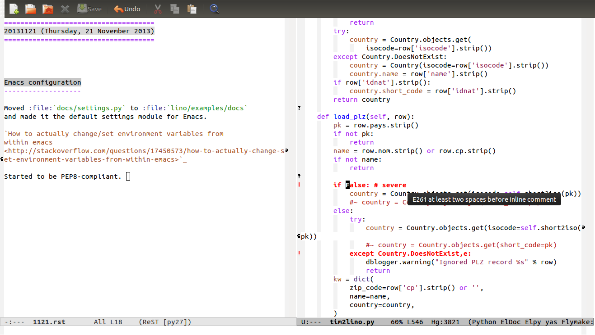

=====================================
20131121 (Thursday, 21 November 2013)
=====================================

Continued :ref:`tim2lino`
-------------------------

The "Sector" project 
(:ref:`tim2lino` and :ref:`cosi`)
is getting into a final phase! 
Soon I'll invite Andreas to a visit.

Some problems yet to solve: 

- the invoices generate only two movements, the one for the vat is missing.
- how to make `get_vat_rate` configurable.
  Should there be a VAT plugin instead of the SiteMixin?
  It must also receive the date.

Emacs configuration
-------------------

Actually I wanted to continue with :ref:`tim2lino`...  but (cool:)
Emacs now paints everything red that is not compliant with PEP8.  

And of course nobody wants to work in such code!  (Joe: "I know it
would be quite a change, but I think it is worth the trouble, because
Python programmers tend to avoid code not formated using PEP8 or
something very similar.")  So I started to manually convert code to
look PEP8-compliant.  The first victim is
:mod:`lino.projects.presto.fixtures.tim2lino`.

Many warnings are about missing whitespace after ',',
which I perceive as rather nitpicky. For example::

    def load_fin(self,row,**kw):
        self.FINDICT[(jnl,year,number)] = doc

is not compliant. Must be::

    def load_fin(self, row, **kw):
        self.FINDICT[(jnl, year, number)] = doc

Maybe there is a way to tell Emacs to ignore certain 
warnings? 
Because such changes should rather not come 
together with "real" changes.

Should I tell Emacs to remove trailing spaces automatically?
Here is the same problem: such changes should rather not come 
together with "real" changes.

Moved :file:`docs/settings.py` to :file:`lino/examples/docs` 
and made it the default settings module for Emacs.

`How to actually change/set environment variables from 
within emacs
<http://stackoverflow.com/questions/17450573/how-to-actually-change-set-environment-variables-from-within-emacs>`_

