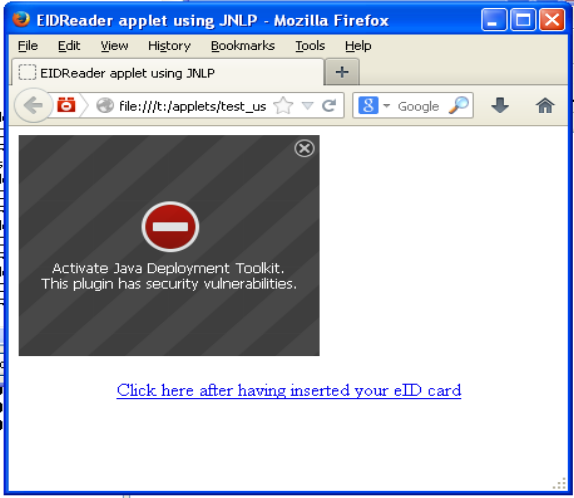
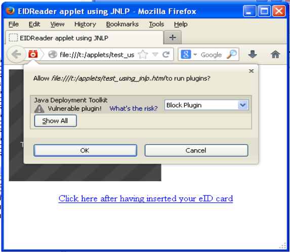
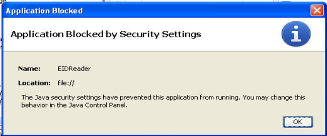
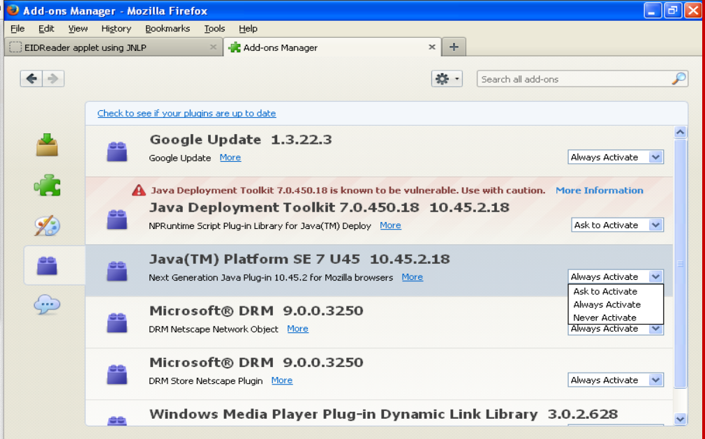

===================================
20131220 (Friday, 20 December 2013)
===================================

Today I continued to try to get :ref:`eidreader` to run on a virtual
machine using Windows XP, Oracle Java 1.7. Update 45 and Mozilla
Firefox.  `Re-installing Java`_ did not solve the issue.
Nor did `Signing third-party archives`_.
I surfed `More about JNLP`_ without really finding new possible explanations.
Started to set up a `public test page`_.

Fun with Java
-------------

Here are some pictures taken yesterday during my trips to Java 
with Manuel and Dirk...

Re-installing Java
------------------

I noted once more that the installer for Oracle Java 1.7 Update 45
doesn't work, I have the same problem as described `here
<https://support.mozilla.org/en-US/questions/972276>`_, and the
solution being to not use the default `.msi` file but the "offline
installer" (an `.exe` file of 29MB) which can be downloaded from
http://www.java.com/en/download/windows_offline.jsp

Signing third-party archives
----------------------------

One person on SO `reported
<http://stackoverflow.com/questions/4750137/sign-java-applet-step-by-step>`_
that he solved it by "recompiling all the Apache library putted
together with my classes so I generate an unique jar file and then I
signed it".

Yes, also user107312 writes that "The problem was that my jar files
weren't being compiled in the same way that I was referencing the
class files."  (in `How do I sign a Java applet for use in a browser?
<http://stackoverflow.com/questions/908748/how-do-i-sign-a-java-applet-for-use-in-a-browser>`__.)

And indeed I am working with unsigned versions of `eid-applet.jar`,
`commons-logging.jar` and `commons-codec.jar`.  This might be the
problem.  How to sign other people's code?  Simply by using jarsigner
as you do with your own `.jar` files.  Now I sign them as well. But
nope, this still didn't solve it!

More about JNLP
---------------

- `Java 7 u45 Web Start application won't launch
  <https://forums.oracle.com/thread/2593583>`_ seems to match my
  problem, and one poster there writes that he had to 
  sign the JNLP file.  (I guess he means as explained `here
  <https://blogs.oracle.com/thejavatutorials/entry/signing_a_jnlp_file>`__).
  But I don't (yet) believe it...

- The official release note for `JNLP support
  <http://www.oracle.com/technetwork/java/javase/index-142562.html>`__
  (introduced by Oracle in 1.6)
  explains interesting things.
  But I don't believe that the solution for our problem lies there.

- Fernando Cassia nicely explains in a `blog post 
  <http://geekgaucho.blogspot.com/2012/04/how-to-run-jnlp-java-web-start-jws-apps.html>`_ certain things I didn't yet know.

public test page
----------------

A public test page where I can invite other people to test my applet
is online but doesn't yet work:

http://test-eidreader.lino-framework.org/

TODO: sign the third party jars on the server!? I'd rather include the
signed jars with eidreader repository... but am I allowed to do that?

Distributing third-party .jar files
-----------------------------------

Is it allowed to sign a third-party `.jar` file and to 
distribute it together with my .jar file?
Concretely I speak about the following libraries:

- `eid-applet-services.jar` from the
  `eid-applet <https://code.google.com/p/eid-applet/>`_
  project (LGPL)
- `commons-logging.jar` from the
  `commons-logging <http://commons.apache.org/proper/commons-logging/>`_
  project.
- `commons-codec.jar` from the
  `commons-codec <http://commons.apache.org/proper/commons-codec/>`_
  project.

I discovered that Thunderbird is a nice IRC client and had my first
chat on #apache-commons with Stefan Bodewig who did not see any 
problem.

I updated the docs and added a dedicated page about
:doc:`/eidreader/applets`.

Before actually publishing the signed third-party jars, I can now ask
from other people whether this is legally correct.

Are applets the right technology for eidreader?
-----------------------------------------------

Many people are telling me that Java applets are an obsolete
technique.  Here again a blog entry `Creating a Java Applet in 2013
<http://www.stichlberger.com/software/creating-a-java-applet-in-2013/>`_
where **Sti** writes "consider using a different technology (these
days, flash doesn’t have much lure either). Oracle doesn’t seem keen
to make your life with applets easier, and applets don’t run on mobile
clients … so welcome to Canvas, jQuery and tons of interesting
Javascript frameworks (most applets do some drawing, so why not use
processing.js?)."

Sorry, but I didn't yet find an alternative to Java when I want to
read a PC/SC card from a browser.  Except of course for writing my own
set of browser extensions.

Ist Tschetschenien ein Land?
----------------------------

Tschetschenien is eine der russischen Republiken.  Eigentlich sagt man
in Lino also als Land "Russland".  Genauso wie es auch kein "Land"
namens Kalifornien gibt, weil Kalifornien zu den Vereingten Staaten
von Amerika (USA) gehört.

"Land" ist hier im Sinne von 
`ISO 3166-1 <https://en.wikipedia.org/wiki/ISO_3166-1>`_ 
gemeint.
Es gibt aber einen anderen Standard, 
`ISO 3166-2 <https://en.wikipedia.org/wiki/ISO_3166-2>`_, 
der die Unterteilungen der Länder regelt.

Nicht nur für 
`Russland <https://en.wikipedia.org/wiki/ISO_3166-2:RU>`_,
sondern auch für 
die `USA <https://de.wikipedia.org/wiki/ISO_3166-2:US>`_
oder... `Belgien <https://de.wikipedia.org/wiki/ISO_3166-2:BE>`_.

`ISO 3166-1 <https://en.wikipedia.org/wiki/ISO_3166-1>`_ wird in Lino
in der Fixture :mod:`all_countries
<lino.modlib.countries.fixtures.all_countries>` definiert, welche
ihrerseits auf Arbeit von `bosteels
<http://users.telenet.be/bosteels/countries.xml>`_ basiert (was ich
aber irgendwann ändern möchte, denn inzwischen habe ich ja
python-babel entdeckt).
Randnotiz: Jonathan Callahan beschreibt in einem Blog-Eintrag sehr
anschaulich den Nutzen von python-babel:
http://mazamascience.com/WorkingWithData/?p=129

Angesichts der vielen russischen Einwanderer in Eupen scheint es
Bedarf zu geben, die Teilstaaten großer Nationen in Linos Länderliste
aufzunehmen. Das Geburtsland einer Person ist nicht unbedingt das
Gleiche wie das Land, dem ihr Geburtsort jetzt angehört.

Aber es wäre falsch, diese "Regionen" jetzt in die Liste der Länder
aufzunehmen. Die gehören in die Liste der **Orte** (die wir in erster
Linie für **Städte** benutzen).

Repairing the test suite
------------------------

- Fixed a bug in `lino/apps/extensible/config/snippets/extensible.js`: 
  the `ls_url` was still using "cal" instead of "extensible" as app label.
