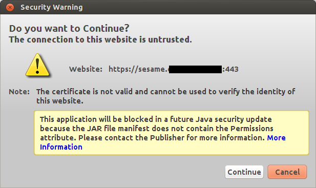
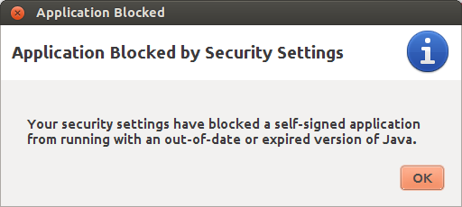
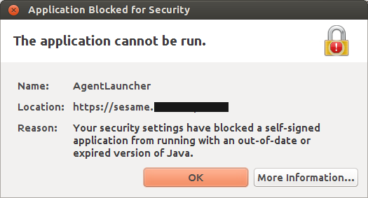

====================================
20140211 (Tuesday, 11 February 2014)
====================================

Cannot connect to Sesame VDI server
-----------------------------------

One of my customers wants me to occasionally log into their system
using a combination of Sesame, Adito and Citrix, I ignore the details,
but basically it requires some Java. At some moment it says:

    Launch Adito Agent
    Some features of the Adito require the use of the Adito Agent which should now launch. 

And recently it then started to not start a Citrix VDI but to say:

And finally::

   com.sun.deploy.security.BlockedException: Your security settings have blocked a self-signed application \
   from running with an out-of-date or expired version of Java.
	at com.sun.deploy.security.SandboxSecurity.showBlockedDialog(Unknown Source)
	at com.sun.deploy.security.TrustDecider.askUser(Unknown Source)
	at com.sun.deploy.security.TrustDecider.validateChain(Unknown Source)
	at com.sun.deploy.security.TrustDecider.isAllPermissionGranted(Unknown Source)
	at sun.plugin2.applet.Plugin2ClassLoader.isTrustedByTrustDecider(Unknown Source)
	at sun.plugin2.applet.Plugin2ClassLoader.getTrustedCodeSources(Unknown Source)
	at com.sun.deploy.security.CPCallbackHandler$ParentCallback.strategy(Unknown Source)
	at com.sun.deploy.security.CPCallbackHandler$ParentCallback.openClassPathElement(Unknown Source)
	at com.sun.deploy.security.DeployURLClassPath$JarLoader.getJarFile(Unknown Source)
	at com.sun.deploy.security.DeployURLClassPath$JarLoader.access$1000(Unknown Source)
	at com.sun.deploy.security.DeployURLClassPath$JarLoader$1.run(Unknown Source)
	at java.security.AccessController.doPrivileged(Native Method)
	at com.sun.deploy.security.DeployURLClassPath$JarLoader.ensureOpen(Unknown Source)
	at com.sun.deploy.security.DeployURLClassPath$JarLoader.<init>(Unknown Source)
	at com.sun.deploy.security.DeployURLClassPath$3.run(Unknown Source)
	at java.security.AccessController.doPrivileged(Native Method)
	at com.sun.deploy.security.DeployURLClassPath.getLoader(Unknown Source)
	at com.sun.deploy.security.DeployURLClassPath.getLoader(Unknown Source)
	at com.sun.deploy.security.DeployURLClassPath.getResource(Unknown Source)
	at sun.plugin2.applet.Plugin2ClassLoader$2.run(Unknown Source)
	at java.security.AccessController.doPrivileged(Native Method)
	at sun.plugin2.applet.Plugin2ClassLoader.findClassHelper(Unknown Source)
	at sun.plugin2.applet.Applet2ClassLoader.findClass(Unknown Source)
	at sun.plugin2.applet.Plugin2ClassLoader.loadClass0(Unknown Source)
	at sun.plugin2.applet.Plugin2ClassLoader.loadClass(Unknown Source)
	at sun.plugin2.applet.Plugin2ClassLoader.loadClass0(Unknown Source)
	at sun.plugin2.applet.Plugin2ClassLoader.loadClass(Unknown Source)
	at sun.plugin2.applet.Plugin2ClassLoader.loadClass(Unknown Source)
	at java.lang.ClassLoader.loadClass(ClassLoader.java:358)
	at sun.plugin2.applet.Plugin2ClassLoader.loadCode(Unknown Source)
	at sun.plugin2.applet.Plugin2Manager.initAppletAdapter(Unknown Source)
	at sun.plugin2.applet.Plugin2Manager$AppletExecutionRunnable.run(Unknown Source)
	at java.lang.Thread.run(Thread.java:744)

This was with Oracle's Java activated on my Ubuntu Saucy.
Tried to see what happens with OpenJDK. But unfortunately::

    # update-java-alternatives -l
    java-1.7.0-openjdk-i386 1071 /usr/lib/jvm/java-1.7.0-openjdk-i386
    java-7-oracle 1073 /usr/lib/jvm/java-7-oracle
    # update-java-alternatives -s java-1.7.0-openjdk-i386
    update-alternatives: error: no alternatives for apt
    #

I guess that this is a problem on my machine after upgrading to
saucy, similar to `java alternatives missing after upgrade to precise
<https://bugs.launchpad.net/ubuntu/+source/openjdk-6/+bug/905808>`_

Asked Google:

- http://java.com/de/download/help/linux_install.xml
- https://help.ubuntu.com/community/Java

Okay, I remove all Java environments, development kits, and all
IcedTea plugins from my machine and restart at the beginning. 
Only one little problem (which I ignored)::

  update-binfmts: warning: current package is oracle-java7, but binary format already installed by openjdk-6; not removing.

Restart. In the beginning there was OpenJDK::

  # aptitude install openjdk-7-jdk
  # aptitude install icedtea-plugin

And wow! now everything seems to work!
Maybe I'll never need any Oracle Java anymore!

Endspurt
--------

There was a bug in :mod:`lino.modlib.beid`: the generated ``<applet>``
tag for :ref:`eidreader` did not set `codebase`, and thus OpenJava
failed to load the third-party jar files.  It is strange that this
problem does not seem to have occured earlier.

Added :mod:`lino.projects.docs.settings` to `fabfile.py` in `lino`, in
order to avoid error messages when generating the docs.
:mod:`lino.modlib.households.fixtures.demo` caused `fab initdb` in
`lino` to fail because it sorted existing persons by `birth_date` and
this field doesn't exist by default. Sort by `-id` instead. This might
change some outputs in tested documents.

:ref:`eidreader` deployment
---------------------------

I finally decided to add the signed third-party jars to the eidreader
repository. The reasons why this had to wait until now were my fears
of (1) doing something illegal and/or (2) opening a possibility for
others to peruse my signature.
Fear (1) is explained in :ref:`third_party_jars`.
Fear (2) has gone away after checking documents like `Signing Applets
Using RSA Certificates
<http://docs.oracle.com/javase/7/docs/technotes/guides/jweb/security/rsa_signing.html>`_. Yes,
anonymous people can now see and download files like
`commons-logging.jar` which contains a set of code and my signature
which confirms that this code can be trusted. They cannot extract my
signature from that file and use it to sign something else.

Things are now getting much easier, and that's good because they are
complicated enough by themselves.

One of my stumble stones while testing on testlino::
    
    AttributeError
    AttrDict instance has no key 'nationalNumber' (keys are valid_until, last_name, national_id, ResidencePermitType, date_issued, birth_place, remark2, remark3, nationality, remark1, remark4, first_name, gender, other_names, card_id, reader, birth_date)

    TRACEBACK:
    File "/usr/local/django/testlino/env/lib/python2.6/site-packages/django/core/handlers/base.py", line 115, in get_response
    (...)
    File "/home/lsaffre/repositories/lino/lino/modlib/beid/__init__.py", line 95, in card2client
    kw.update(national_id=ssin.format_ssin(str(data.nationalNumber)))
    File "/home/lsaffre/repositories/atelier/atelier/utils.py", line 50, in __getattr__
    name, ', '.join(self.keys())))

It seems that an old version of eidreader is still stored somewhere...
How to flush the Java cache?  `stackoverflow
<http://stackoverflow.com/questions/8828643/java-web-start-how-to-clear-cache-or-update-the-app-from-users-perspective>`_
did not help me this time.  I even started a new entry
:ref:`java.flush` in my :doc:`/java`.

After having tested all these, I found the solution: I had inserted my
Estonian id card instead of the Belgian one.  Die dümmsten Fehler sind
am schwersten zu finden.

