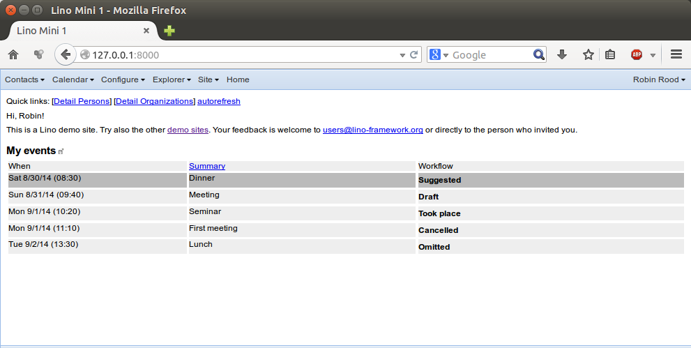

=========================
Saturday, August 30, 2014
=========================

I am working on a frustrating problem with Javascript/ExtJS.  

To show the context without requiring you to install :ref:`welfare`, I
extended :mod:`lino.projects.min1`:

- it now installs :mod:`ml.cal` (a basic calendar module)

- it now defines a :meth:`ad.Site.get_admin_main_items` method which
  yields :class:`ml.cal.MyEvents`::

    def get_admin_main_items(self, ar):
        yield self.modules.cal.MyEvents

  The :meth:`ad.Site.get_admin_main_items` method is expected to yield
  a list of tables to be displayed in the body of the main page using
  "plain html".

Here is how :mod:`lino.projects.min1` now looks after Robin logged in:

You should be able to reproduce the above by installing the latest
development version of Lino (as explained in :ref:`lino.dev.install`)
and executing::

  $ cd ~/repositories/lino/lino/projects/min1
  $ python manage.py initdb_demo
  $ runserver

.. |link| image:: ../../../lino/media/extjs/images/xsite/link.png
  
Now please note the |link| symbol after the table's title ("My
events"). Clicking on this symbol opens the given table in a "real"
window with an editable ExtJS grid.

The initial problem report then was:

- When I add an event in the "My events" table, then that event isn't
  displayed in main page after closing the window.

This was an easy pick, the problem came because Lino didn't refresh
the main page. I just needed to add a call to
`Lino.viewport.refresh()` when the last window has been
closed. Summary of the relevant JavaScript code::

    Lino.close_window = function(status_update, norestore) {
      var ww = Lino.window_history.pop();
      ...
      if (ww) {
        ...
        Lino.current_window = ww.window;
      } else {
          Lino.current_window = null;
          Lino.viewport.refresh();       // new since 20140829
      }
      ...
    };

That worked.  But it has a side effect:

Once the main page has been refreshed that way (by closing the last
window, not by reloading the whole page), the |link| doesn't work
anymore. The window just doesn't open, and there is no error message.

If you were able to follow until here, then please try help me to
solve this problem!
