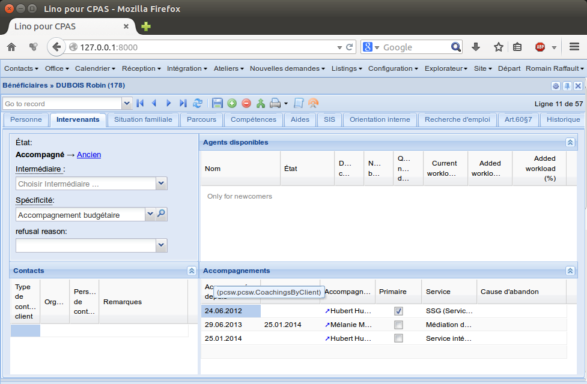

====================================
20140912 (Friday, 12 September 2014)
====================================

Getting started with :ref:`cosi`
--------------------------------

Johannes is trying to get a :ref:`cosi` up and running. Which revealed
some problems.

- Lino does not yet work in Dango 1.7

- :manage:`initdb_demo` for :ref:`cosi` failed because the demo
  fixtures require `commondata
  <https://github.com/lsaffre/commondata>`_ (and `commondata.be
  <https://github.com/lsaffre/commondata-be>`_ and `commondata.ee
  <https://github.com/lsaffre/commondata-ee>`_)

  EDIT: Maybe only :cmd:`fab initdb` failed, and commondata is not
  needed for getting started.

- I added instructions in :ref:`cosi.install`, but agree that this is
  a suboptimal procedure since it is a lot of typing. It would be
  easier to just type `pip install commondata.ee`, but I haven't yet
  released these packages to PyPI.

- :cmd:`fab test` failed for commondata.

- Released the commondata packages to PyPI and changed the 
  instructions in :ref:`cosi.install`.

- Fixed some copyright headers in :ref:`cosi` which still mentioned
  GPL instead of LGPL.

- Renamed the file :file:`project_info.py` to :file:`setup_info.py` in
  3 projects: Lino itself, :ref:`welfare` and :ref:`cosi`. Because (1)
  that sounds a more logical name and (2) the file is next to a
  :file:`projects` directory, which was annoying because
  auto-completion needed a second shoot to differenciate them.

- Continued to meditate (in `/about/license.rst`) about the question
  "BSD or GPL".

:ref:`welfare`: Coaching ended but client still coached
-------------------------------------------------------

Mathieu reported a subtle problem: 

- Quand les travailleurs consultent la liste de leurs dossiers
  attribués, même quand ils ont noté la fin du suivi, le dossier reste
  dans leur quota (voir mail d’Arianne ci-dessous).

Here is an example case in the demo data:

`pcsw.Clients` with parameter `coached_by` set to "Mélanie" should
*not* show this client. But currently it does.

Added a test case in :ref:`welfare.tested.pcsw`.

The directives defined by :mod:`atelier.sphinxconf.insert_input` now
cause a warning and report the filename and line number when an
exception occurs.  This helped me to unreveal the following problem
which had been occuring for some time when building the docs for
:ref:`welfare`.

A default implementation of :meth:`dd.Model.get_print_language` is now
defined on every model. No need to explicitly declare it as
:class:`dd.Printable`.  This is because :mod:`lino.modlib.excerpts` makes
printability "dynamic": it makes it possible to turn any model into a
"printable" just by creating an :class:`lino.modlib.excerpts.ExcerptType` for
it.  Another such method is :meth:`dd.Model.get_print_recipient` which
returns `None` by default.
