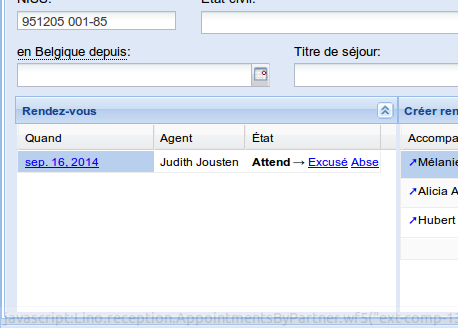
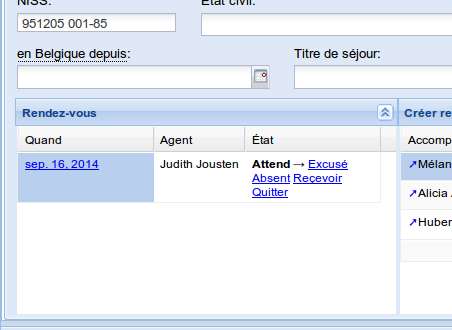

============================
Thursday, September 18, 2014
============================

Cool: I finally fixed a bug in `linoweb.js` which has caused already
quite some irritation: Lino.HtmlBoxPanels failed to automatically
refresh after certain actions.  The reason was:
:meth:`Lino.FormPanel.get_status` must not store the whole
`data_record` (only the `record_id`) because that would prevent the
form from actually reloading when :meth:`set_status` is called after a
child window closed.

Continued to optimize for :ref:`chat`:

- Added a clickable checkbox indicating the primary household in 
  the summary view of :class:`ml.households.MembersByPerson`.

- :attr:`ml.cal.Event.user` : `verbose_name` is now "Agent" instead of
  "Responsible user"

Opened :doc:`/tickets/125`.

:mod:`ml.reception` now adds two new states "excused" and "absent" to
:class:`ml.cal.GuestStates`.

Added :attr:`dd.AbstractTable.variable_row_height` to
:class:`ml.reception.AppointmentsByPartner`.
Before and after:

(Also tried whether it makes a difference when in :file:`lino.css` I
change the `white-space` property of `lino-auto-height` class from
``normal`` to ``wrap``.)

