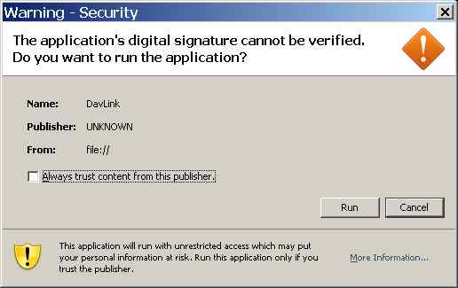

How to configure Java security policy on each client
----------------------------------------------------

This is rather complex. 

The following message may come on the clients when they enter 
to a Lino site which uses DavLink.
  

  
TODO:
Self-signed certificate: 
`Saffre-Rumma.cer <http://lino.googlecode.com/hg/docs/davlink/Saffre-Rumma.cer>`__.

