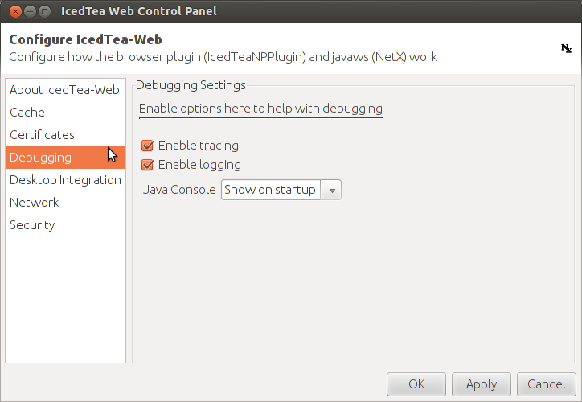

=========================================
Configuring your client for using DavLink
=========================================

:ref:`davlink` launches an executable application program on your 
computer. For security reasons it is normal that the Java Runtime on 
your computer refuses this without your prior explicit permission.

The problem is that it is not always easy to give this permission.

Note that the :ref:`demos` have their 
:ref:`davlink` functionality switched off 
for security reasons (they have :attr:`use_davlink <lino.site.Site.use_davlink>` 
set to False).

Debian
======

#.  To enable Java in your browser, 
    you need to install the `icedtea-plugin` package.

#.  And then you must tell icedtea that you grant permission for 
    the DavLink applet to launch a program.

    Edit your :file:`/etc/java-7-openjdk/security/java.policy`, 
    adding something like::

      grant codeBase "http://lino.example.com/" {
            permission java.security.AllPermission;
      };
      
    If you know that you can trust the applets on that URL, 
    then you can simply grant `AllPermission`. 
    Otherwise adapt your entry to grant only the minimum required. 
    (TODO: which ones?)

If any other problems arise, 
watch your console to see what the applet wants to do.

How to see the java console of an applet
----------------------------------------

To see the Java console output, simply close all browser windows, then 
launch your browser from a command shell::

  $ firefox
  $ chromium-browser
  
Then use your browser as usual, and watch the Java console output in 
your terminal window.
 

Allowing DavLink applet to store preferences
--------------------------------------------

Currently just some notes of problems I saw and how I solved them.

The console says::

    WARNING: Couldn't flush system prefs: java.util.prefs.BackingStoreException: /etc/.java/.systemPrefs/lino create failed.
    
Reaction::    

    $ sudo mkdir /etc/.java/.systemPrefs/lino
    
Now it says::    

    WARNING: Couldn't flush system prefs: java.util.prefs.BackingStoreException: java.io.FileNotFoundException: /etc/.java/.systemPrefs/lino/prefs.tmp (Permission denied)
    
Reaction::    

    $ sudo chgrp www-data /etc/.java/.systemPrefs/lino
    $ sudo chmod g+ws /etc/.java/.systemPrefs/lino

Now that part works.    
To see what the applet wrote to your preferences::

    $ less /etc/.java/.systemPrefs/lino/davlink/prefs.xml 

Next problem is (when I try to open an URL ending with `.odt`) 
that it still says::

  java.lang.RuntimeException: No launcher defined for extension 'odt'
  
Theoretically it should find `libreoffice` automatically.

(EDIT: I don't remember for sure how I solved this. 
Maybe this was simply a bug in DavLink which is now fixed.)

Why are there infinitely many x11 subdirectories in /usr/bin/x11?
-----------------------------------------------------------------

When DavLink starts scanning a Linux client for installed launchers, 
then you see something funny::

    Searching /usr/bin
      Found /usr/bin/libreoffice
    Searching /usr/bin/X11
    Searching /usr/bin/X11/X11
    Searching /usr/bin/X11/X11/X11
    Searching /usr/bin/X11/X11/X11/X11
    Searching /usr/bin/X11/X11/X11/X11/X11
    Searching /usr/bin/X11/X11/X11/X11/X11/X11
    Searching /usr/bin/X11/X11/X11/X11/X11/X11/X11
    Searching /usr/bin/X11/X11/X11/X11/X11/X11/X11/X11
    Searching /usr/bin/X11/X11/X11/X11/X11/X11/X11/X11/X11

... and so on until about 40 occurences of the X11 subdir. 
That's surprising but does no harm. 
Explanation is here:
http://askubuntu.com/questions/191654/why-are-there-infinitely-many-x11-subdirectories-in-usr-bin-x11

How to have DavLink re-scan your system for launchers
-----------------------------------------------------

Using brute force::

  $ rm /etc/.java/.systemPrefs/lino/davlink/prefs.xml

This will later cause a warning "Prefs file removed in background 
/etc/.java/.systemPrefs/lino/davlink/prefs.xml". 

How to configure Java security policy on each client
----------------------------------------------------

(This section is obsolete)

This is rather complex. 

The following message may come on the clients when they enter 
to a Lino site which uses DavLink.
  
.. image:: not_verified.jpg
  :scale: 80
  
TODO:
Self-signed certificate: 
`Saffre-Rumma.cer <http://lino.googlecode.com/hg/docs/davlink/Saffre-Rumma.cer>`__.

Enable Java logging
-------------------

If for some reason you cannot launch your browser from command line 
to see the java console of an applet, 
then try to enable "logging" in the `IcedTea Web Control 
Panel`:

  
And then watch the log files::

  $ tail -f ~/.icedtea/log/java.stderr 
  $ tail -f ~/.icedtea/log/java.stdout
  $ tail -f ~/.icedtea/log/java.stderr ~/.icedtea/log/java.stdout
  $ multitail ~/.icedtea/log/java.stderr ~/.icedtea/log/java.stdout

